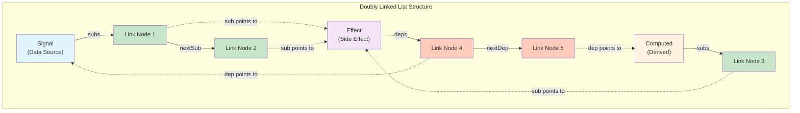
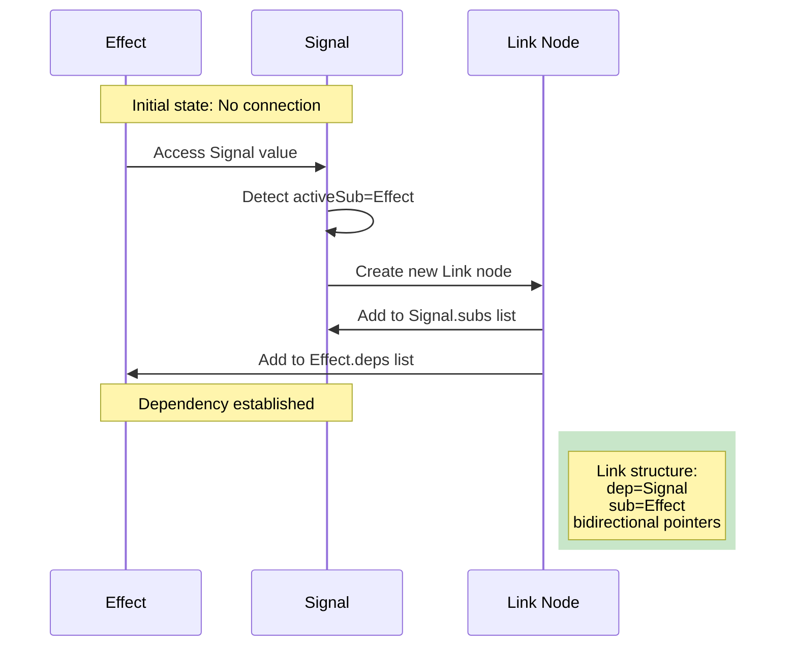
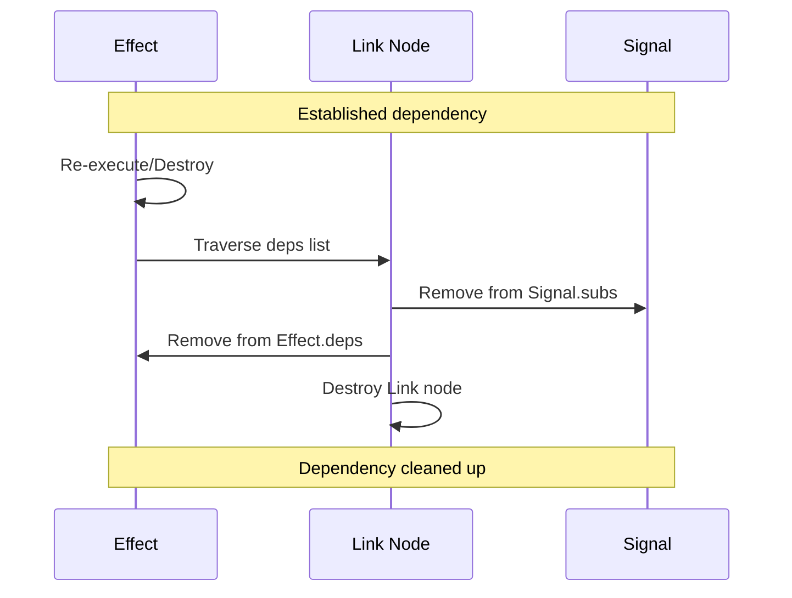
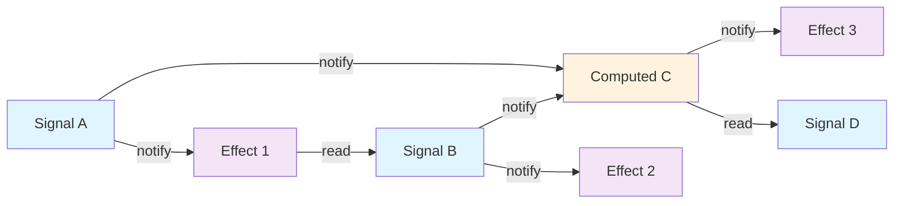

# Alien Signals - Lua Reactive Programming System

**Version: 3.1.0** - Compatible with alien-signals v3.1.0

[简体中文 README](README.md)

## Introduction

This project is ported from [stackblitz/alien-signals](https://github.com/stackblitz/alien-signals), and is a Lua implementation of the original TypeScript reactive system.

Alien Signals is an efficient reactive programming system. It provides automatic dependency tracking and reactive data flow management capabilities for applications through a clean and powerful API.

## Core Concepts

1. Signal
   - Used to store and track reactive values
   - Automatically notifies dependent computed properties and effects when values change
   - Read and write values directly via function calls

2. Computed
   - Derived values based on other reactive values
   - Recalculated only when dependent values change
   - Automatically caches results to avoid unnecessary recalculations

3. Effect
   - Functions automatically executed when reactive values change
   - Used to handle side effects, such as updating UI, sending network requests, etc.
   - Supports cleanup and unsubscription

4. EffectScope
   - Used to batch manage and clean up multiple reactive effect functions
   - Simplifies memory management in complex systems
   - Supports nested scope structures

## Usage Example

```lua
local reactive = require("reactive")
local signal = reactive.signal
local computed = reactive.computed
local effect = reactive.effect
local effectScope = reactive.effectScope

-- Create reactive values
local count = signal(0)
local doubled = computed(function()
    return count() * 2
end)

-- Create an effect
local stopEffect = effect(function()
    print("Count:", count())
    print("Doubled:", doubled())
end)
-- Output: Count: 0, Doubled: 0

-- Modify values, which will automatically trigger related computations and effects
count(1)  -- Output: Count: 1, Doubled: 2
count(2)  -- Output: Count: 2, Doubled: 4

-- Stop effect listening
stopEffect()
count(3)  -- Won't trigger any output

-- Using effect scope
local cleanup = effectScope(function()
    -- All effect functions created within this scope
    effect(function()
        print("Scoped effect:", count())
    end)
    
    effect(function()
        print("Another effect:", doubled())
    end)
end)

count(4)  -- Triggers all effect functions in the scope
cleanup()  -- Cleans up all effect functions in the scope
count(5)  -- Won't trigger any output
```

## Advanced Features

### Batch Updates

When performing multiple state updates, you can use batch update mode to avoid triggering effects multiple times, improving performance.

```lua
local reactive = require("reactive")
local signal = reactive.signal
local effect = reactive.effect
local startBatch = reactive.startBatch
local endBatch = reactive.endBatch

local count = signal(0)
local multiplier = signal(1)

effect(function()
    print("Result:", count() * multiplier())
end)
-- Output: Result: 0

-- Without batch updates: the effect executes twice
count(5) -- Output: Result: 5
multiplier(2) -- Output: Result: 10

-- With batch updates: the effect executes only once
startBatch()
count(10)
multiplier(3)
endBatch() -- Output: Result: 30
```

### Manual Trigger Updates

When you directly modify the internal state of a reactive value (instead of using the setter), you can use the `trigger` function to manually trigger dependency updates.

```lua
local reactive = require("reactive")
local signal = reactive.signal
local computed = reactive.computed
local trigger = reactive.trigger

-- Create a signal containing an array
local arr = signal({1, 2, 3})

-- Create a computed property to get the array length
local length = computed(function()
    return #arr()
end)

print("Initial length:", length())  -- Output: Initial length: 3

-- Directly modify the array content (won't automatically trigger updates)
table.insert(arr(), 4)

-- Use trigger to manually trigger updates
trigger(function()
    arr()  -- Access the signal to collect dependencies
end)

print("Updated length:", length())  -- Output: Updated length: 4
```

**Notes:**
- `trigger` is mainly used for handling cases where you directly modify the internal state of reactive values
- If possible, prefer using the setter approach to modify values (e.g., `arr({1, 2, 3, 4})`)
- `trigger` collects all dependencies accessed in the callback function and triggers their updates

The system uses the following techniques to implement reactivity:

1. Dependency Tracking
   - Uses function closures and binding mechanism for the object system
   - Tracks the currently executing computation or effect through global state
   - Automatically collects and manages dependencies, building a reactive data dependency graph

2. Doubly Linked List Dependency Management
   - Uses efficient doubly linked list structure to manage dependencies
   - O(1) time complexity for dependency addition and removal operations
   - Automatically cleans up dependencies that are no longer needed, preventing memory leaks

3. Dirty Value Checking and Optimization
   - Employs efficient bit operations for dirty value checking
   - Intelligently determines when to recalculate derived values
   - Precise dependency graph traversal algorithm

4. Update Scheduling System
   - Uses a queue to manage pending effect functions
   - Intelligently merges multiple updates to reduce unnecessary computations
   - Supports batch updates to improve performance

## Linked List Structure In Detail

The core of Alien Signals is a dependency tracking system implemented using doubly-linked list structures. Each link node exists simultaneously in two different linked lists, enabling efficient dependency collection and notification propagation.

### Link Node Structure

Each link node contains the following fields:

```lua
{
    dep = dep,        -- Dependency object (Signal or Computed)
    sub = sub,        -- Subscriber object (Effect or Computed)
    prevSub = prevSub, -- Previous node in the subscriber chain
    nextSub = nextSub, -- Next node in the subscriber chain
    prevDep = prevDep, -- Previous node in the dependency chain
    nextDep = nextDep  -- Next node in the dependency chain
}
```

### Doubly Linked List Diagram

**Core Principle**: Each Link node exists in two lists simultaneously:
- **Subscriber Chain (Vertical)**: Links all subscribers downward from dependency source (Signal/Computed)
- **Dependency Chain (Horizontal)**: Links all dependency sources rightward from subscriber (Effect/Computed)

This design achieves O(1) dependency add/remove and efficient notification propagation.



**How it works**:
1. **Dependency Collection**: Effect executes → accesses Signal → creates Link node → adds to both Signal's subs list and Effect's deps list
2. **Notification Propagation**: Signal changes → traverses subs list → notifies all subscribers to execute
3. **Dependency Cleanup**: Before Effect re-executes → traverses deps list → removes itself from old dependencies

### Link Process

**Principle**: When Effect executes and accesses Signal, the system automatically establishes dependency relationship.



**Key Steps**:
1. **Detect Access**: When Signal is read, check global activeSub
2. **Create Link**: If activeSub exists, create Link node connecting them
3. **Prevent Duplicates**: Check if dependency already exists to avoid duplication
4. **Bidirectional Connection**: Link added to both Signal.subs and Effect.deps

### Unlink Process

**Principle**: When Effect re-executes or is destroyed, old dependency relationships need to be cleaned up.



**Key Steps**:
1. **Trigger Timing**: Before Effect re-executes or when destroyed
2. **Traverse Dependencies**: Find all Link nodes through deps list
3. **Bidirectional Removal**: Remove from both Signal.subs and Effect.deps
4. **Memory Release**: Link node is garbage collected

### Complex Scenario Example

**Principle**: The reactive system supports multi-level dependency relationships, forming a Directed Acyclic Graph (DAG).



**Data Flow**:
1. **Signal A** changes → triggers **Effect 1** and **Computed C**
2. **Effect 1** executes → may modify **Signal B**
3. **Signal B** changes → triggers **Effect 2** and **Computed C** (again)
4. **Computed C** updates → triggers **Effect 3**

**Optimization Mechanisms**:
- **Dirty Checking**: Computed only recalculates when dependencies change
- **Batch Updates**: Multiple Signals change simultaneously, Effect executes only once
- **Topological Sort**: Ensures dependencies update in correct order, avoiding redundant calculations

This complex dependency relationship is efficiently managed through the doubly-linked list structure, achieving O(1) time complexity for dependency operations.

## Considerations

1. Performance Optimization
   - Avoid accessing too many reactive values in a single computed property
   - Use batch updates judiciously to improve performance
   - Don't modify other reactive values inside computed properties

2. Circular Dependencies
   - Although the system can intelligently handle some circular dependencies
   - It's still recommended to avoid complex circular dependencies
   - Uses bit flags to prevent infinite recursion and stack overflow

3. Memory Management
   - System automatically manages dependency relationships
   - Effects no longer in use are automatically cleaned up
   - Use effectScope to manage multiple effects in complex components

4. Lua 5.1 Compatibility
   - Supports Lua 5.1
   - All examples and tests are compatible with both Lua 5.1 and newer versions

## Complete API Reference

```lua
local reactive = require("reactive")

-- Core reactive primitives
local signal = reactive.signal           -- Create reactive signal
local computed = reactive.computed       -- Create computed value
local effect = reactive.effect           -- Create reactive effect
local effectScope = reactive.effectScope -- Create effect scope

-- Batch operation utilities
local startBatch = reactive.startBatch   -- Start batch updates
local endBatch = reactive.endBatch       -- End batch updates and flush

-- Advanced control API
local setActiveSub = reactive.setActiveSub       -- Set current active subscriber
local getActiveSub = reactive.getActiveSub       -- Get current active subscriber
local getBatchDepth = reactive.getBatchDepth     -- Get batch update depth

-- Type detection API
local isSignal = reactive.isSignal               -- Check if value is Signal
local isComputed = reactive.isComputed           -- Check if value is Computed
local isEffect = reactive.isEffect               -- Check if value is Effect
local isEffectScope = reactive.isEffectScope     -- Check if value is EffectScope
```

## License

This project is licensed under the [LICENSE](LICENSE).
