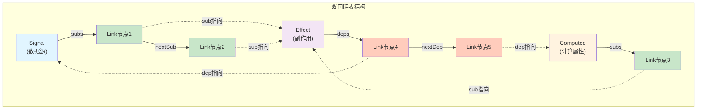
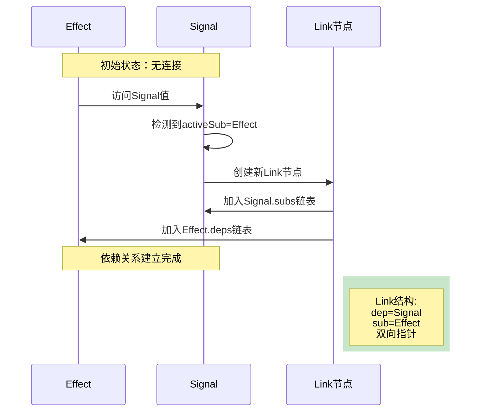
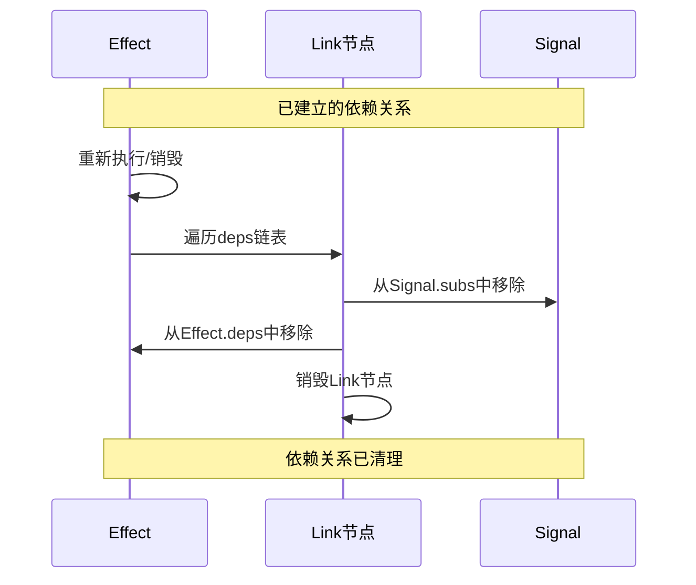
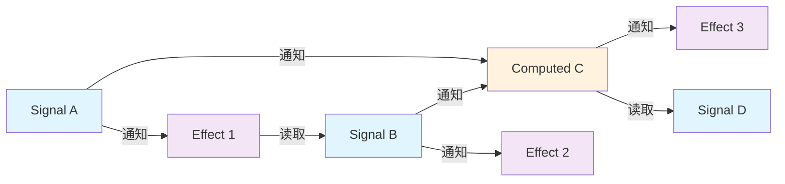

# Alien Signals - Lua响应式编程系统

**版本: 3.1.0** - 兼容 alien-signals v3.1.0

[English README](README.en.md)

## 项目简介

本项目移植自[stackblitz/alien-signals](https://github.com/stackblitz/alien-signals)，是原TypeScript版本响应式系统的Lua实现。

Alien Signals是一个高效的响应式编程系统，它通过简洁而强大的API，为应用提供自动依赖追踪和响应式数据流管理能力。

## 核心概念

1. Signal（信号）
   - 用于存储和追踪响应式值
   - 当值发生变化时，会自动通知依赖它的计算属性和副作用
   - 通过函数调用方式直接读取和修改值

2. Computed（计算属性）
   - 基于其他响应式值的派生值
   - 只有在依赖的值发生变化时才会重新计算
   - 自动缓存结果，避免重复计算

3. Effect（副作用）
   - 响应式值变化时自动执行的函数
   - 用于处理副作用，如更新UI、发送网络请求等
   - 支持清理和取消订阅

4. EffectScope（副作用作用域）
   - 用于批量管理和清理多个响应式副作用函数
   - 简化复杂系统中的内存管理
   - 支持嵌套作用域结构

## 使用示例

```lua
local reactive = require("reactive")
local signal = reactive.signal
local computed = reactive.computed
local effect = reactive.effect
local effectScope = reactive.effectScope

-- 创建响应式值
local count = signal(0)
local doubled = computed(function()
    return count() * 2
end)

-- 创建副作用
local stopEffect = effect(function()
    print("计数:", count())
    print("双倍:", doubled())
end)
-- 输出: 计数: 0, 双倍: 0

-- 修改值，会自动触发相关的计算和副作用
count(1)  -- 输出: 计数: 1, 双倍: 2
count(2)  -- 输出: 计数: 2, 双倍: 4

-- 停止副作用监听
stopEffect()
count(3)  -- 不会触发任何输出

-- 使用副作用作用域
local cleanup = effectScope(function()
    -- 在作用域内创建的所有副作用函数
    effect(function()
        print("作用域内副作用:", count())
    end)
    
    effect(function()
        print("另一个副作用:", doubled())
    end)
end)

count(4)  -- 触发作用域内的所有副作用函数
cleanup()  -- 清理作用域内的所有副作用函数
count(5)  -- 不会触发任何输出
```

## 高级功能

### 批量更新

在进行多个状态更新时，可以使用批量更新模式避免多次触发副作用，提高性能。

```lua
local reactive = require("reactive")
local signal = reactive.signal
local effect = reactive.effect
local startBatch = reactive.startBatch
local endBatch = reactive.endBatch

local count = signal(0)
local multiplier = signal(1)

effect(function()
    print("结果:", count() * multiplier())
end)
-- 输出：结果: 0

-- 不使用批量更新：副作用会执行两次
count(5) -- 输出：结果: 5
multiplier(2) -- 输出：结果: 10

-- 使用批量更新：副作用只执行一次
startBatch()
count(10)
multiplier(3)
endBatch() -- 输出：结果: 30
```

### 手动触发更新（trigger）

当你直接修改响应式值的内部状态（而不是通过setter），可以使用 `trigger` 函数手动触发依赖更新。

```lua
local reactive = require("reactive")
local signal = reactive.signal
local computed = reactive.computed
local trigger = reactive.trigger

-- 创建一个包含数组的信号
local arr = signal({1, 2, 3})

-- 创建一个计算属性来获取数组长度
local length = computed(function()
    return #arr()
end)

print("初始长度:", length())  -- 输出: 初始长度: 3

-- 直接修改数组内容（不会自动触发更新）
table.insert(arr(), 4)

-- 使用 trigger 手动触发更新
trigger(function()
    arr()  -- 访问信号以收集依赖
end)

print("更新后长度:", length())  -- 输出: 更新后长度: 4
```

**注意事项：**
- `trigger` 主要用于处理直接修改响应式值内部状态的情况
- 如果可能，优先使用 setter 方式修改值（如 `arr({1, 2, 3, 4})`）
- `trigger` 会收集回调函数中访问的所有依赖，并触发它们的更新

系统使用了以下技术来实现响应式：

1. 依赖追踪
   - 使用函数闭包和绑定机制实现对象系统
   - 通过全局状态追踪当前正在执行的计算或副作用
   - 自动收集和管理依赖关系，构建响应式数据依赖图

2. 双向链表依赖管理
   - 使用高效的双向链表结构管理依赖关系
   - O(1)时间复杂度的依赖添加和删除操作
   - 自动清理不再需要的依赖，避免内存泄漏

3. 脏值检查与优化
   - 采用位运算的高效脏值检查机制
   - 智能判断何时需要重新计算派生值
   - 精确的依赖图遍历算法

4. 更新调度系统
   - 使用队列管理待执行的副作用函数
   - 智能合并多次更新，减少不必要的计算
   - 支持批量更新以提高性能

## 链表结构详解

Alien Signals 的核心是通过双向链表（doubly-linked list）结构实现的依赖追踪系统。每个链接节点同时存在于两个不同的链表中，实现了高效的依赖收集和通知传播。

### 链表节点结构

每个链接节点包含以下字段：

```lua
{
    dep = dep,        -- 依赖对象（Signal或Computed）
    sub = sub,        -- 订阅者对象（Effect或Computed）
    prevSub = prevSub, -- 订阅者链表中的前一个节点
    nextSub = nextSub, -- 订阅者链表中的下一个节点
    prevDep = prevDep, -- 依赖链表中的前一个节点
    nextDep = nextDep  -- 依赖链表中的下一个节点
}
```

### 双向链表示意图

**核心原理**：每个Link节点同时存在于两个链表中：
- **订阅者链表（垂直）**：从依赖源（Signal/Computed）向下链接所有订阅者
- **依赖链表（水平）**：从订阅者（Effect/Computed）向右链接所有依赖源

这种设计实现了O(1)的依赖添加/删除，以及高效的通知传播。



**工作原理**：
1. **依赖收集**：Effect执行时，访问Signal → 创建Link节点 → 加入Signal的订阅者链表和Effect的依赖链表
2. **通知传播**：Signal变化 → 遍历subs链表 → 通知所有订阅者执行
3. **依赖清理**：Effect重新执行前 → 遍历deps链表 → 从旧依赖中移除自己

### 链接(link)过程

**原理**：当Effect执行时访问Signal，系统自动建立依赖关系。



**关键步骤**：
1. **检测访问**：Signal被读取时，检查全局activeSub
2. **创建链接**：若存在activeSub，创建Link节点连接二者
3. **防重复**：检查是否已存在相同依赖，避免重复添加
4. **双向连接**：Link同时加入Signal.subs和Effect.deps

### 解除链接(unlink)过程

**原理**：Effect重新执行或销毁时，需要清理旧的依赖关系。



**关键步骤**：
1. **触发时机**：Effect重新执行前或被销毁时
2. **遍历依赖**：通过deps链表找到所有Link节点
3. **双向移除**：从Signal.subs和Effect.deps中同时移除
4. **内存释放**：Link节点被垃圾回收

### 复杂场景示例

**原理**：响应式系统支持多层依赖关系，形成有向无环图（DAG）。



**数据流动**：
1. **Signal A** 变化 → 触发 **Effect 1** 和 **Computed C**
2. **Effect 1** 执行 → 可能修改 **Signal B**
3. **Signal B** 变化 → 触发 **Effect 2** 和 **Computed C**（再次）
4. **Computed C** 更新 → 触发 **Effect 3**

**优化机制**：
- **脏值检查**：Computed只在依赖变化时重新计算
- **批量更新**：多个Signal同时变化，Effect只执行一次
- **拓扑排序**：确保依赖按正确顺序更新，避免重复计算

这种复杂的依赖关系通过双向链表结构高效管理，实现了O(1)时间复杂度的依赖操作。

## 注意事项

1. 性能优化
   - 尽量避免在一个计算属性中访问太多的响应式值
   - 合理使用批量更新来提高性能
   - 不要在计算属性内部修改其他响应式值

2. 循环依赖
   - 虽然系统能够智能处理一定程度的循环依赖
   - 但仍建议避免复杂的循环依赖关系
   - 使用位运算标记位避免无限递归和栈溢出

3. 内存管理
   - 系统会自动管理依赖关系
   - 不再使用的副作用会被自动清理
   - 使用 effectScope 管理复杂组件的多个副作用函数

4. Lua 5.1 兼容性
   - 支持Lua 5.1
   - 所有示例和测试都兼容Lua 5.1和更新版本

## 完整API参考

```lua
local reactive = require("reactive")

-- 核心响应式原语
local signal = reactive.signal           -- 创建响应式信号
local computed = reactive.computed       -- 创建计算值
local effect = reactive.effect           -- 创建响应式副作用
local effectScope = reactive.effectScope -- 创建副作用作用域

-- 批量操作工具
local startBatch = reactive.startBatch   -- 开始批量更新
local endBatch = reactive.endBatch       -- 结束批量更新并刷新

-- 高级控制 API
local setActiveSub = reactive.setActiveSub       -- 设置当前活动订阅者
local getActiveSub = reactive.getActiveSub       -- 获取当前活动订阅者
local getBatchDepth = reactive.getBatchDepth     -- 获取批量更新深度

-- 类型检测 API
local isSignal = reactive.isSignal               -- 检测是否为Signal
local isComputed = reactive.isComputed           -- 检测是否为Computed
local isEffect = reactive.isEffect               -- 检测是否为Effect
local isEffectScope = reactive.isEffectScope     -- 检测是否为EffectScope
```

## 许可证

本项目使用[LICENSE](LICENSE)许可证。
