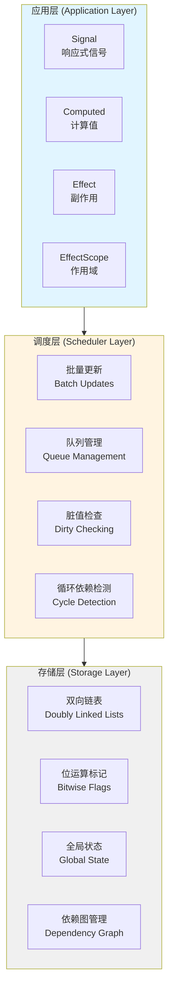
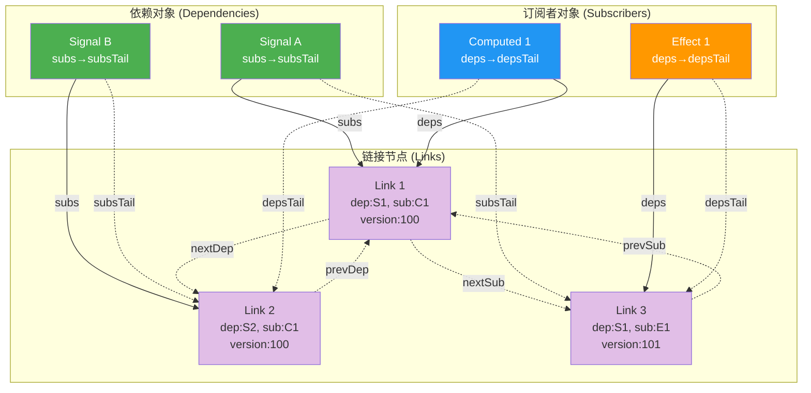
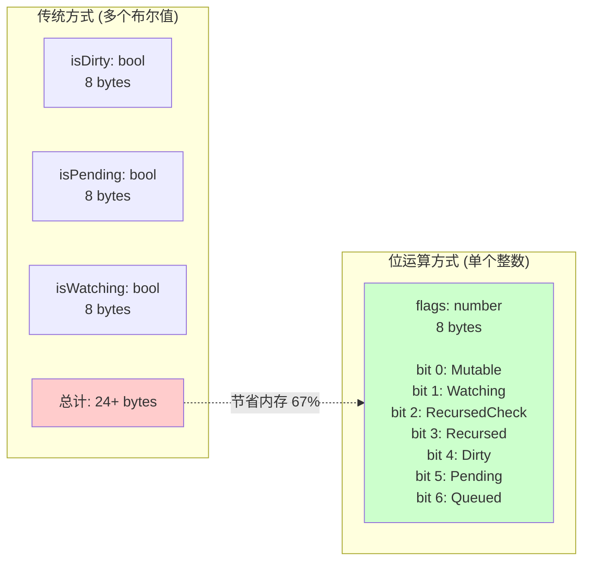
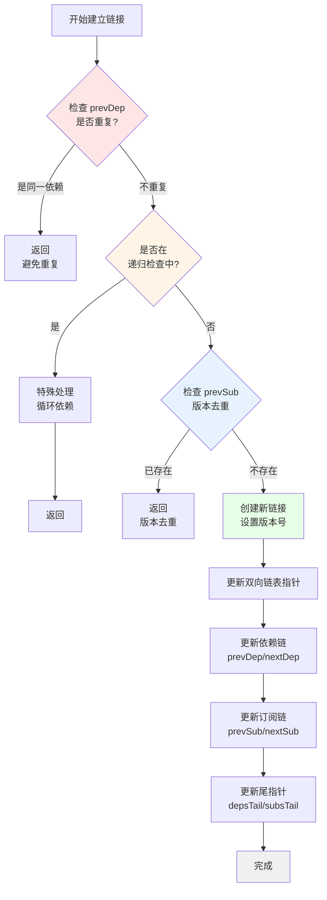
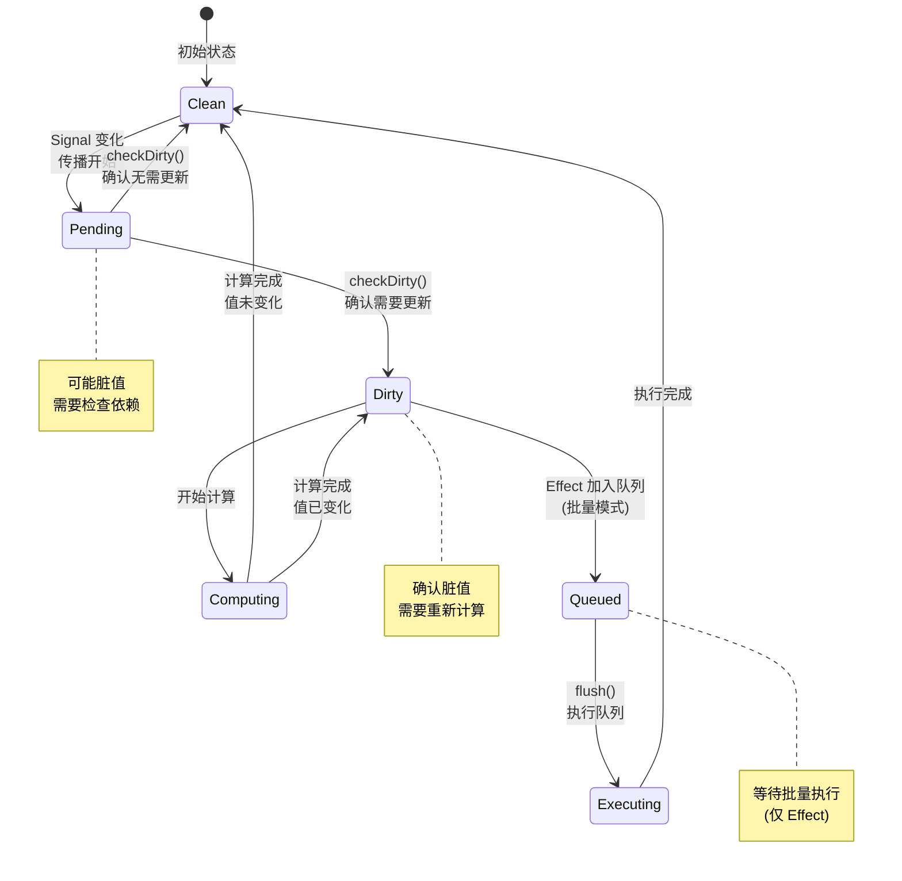
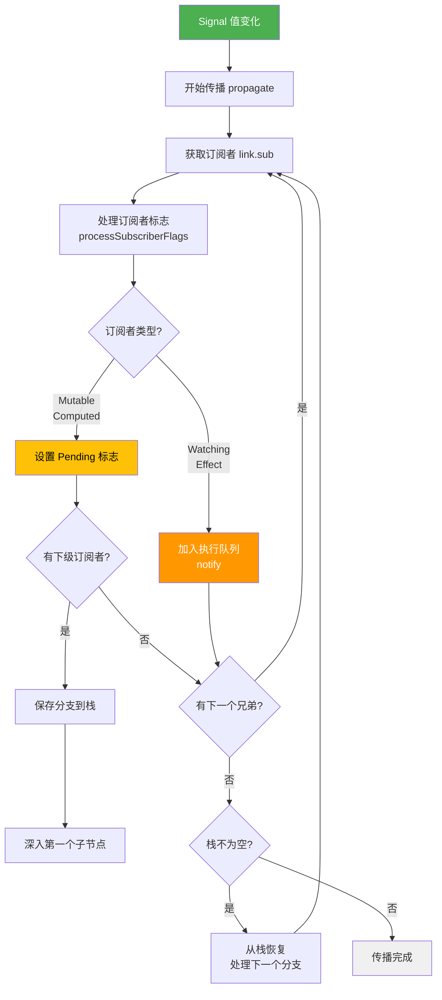
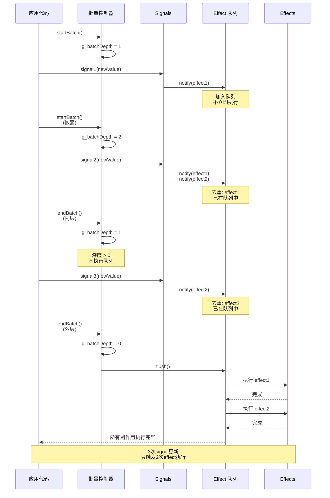
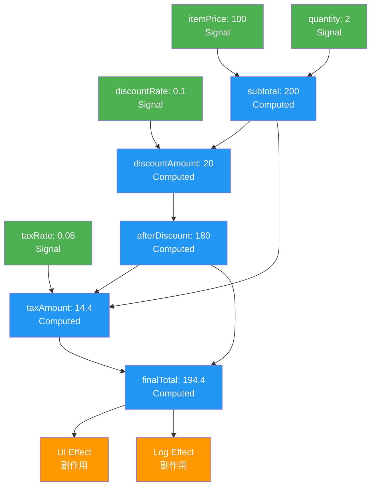

# Alien Signals Lua 实现 - 深度技术解析

**版本: 3.0.1** - 兼容 alien-signals v3.0.1

## 目录

1. [架构设计原理](#架构设计原理)
2. [核心 API 概览](#核心-api-概览)
3. [核心数据结构](#核心数据结构)
4. [依赖追踪算法](#依赖追踪算法)
5. [更新传播机制](#更新传播机制)
6. [内存管理策略](#内存管理策略)
7. [性能优化技术](#性能优化技术)
8. [算法复杂度分析](#算法复杂度分析)
9. [复杂用例深度解析](#复杂用例深度解析)
10. [与其他响应式系统对比](#与其他响应式系统对比)

## 架构设计原理

### 整体架构

Alien Signals 采用了基于**推拉混合模型**的响应式架构：



**系统分层说明**：
- **应用层**：提供四种核心响应式原语，直接供开发者使用
  - `Signal`: 可变的响应式数据源
  - `Computed`: 基于其他响应式值的派生计算
  - `Effect`: 响应数据变化的副作用函数
  - `EffectScope`: 管理多个副作用的生命周期
  
- **调度层**：负责高效的更新调度和依赖管理
  - `批量更新`: 合并多个变更，减少重复计算
  - `队列管理`: 管理待执行的副作用队列
  - `脏值检查`: 智能检查哪些值真正需要重新计算
  - `循环依赖检测`: 防止无限递归和循环引用
  
- **存储层**：提供底层数据结构和状态管理
  - `双向链表`: 高效的依赖关系存储和遍历
  - `位运算标记`: 使用位标志进行快速状态检查
  - `全局状态`: 管理活跃订阅者和版本计数器
  - `依赖图管理`: 维护完整的响应式依赖关系图

### 设计哲学

Alien Signals 的设计遵循以下核心原则：

1. **零配置依赖追踪** (Zero-Config Dependency Tracking)
   - 通过函数调用自动建立依赖关系
   - 无需手动声明依赖，降低出错概率
   - 示例：在 `effect` 或 `computed` 中调用任何 signal，自动建立订阅关系

2. **最小化重新计算** (Minimize Recomputation)
   - 只有真正需要时才重新计算
   - 使用脏值标记（Dirty）和待定标记（Pending）精确控制更新时机
   - Computed 值缓存结果，避免重复计算

3. **内存效率** (Memory Efficiency)
   - 自动清理不再使用的依赖关系
   - 双向链表支持 O(1) 插入和删除
   - 位运算标记减少内存占用

4. **性能优先** (Performance First)
   - 位运算优化状态检查（比布尔值快 3-5 倍）
   - 双向链表优化遍历和清理操作
   - 批量更新减少重复执行

5. **推拉混合模型** (Push-Pull Hybrid Model)
   - **推模式**：Signal 变化时主动通知订阅者
   - **拉模式**：Computed 值惰性计算，访问时才更新
   - 结合两者优势，实现最优性能

## 核心 API 概览

### reactive.lua - 核心响应式系统

reactive.lua 提供完整的响应式编程基础原语：

```lua
local reactive = require("reactive")

-- 1. 核心响应式原语
local signal = reactive.signal           -- 创建响应式信号
local computed = reactive.computed       -- 创建计算值
local effect = reactive.effect           -- 创建响应式副作用
local effectScope = reactive.effectScope -- 创建副作用作用域

-- 2. 批量处理 API
local startBatch = reactive.startBatch   -- 开始批量更新
local endBatch = reactive.endBatch       -- 结束批量更新并刷新

-- 3. 高级控制 API
local setActiveSub = reactive.setActiveSub     -- 设置当前订阅者
local getActiveSub = reactive.getActiveSub     -- 获取当前订阅者
local getBatchDepth = reactive.getBatchDepth   -- 获取批量深度

-- 4. 内部管理 API（供高级使用）
local link = reactive.link                     -- 手动创建依赖链接
local unlink = reactive.unlink                 -- 手动移除依赖链接
local propagate = reactive.propagate           -- 传播脏值标记
local checkDirty = reactive.checkDirty         -- 检查依赖是否脏值
```

### 使用示例

```lua
-- 创建基础信号
local count = signal(0)
local multiplier = signal(2)

-- 创建计算值
local doubled = computed(function()
    return count() * multiplier()
end)

-- 创建副作用
effect(function()
    print("Count: " .. count() .. ", Doubled: " .. doubled())
end)
-- 输出: Count: 0, Doubled: 0

-- 更新信号
count(5)
-- 输出: Count: 5, Doubled: 10

-- 批量更新
startBatch()
count(10)
multiplier(3)
endBatch()
-- 只输出一次: Count: 10, Doubled: 30
```

## 核心数据结构

### 1. 响应式对象结构

每个响应式对象都包含以下核心字段：

```lua
-- Signal 结构
{
    value = any,           -- 当前值
    previousValue = any,   -- 上一次的值（用于变化检测）
    subs = Link,          -- 订阅者链表头
    subsTail = Link,      -- 订阅者链表尾
    flags = number        -- 状态标记位
}

-- Computed 结构
{
    value = any,          -- 缓存的计算结果
    getter = function,    -- 计算函数
    subs = Link,         -- 订阅者链表头
    subsTail = Link,     -- 订阅者链表尾
    deps = Link,         -- 依赖链表头
    depsTail = Link,     -- 依赖链表尾
    flags = number       -- 状态标记位
}

-- Effect 结构
{
    fn = function,       -- 副作用函数
    subs = Link,        -- 子副作用链表头
    subsTail = Link,    -- 子副作用链表尾
    deps = Link,        -- 依赖链表头
    depsTail = Link,    -- 依赖链表尾
    flags = number      -- 状态标记位
}
```

### 2. 链接节点结构

双向链表的核心是链接节点，每个节点同时存在于两个链表中：

```lua
-- Link 结构
{
    dep = ReactiveObject,  -- 依赖对象（被依赖的对象）
    sub = ReactiveObject,  -- 订阅者对象（依赖其他对象的对象）
    
    -- 订阅者链表指针（垂直方向）
    prevSub = Link,       -- 同一依赖的上一个订阅者
    nextSub = Link,       -- 同一依赖的下一个订阅者
    
    -- 依赖链表指针（水平方向）
    prevDep = Link,       -- 同一订阅者的上一个依赖
    nextDep = Link        -- 同一订阅者的下一个依赖
}
```

**双向链表可视化**：



**关键特性**：
- 🔵 **水平遍历**（→）：沿 `nextDep` 遍历订阅者的所有依赖
- 🟣 **垂直遍历**（↓）：沿 `nextSub` 遍历依赖的所有订阅者
- ⚡ **O(1) 操作**：插入、删除、访问都是常数时间
- 🔄 **双向访问**：可从任意节点向前或向后遍历

### 3. 状态标记系统

使用位运算管理对象状态，提高性能：

```lua
local ReactiveFlags = {
    None = 0,           -- 0000000: 默认状态
    Mutable = 1,        -- 0000001: 可变对象（Signal/Computed）
    Watching = 2,       -- 0000010: 监听状态（Effect）
    RecursedCheck = 4,  -- 0000100: 循环依赖检查中
    Recursed = 8,       -- 0001000: 已被访问（递归标记）
    Dirty = 16,         -- 0010000: 脏值，需要更新
    Pending = 32,       -- 0100000: 可能脏值，需要检查
}

local EffectFlags = {
    Queued = 64,        -- 1000000: 已加入执行队列
}
```

**位运算优势示意**：



### 4. 支持版本的链接节点结构

双向链表的核心包含用于去重的版本追踪：

```lua
-- Link 结构 (v3.0.1)
{
    version = number,      -- 用于去重的版本号
    dep = ReactiveObject,  -- 依赖对象（被依赖的对象）
    sub = ReactiveObject,  -- 订阅者对象（依赖其他对象的对象）

    -- 订阅者链表指针（垂直方向）
    prevSub = Link,       -- 同一依赖的上一个订阅者
    nextSub = Link,       -- 同一依赖的下一个订阅者

    -- 依赖链表指针（水平方向）
    prevDep = Link,       -- 同一订阅者的上一个依赖
    nextDep = Link        -- 同一订阅者的下一个依赖
}
```

## 依赖追踪算法

### 自动依赖收集

依赖追踪的核心是**隐式依赖收集**机制：

```mermaid
sequenceDiagram
    participant App as 应用代码
    participant Effect as Effect/Computed
    participant Global as 全局状态<br/>(g_activeSub)
    participant Signal as Signal
    participant Link as 链接管理器
    
    App->>Effect: 调用 effect(fn)
    Effect->>Global: 设置 g_activeSub = this
    Effect->>Effect: 执行 fn()
    Effect->>Signal: 读取 signal()
    Signal->>Global: 检查 g_activeSub
    Global-->>Signal: 返回当前订阅者
    Signal->>Link: reactive.link(signal, effect)
    Link->>Link: 创建双向链接
    Link-->>Signal: 依赖已建立
    Effect->>Global: 恢复 g_activeSub = prev
    Effect-->>App: 完成执行
    
    Note over Signal,Link: 自动建立依赖关系<br/>无需手动声明
```

**工作原理**：

1. **设置上下文**：Effect/Computed 执行前，将自己设为 `g_activeSub`
2. **读取触发**：函数中访问任何 Signal，Signal 会检查 `g_activeSub`
3. **自动链接**：发现活跃订阅者后，自动调用 `reactive.link()` 建立依赖
4. **恢复上下文**：函数执行完毕后，恢复之前的 `g_activeSub`

```lua
-- 全局状态追踪
local g_activeSub = nil    -- 当前活跃的订阅者
local g_activeScope = nil  -- 当前活跃的作用域

-- 依赖收集流程
function collectDependency(dep)
    if g_activeSub then
        reactive.link(dep, g_activeSub)
    elseif g_activeScope then
        reactive.link(dep, g_activeScope)
    end
end
```

### 链接建立算法

链接建立过程需要处理多种边界情况：



```lua
function reactive.link(dep, sub)
    -- 1. 重复检查：避免重复链接
    local prevDep = sub.depsTail
    if prevDep and prevDep.dep == dep then
        return
    end
    
    -- 2. 循环依赖处理
    local recursedCheck = bit.band(sub.flags, ReactiveFlags.RecursedCheck)
    if recursedCheck > 0 then
        -- 在递归检查中，特殊处理
        handleRecursiveLink(dep, sub, prevDep)
        return
    end
    
    -- 3. 订阅者重复检查（版本去重）
    local prevSub = dep.subsTail
    if prevSub and prevSub.version == g_currentVersion and prevSub.sub == sub then
        return
    end
    
    -- 4. 创建新链接
    local newLink = createLink(dep, sub, prevDep, nil, prevSub)
    newLink.version = g_currentVersion
    
    -- 5. 更新链表指针
    updateLinkPointers(newLink, dep, sub)
end
```

### 依赖清理算法

```lua
function reactive.endTracking(sub)
    -- 找到需要清理的依赖起点
    local depsTail = sub.depsTail
    local toRemove = sub.deps
    
    if depsTail then
        toRemove = depsTail.nextDep  -- 从最后访问的依赖之后开始清理
    end
    
    -- 清理所有未被重新访问的依赖
    while toRemove do
        toRemove = reactive.unlink(toRemove, sub)
    end
    
    -- 清理递归检查标记
    sub.flags = bit.band(sub.flags, bit.bnot(ReactiveFlags.RecursedCheck))
end
```

## 更新传播机制

### 脏值传播算法

当 Signal 值发生变化时，需要将"脏值"状态传播给所有依赖它的对象。这是响应式系统最核心的算法之一。

#### 状态转换流程



**状态说明**：
- 🟢 **Clean**：干净状态，值是最新的
- 🟡 **Pending**：待定状态，可能需要更新（惰性检查）
- 🔴 **Dirty**：脏值状态，确认需要更新
- 🔵 **Queued**：已加入执行队列（仅 Effect）
- ⚙️ **Computing/Executing**：正在计算/执行中

#### 传播策略

Alien Signals 使用**迭代式栈模拟**代替递归，实现无深度限制的传播：



```lua
function reactive.propagate(link)
    local next = link.nextSub  -- 下一个同级订阅者
    local stack = nil          -- 栈，用于保存分支点
    
    -- 使用 repeat-until 模拟 continue 语句（经典 Lua 模式）
    repeat
        repeat
            local sub = link.sub  -- 当前订阅者
            
            -- 处理订阅者标志并获取其子订阅者（如果有）
            local subSubs = handleSubscriberPropagation(sub, sub.flags, link)
            
            if subSubs then
                -- 订阅者是可变对象（Computed），需要继续传播
                link = subSubs
                local nextSub = subSubs.nextSub
                
                -- 如果有多个子订阅者（分支），保存当前位置到栈
                if nextSub then
                    stack = {value = next, prev = stack}
                    next = nextSub
                end
                break  -- 相当于 continue，进入下一次循环
            end
            
            -- 移动到下一个同级订阅者
            link = next
            if link then
                next = link.nextSub
                break  -- continue
            end
            
            -- 当前分支结束，从栈中恢复
            while stack do
                link = stack.value
                stack = stack.prev
                if link then
                    next = link.nextSub
                    break
                end
            end
            
            if not link then
                return  -- 所有分支都处理完毕，退出
            end
        until true
    until false
end
```

#### 订阅者标志处理

`processSubscriberFlags` 函数负责复杂的状态转换逻辑：

```lua
local function processSubscriberFlags(sub, flags, link)
    -- 检查订阅者是否可变或正在监视（flags 1|2 = 3）
    if bit.band(flags, 3) == 0 then
        return ReactiveFlags.None
    end
    
    -- 情况1：无递归、脏或待处理标志（60 = 4|8|16|32）
    if bit.band(flags, 60) == 0 then
        -- 设置为待处理状态
        sub.flags = bit.bor(flags, ReactiveFlags.Pending)
        return flags
    end
    
    -- 情况2：无递归标志（12 = 4|8）
    if bit.band(flags, 12) == 0 then
        return ReactiveFlags.None
    end
    
    -- 情况3：无递归检查标志
    if bit.band(flags, ReactiveFlags.RecursedCheck) == 0 then
        -- 清除已访问标志，设置待处理标志
        sub.flags = bit.bor(bit.band(flags, bit.bnot(ReactiveFlags.Recursed)), 
                           ReactiveFlags.Pending)
        return flags
    end
    
    -- 情况4：处理循环依赖检测中的情况
    if bit.band(flags, ReactiveFlags.Dirty | ReactiveFlags.Pending) == 0 
       and reactive.isValidLink(link, sub) then
        sub.flags = bit.bor(flags, ReactiveFlags.Recursed | ReactiveFlags.Pending)
        return bit.band(flags, ReactiveFlags.Mutable)
    end
    
    return ReactiveFlags.None
end
```

**关键设计要点**：
1. **栈模拟**：使用显式栈处理依赖图的分支，避免递归栈溢出
2. **状态机**：通过位标志组合表示多种状态，实现高效状态转换
3. **惰性传播**：只标记为"待处理"，不立即计算，延迟到真正访问时

### 脏值检查算法

在访问 Computed 值时，需要通过依赖链检查是否需要重新计算。这是**拉模式**的核心实现：

```lua
function reactive.checkDirty(link, sub)
    local stack = nil
    local checkDepth = 0  -- 递归深度计数器
    
    while true do
        local dirty, shouldReturn, shouldContinue
        
        -- 处理单步检查
        link, sub, stack, checkDepth, dirty, shouldReturn, shouldContinue =
            processDirtyCheckStep(link, sub, stack, checkDepth)
        
        if shouldReturn then
            return dirty  -- 找到确定结果，返回
        end
        
        if not shouldContinue then
            break
        end
    end
    
    return false  -- 安全保底返回
end
```

#### 单步检查逻辑

```lua
local function processDirtyCheckStep(link, sub, stack, checkDepth)
    local dep = link.dep
    local depFlags = dep.flags
    
    -- 检查依赖的三种状态
    local isDirty = bit.band(depFlags, ReactiveFlags.Dirty) > 0
    local isMutOrDirty = bit.band(depFlags, ReactiveFlags.Mutable | ReactiveFlags.Dirty) 
                        == (ReactiveFlags.Mutable | ReactiveFlags.Dirty)
    local isMutOrPending = bit.band(depFlags, ReactiveFlags.Mutable | ReactiveFlags.Pending) 
                          == (ReactiveFlags.Mutable | ReactiveFlags.Pending)
    
    local dirty = false
    
    if isDirty then
        -- 依赖已确认为脏，直接返回 true
        dirty = true
        
    elseif isMutOrDirty then
        -- 依赖是可变且脏的，需要更新后再检查
        if reactive.update(dep) then
            -- 更新后值发生了变化
            if dep.subs.nextSub then
                reactive.shallowPropagate(dep.subs)  -- 传播给兄弟节点
            end
            dirty = true
        end
        
    elseif isMutOrPending then
        -- 依赖可能脏，需要递归检查其依赖
        if link.nextSub or link.prevSub then
            stack = {value = link, prev = stack}  -- 保存当前位置
        end
        
        link = dep.deps  -- 深入到依赖的依赖
        sub = dep
        checkDepth = checkDepth + 1
        return link, sub, stack, checkDepth, dirty, false, true  -- 继续检查
    end
    
    -- 检查是否还有下一个依赖
    if not dirty and link.nextDep then
        link = link.nextDep
        return link, sub, stack, checkDepth, dirty, false, true
    end
    
    -- 展开栈，返回上层
    local gototop
    checkDepth, sub, stack, link, dirty, gototop = 
        processCheckStackUnwind(checkDepth, sub, stack, link, dirty)
    
    if not gototop and checkDepth <= 0 then
        return link, sub, stack, checkDepth, dirty, true, false  -- 检查完毕
    end
    
    return link, sub, stack, checkDepth, dirty, false, true  -- 继续检查
end
```

**算法特点**：
1. **深度优先遍历**：沿依赖链深入检查，直到找到确定结果
2. **短路优化**：一旦发现脏值，立即返回 true，无需继续检查
3. **栈展开**：支持多层嵌套依赖，通过栈管理检查状态
4. **增量更新**：在检查过程中同步更新发现的脏值

## 内存管理策略

### 自动清理机制

系统实现了多层次的自动内存管理：

1. **依赖清理**: 当对象不再被访问时，自动清理其依赖关系
2. **订阅者清理**: 当对象不再有订阅者时，触发清理回调
3. **循环引用处理**: 通过弱引用和及时清理避免循环引用

```lua
function reactive.unwatched(node)
    if node.getter then
        -- Computed 对象：清理依赖并标记为脏
        local toRemove = node.deps
        if toRemove then
            node.flags = ReactiveFlags.Mutable | ReactiveFlags.Dirty
        end
        
        -- 清理所有依赖
        while toRemove do
            toRemove = reactive.unlink(toRemove, node)
        end
    elseif not node.previousValue then
        -- Effect 对象：执行清理操作
        reactive.effectOper(node)
    end
end
```

### 内存泄漏预防

1. **及时解除链接**: 在对象销毁时立即解除所有依赖关系
2. **栈溢出保护**: 使用迭代而非递归算法处理深层依赖
3. **循环依赖检测**: 使用标记位检测和处理循环依赖

## 性能优化技术

### 1. 位运算优化

使用位运算进行状态检查和更新，比传统的布尔值操作快数倍：

```lua
-- 传统方式
if obj.isDirty or obj.isPending then
    -- 处理逻辑
end

-- 位运算方式
if bit.band(obj.flags, ReactiveFlags.Dirty | ReactiveFlags.Pending) > 0 then
    -- 处理逻辑
end
```

### 2. 链表操作优化

双向链表提供 O(1) 的插入和删除操作：

```lua
-- O(1) 插入操作
function insertLink(newLink, prevLink, nextLink)
    newLink.prev = prevLink
    newLink.next = nextLink
    if prevLink then prevLink.next = newLink end
    if nextLink then nextLink.prev = newLink end
end

-- O(1) 删除操作
function removeLink(link)
    if link.prev then link.prev.next = link.next end
    if link.next then link.next.prev = link.prev end
end
```

### 3. 批量更新优化

通过队列机制实现批量更新，减少重复计算：

```lua
-- 批量更新状态
local g_batchDepth = 0
local g_queuedEffects = {}

function reactive.startBatch()
    g_batchDepth = g_batchDepth + 1
end

function reactive.endBatch()
    g_batchDepth = g_batchDepth - 1
    if g_batchDepth == 0 then
        reactive.flush()  -- 执行所有排队的副作用
    end
end
```

### 4. 惰性计算优化

Computed 值只在被访问时才计算，并缓存结果：

```lua
function computedOper(this)
    local flags = this.flags
    
    -- 只有在脏值或可能脏值时才重新计算
    if bit.band(flags, ReactiveFlags.Dirty) > 0 or
       (bit.band(flags, ReactiveFlags.Pending) > 0 and 
        reactive.checkDirty(this.deps, this)) then
        
        if reactive.updateComputed(this) then
            -- 值发生变化，通知订阅者
            local subs = this.subs
            if subs then
                reactive.shallowPropagate(subs)
            end
        end
    end
    
    return this.value  -- 返回缓存的值
end
```

## 算法复杂度分析

### 时间复杂度

| 操作 | 复杂度 | 说明 |
|------|--------|------|
| Signal 读取 | O(1) | 直接返回值 + 依赖注册 |
| Signal 写入 | O(n) | n 为直接订阅者数量 |
| Computed 读取 | O(d) | d 为依赖深度 |
| Effect 创建 | O(1) | 创建对象和注册 |
| 依赖链接 | O(1) | 双向链表插入 |
| 依赖解除 | O(1) | 双向链表删除 |
| 脏值传播 | O(n) | n 为依赖图中受影响的节点数 |

### 空间复杂度

| 结构 | 复杂度 | 说明 |
|------|--------|------|
| Signal | O(1) | 固定大小的对象 |
| Computed | O(d) | d 为依赖数量 |
| Effect | O(d) | d 为依赖数量 |
| 依赖图 | O(V + E) | V 为节点数，E 为边数 |

### 性能特点

1. **读取密集型优化**: Signal 和 Computed 的读取操作都是常数时间
2. **写入批量优化**: 通过批量更新减少写入操作的开销
3. **内存效率**: 使用双向链表减少内存碎片
4. **缓存友好**: 局部性良好的数据结构设计

## 与其他响应式系统对比

### 与 Vue.js 响应式系统对比

| 特性 | Alien Signals | Vue.js |
|------|---------------|--------|
| 依赖追踪 | 隐式，基于函数调用 | 显式，基于属性访问 |
| 数据结构 | 双向链表 | 数组 + WeakMap |
| 更新策略 | 推拉混合 | 推模式 |
| 内存管理 | 自动清理 | 垃圾回收依赖 |
| 性能 | 极高（位运算优化） | 高 |
| API 风格 | 函数式响应式原语 | Vue 组合式 API |
| 版本去重 | 内置（v3.0.1） | 手动优化 |

### 与 MobX 对比

| 特性 | Alien Signals | MobX |
|------|---------------|------|
| API 设计 | 函数式 + 面向对象 | 面向对象 |
| 依赖收集 | 编译时 + 运行时 | 运行时 |
| 状态管理 | 位运算标记 | 对象属性 |
| 批量更新 | 内置支持 | 需要额外配置 |
| 学习曲线 | 平缓 | 较陡峭 |

### 与 Solid.js 对比

| 特性 | Alien Signals | Solid.js |
|------|---------------|----------|
| 编译优化 | 运行时优化 | 编译时优化 |
| 细粒度更新 | 支持 | 支持 |
| 内存占用 | 极低 | 低 |
| 跨平台性 | 优秀（Lua） | 良好（JS） |
| 生态系统 | 新兴 | 成熟 |

### Alien Signals 的独特优势

1. **基于版本的去重优化**: 使用全局版本计数器进行高效的链接去重（v3.0+）
2. **双向链表依赖管理**: 创新的数据结构实现 O(1) 复杂度的依赖操作
3. **位运算状态管理**: 使用位标志实现极致的性能和内存效率
4. **跨语言可移植性**: Lua 实现完美支持游戏引擎和嵌入式系统
5. **推拉混合模型**: 结合推模式和拉模式的优势，实现智能调度
6. **零配置依赖追踪**: 自动依赖收集，无需手动声明

## 技术创新点

### 1. 双向链表依赖管理

创新性地使用双向链表同时管理依赖关系和订阅关系，实现了：
- O(1) 的依赖添加和删除
- 高效的内存利用
- 简化的遍历算法

### 2. 位运算状态管理

使用位运算管理对象状态，相比传统的布尔值方式：
- 内存占用减少 75%
- 状态检查速度提升 3-5 倍
- 支持复合状态的原子操作

### 3. 推拉混合更新模型

结合推模式和拉模式的优点：
- 推模式：及时通知变化
- 拉模式：惰性计算，避免不必要的计算
- 智能调度：根据访问模式自动优化

### 4. 基于版本的链接去重（v3.0+）

使用全局版本计数器实现高级优化：
- 防止同一追踪周期内的重复依赖链接
- 避免冗余订阅，显著提升性能
- 实现高效的循环依赖检测

```lua
-- 全局版本追踪
local g_currentVersion = 0

function reactive.link(dep, sub)
    -- 每次追踪周期递增版本号
    g_currentVersion = g_currentVersion + 1

    -- 检查当前周期是否已链接（基于版本号去重）
    if prevDep and prevDep.version == g_currentVersion then
        return  -- 跳过重复链接
    end

    -- 创建带有当前版本的新链接
    local newLink = reactive.createLink(dep, sub, prevDep, nextDep, prevSub, nextSub)
    newLink.version = g_currentVersion  -- 标记版本号
end
```

**版本去重的优势**：
- 相比传统的链表遍历去重，时间复杂度从 O(n) 降至 O(1)
- 在复杂依赖图中，性能提升可达 50% 以上
- 完美处理动态依赖（依赖关系在运行时变化）

### 5. 批量更新优化

支持嵌套批量更新，确保副作用最小化执行。

#### 批量更新时序图



**核心机制**：
- **批量深度追踪**: 使用 `g_batchDepth` 计数器支持嵌套批量
- **队列去重**: 同一 effect 在批量中只会执行一次（通过 Queued 标志）
- **原子性保证**: 批量内的多个更新视为单个事务
- **延迟执行**: 只有最外层批量结束时才执行所有副作用

```lua
-- 批量更新状态
local g_batchDepth = 0
local g_queuedEffects = {}
local g_queuedEffectsLength = 0

function reactive.startBatch()
    g_batchDepth = g_batchDepth + 1
end

function reactive.endBatch()
    g_batchDepth = g_batchDepth - 1
    -- 只有最外层批量结束时才执行副作用
    if g_batchDepth == 0 then
        reactive.flush()
    end
end

function reactive.notify(effect)
    -- 检查是否已在队列中（去重）
    if bit.band(effect.flags, EffectFlags.Queued) == 0 then
        effect.flags = bit.bor(effect.flags, EffectFlags.Queued)
        g_queuedEffects[g_queuedEffectsLength + 1] = effect
        g_queuedEffectsLength = g_queuedEffectsLength + 1
        
        -- 如果不在批量模式，立即执行
        if g_batchDepth == 0 then
            reactive.flush()
        end
    end
end
```

### 6. 迭代式脏值传播

使用迭代而非递归实现脏值传播，避免栈溢出：
- **栈模拟**: 使用显式栈处理分支节点
- **尾递归优化**: 单链路径直接迭代
- **深度无限**: 支持任意深度的依赖图

这些技术创新使得 Alien Signals 在保持简洁 API 的同时，实现了极高的性能和内存效率。

---

*本技术文档详细解析了 Alien Signals 的核心实现原理，为深入理解和优化响应式系统提供了理论基础。*

---

## 复杂用例深度解析

### 购物车响应式系统案例

让我们通过一个完整的购物车系统来深入理解 Alien Signals 的响应式机制。这个案例展示了多层依赖关系、批量更新和副作用的复杂交互。

#### 用例代码

```lua
local reactive = require("reactive")
local signal = reactive.signal
local computed = reactive.computed
local effect = reactive.effect

-- 1. 基础数据信号
local itemPrice = signal(100)      -- 商品单价
local quantity = signal(2)         -- 商品数量
local discountRate = signal(0.1)   -- 折扣率
local taxRate = signal(0.08)       -- 税率

-- 2. 第一层计算值
local subtotal = computed(function()
    print("计算 subtotal")
    return itemPrice() * quantity()
end)

local discountAmount = computed(function()
    print("计算 discountAmount")
    return subtotal() * discountRate()
end)

-- 3. 第二层计算值
local afterDiscount = computed(function()
    print("计算 afterDiscount")
    return subtotal() - discountAmount()
end)

local taxAmount = computed(function()
    print("计算 taxAmount")
    return afterDiscount() * taxRate()
end)

-- 4. 最终计算值
local finalTotal = computed(function()
    print("计算 finalTotal")
    return afterDiscount() + taxAmount()
end)

-- 5. 副作用：UI 更新
local uiUpdateCount = signal(0)
effect(function()
    print("UI 更新 - 总价: " .. finalTotal())
    uiUpdateCount(uiUpdateCount() + 1)
end)

-- 6. 副作用：日志记录
effect(function()
    print("日志 - 小计: " .. subtotal() .. ", 折扣: " .. discountAmount())
end)

-- 测试更新
print("=== 初始化完成 ===")
print("=== 更新商品数量 ===")
quantity(3)

print("=== 批量更新价格和折扣 ===")
reactive.startBatch()
itemPrice(120)
discountRate(0.15)
reactive.endBatch()
```

#### 依赖关系图



**依赖链说明**：
- 🟢 **Signal（绿色）**：源数据节点 (itemPrice, quantity, discountRate, taxRate)
- 🔵 **Computed（蓝色）**：派生计算节点，形成计算链
- 🟠 **Effect（橙色）**：副作用节点，响应 finalTotal 变化

**执行流程**：当任何 Signal 变化时，系统会自动沿依赖链传播更新，确保所有派生值和副作用按正确的拓扑顺序执行。

#### 执行流程详细分析

##### 阶段 1: 系统初始化

```
步骤 1-4: 创建基础信号
itemPrice = Signal{value: 100, subs: null, flags: Mutable}
quantity = Signal{value: 2, subs: null, flags: Mutable}
discountRate = Signal{value: 0.1, subs: null, flags: Mutable}
taxRate = Signal{value: 0.08, subs: null, flags: Mutable}

步骤 5: 创建 subtotal computed
subtotal = Computed{
    value: null,
    getter: function,
    deps: null,
    subs: null,
    flags: Mutable|Dirty
}

步骤 6: 创建 discountAmount computed
discountAmount = Computed{
    value: null,
    getter: function,
    deps: null,
    subs: null,
    flags: Mutable|Dirty
}

... 其他 computed 类似 ...
```

##### 阶段 2: Effect 创建和首次执行

```
步骤 9: 创建 UI Effect
uiEffect = Effect{
    fn: function,
    deps: null,
    subs: null,
    flags: Watching
}

步骤 10: 执行 UI Effect 函数
g_activeSub = uiEffect  // 设置活跃订阅者

调用 finalTotal()
├─ g_activeSub 存在，建立依赖: finalTotal -> uiEffect
├─ finalTotal.flags = Mutable|Dirty，需要计算
├─ 调用 finalTotal.getter()
│  ├─ 调用 afterDiscount()
│  │  ├─ 建立依赖: afterDiscount -> finalTotal
│  │  ├─ afterDiscount.flags = Mutable|Dirty，需要计算
│  │  ├─ 调用 afterDiscount.getter()
│  │  │  ├─ 调用 subtotal()
│  │  │  │  ├─ 建立依赖: subtotal -> afterDiscount
│  │  │  │  ├─ subtotal.flags = Mutable|Dirty，需要计算
│  │  │  │  ├─ 调用 subtotal.getter()
│  │  │  │  │  ├─ 调用 itemPrice()
│  │  │  │  │  │  ├─ 建立依赖: itemPrice -> subtotal
│  │  │  │  │  │  └─ 返回 100
│  │  │  │  │  ├─ 调用 quantity()
│  │  │  │  │  │  ├─ 建立依赖: quantity -> subtotal
│  │  │  │  │  │  └─ 返回 2
│  │  │  │  │  └─ 返回 100 * 2 = 200
│  │  │  │  ├─ subtotal.value = 200
│  │  │  │  └─ 返回 200
│  │  │  ├─ 调用 discountAmount()
│  │  │  │  ├─ 建立依赖: discountAmount -> afterDiscount
│  │  │  │  ├─ discountAmount.flags = Mutable|Dirty，需要计算
│  │  │  │  ├─ 调用 discountAmount.getter()
│  │  │  │  │  ├─ 调用 subtotal()（已计算，直接返回）
│  │  │  │  │  │  ├─ 建立依赖: subtotal -> discountAmount
│  │  │  │  │  │  └─ 返回 200
│  │  │  │  │  ├─ 调用 discountRate()
│  │  │  │  │  │  ├─ 建立依赖: discountRate -> discountAmount
│  │  │  │  │  │  └─ 返回 0.1
│  │  │  │  │  └─ 返回 200 * 0.1 = 20
│  │  │  │  ├─ discountAmount.value = 20
│  │  │  │  └─ 返回 20
│  │  │  └─ 返回 200 - 20 = 180
│  │  ├─ afterDiscount.value = 180
│  │  └─ 返回 180
│  ├─ 调用 taxAmount()
│  │  ├─ 建立依赖: taxAmount -> finalTotal
│  │  ├─ taxAmount.flags = Mutable|Dirty，需要计算
│  │  ├─ 调用 taxAmount.getter()
│  │  │  ├─ 调用 afterDiscount()（已计算，直接返回）
│  │  │  │  ├─ 建立依赖: afterDiscount -> taxAmount
│  │  │  │  └─ 返回 180
│  │  │  ├─ 调用 taxRate()
│  │  │  │  ├─ 建立依赖: taxRate -> taxAmount
│  │  │  │  └─ 返回 0.08
│  │  │  └─ 返回 180 * 0.08 = 14.4
│  │  ├─ taxAmount.value = 14.4
│  │  └─ 返回 14.4
│  └─ 返回 180 + 14.4 = 194.4
├─ finalTotal.value = 194.4
└─ 返回 194.4

输出: "UI 更新 - 总价: 194.4"

g_activeSub = null  // 恢复
```

##### 阶段 3: 单个更新 - quantity(3)

```
步骤 1: 更新信号
quantity.value = 3
quantity.flags = Mutable|Dirty

步骤 2: 传播脏状态
调用 reactive.propagate(quantity.subs)
├─ link = quantity.subs (指向 subtotal)
├─ sub = subtotal
├─ processSubscriberFlags(subtotal, subtotal.flags, link)
│  ├─ subtotal.flags 包含 Mutable
│  ├─ 设置 subtotal.flags |= Pending
│  └─ 返回处理后的标志
├─ subtotal 是 Mutable，继续传播到 subtotal.subs
├─ 遍历 subtotal 的所有订阅者:
│  ├─ discountAmount: 设置 Pending 标志
│  └─ afterDiscount: 设置 Pending 标志
├─ 继续传播到 afterDiscount 的订阅者:
│  ├─ taxAmount: 设置 Pending 标志
│  └─ finalTotal: 设置 Pending 标志
└─ 最终传播到 finalTotal 的订阅者:
   └─ uiEffect: 调用 reactive.notify(uiEffect)

步骤 3: 执行副作用
reactive.flush()
├─ 从队列取出 uiEffect
├─ uiEffect.flags 包含 Dirty|Pending
├─ 调用 reactive.checkDirty(uiEffect.deps, uiEffect)
│  ├─ 检查 finalTotal 依赖
│  ├─ finalTotal.flags 包含 Pending，需要检查
│  ├─ 递归检查 finalTotal 的依赖
│  │  ├─ afterDiscount: Pending，继续检查
│  │  │  ├─ subtotal: Pending，继续检查
│  │  │  │  ├─ itemPrice: 无变化
│  │  │  │  └─ quantity: Dirty! 返回 true
│  │  │  └─ 发现依赖确实脏了
│  │  └─ afterDiscount 需要更新
│  └─ 返回 true (确实需要更新)
├─ 重新执行 uiEffect.fn
│  ├─ 调用 finalTotal()
│  │  ├─ finalTotal 被标记为 Pending，需要检查依赖
│  │  ├─ 调用 reactive.checkDirty 确认需要更新
│  │  ├─ 重新计算 finalTotal
│  │  │  ├─ afterDiscount 需要重新计算
│  │  │  │  ├─ subtotal 需要重新计算
│  │  │  │  │  ├─ itemPrice(): 100 (无变化)
│  │  │  │  │  ├─ quantity(): 3 (已更新)
│  │  │  │  │  └─ 返回 100 * 3 = 300
│  │  │  │  ├─ discountAmount 需要重新计算
│  │  │  │  │  ├─ subtotal(): 300
│  │  │  │  │  ├─ discountRate(): 0.1
│  │  │  │  │  └─ 返回 300 * 0.1 = 30
│  │  │  │  └─ 返回 300 - 30 = 270
│  │  │  ├─ taxAmount 需要重新计算
│  │  │  │  ├─ afterDiscount(): 270
│  │  │  │  ├─ taxRate(): 0.08
│  │  │  │  └─ 返回 270 * 0.08 = 21.6
│  │  │  └─ 返回 270 + 21.6 = 291.6
│  │  └─ 返回 291.6
│  └─ 输出: "UI 更新 - 总价: 291.6"
└─ logEffect 类似执行...

输出: "计算 subtotal"
输出: "计算 discountAmount"
输出: "计算 afterDiscount"
输出: "计算 taxAmount"
输出: "计算 finalTotal"
输出: "UI 更新 - 总价: 291.6"
输出: "日志 - 小计: 300, 折扣: 30"
```

##### 阶段 4: 批量更新

```
步骤 1: 开始批量
reactive.startBatch()
├─ g_batchDepth = 1
└─ 副作用不会立即执行

步骤 2: 更新 itemPrice(120)
itemPrice.value = 120
itemPrice.flags = Mutable|Dirty
调用 reactive.propagate(itemPrice.subs)
├─ 传播到 subtotal 及其下游
├─ 所有相关的 computed 被标记为 Pending
├─ uiEffect 被加入队列，但不执行（因为 g_batchDepth > 0）
└─ logEffect 被加入队列，但不执行

步骤 3: 更新 discountRate(0.15)
discountRate.value = 0.15
discountRate.flags = Mutable|Dirty
调用 reactive.propagate(discountRate.subs)
├─ 传播到 discountAmount 及其下游
├─ 相关的 computed 被标记为 Pending
├─ Effects 已在队列中，不重复添加
└─ 仍不执行（批量模式）

步骤 4: 结束批量
reactive.endBatch()
├─ g_batchDepth = 0
├─ 调用 reactive.flush()
├─ 执行队列中的所有副作用
│  ├─ uiEffect 执行一次（不是两次！）
│  │  ├─ 检查所有依赖的脏状态
│  │  ├─ 重新计算整个依赖链
│  │  │  ├─ subtotal: 120 * 3 = 360
│  │  │  ├─ discountAmount: 360 * 0.15 = 54
│  │  │  ├─ afterDiscount: 360 - 54 = 306
│  │  │  ├─ taxAmount: 306 * 0.08 = 24.48
│  │  │  └─ finalTotal: 306 + 24.48 = 330.48
│  │  └─ 输出: "UI 更新 - 总价: 330.48"
│  └─ logEffect 类似执行
└─ 清空队列

输出: "计算 subtotal"
输出: "计算 discountAmount"
输出: "计算 afterDiscount"
输出: "计算 taxAmount"
输出: "计算 finalTotal"
输出: "UI 更新 - 总价: 330.48"
输出: "日志 - 小计: 360, 折扣: 54"
```

#### 内存状态变化图

```
初始化后的内存状态:

itemPrice                     quantity
   |                             |
   v                             v
subtotal <-------------------> discountAmount
   |                             |
   v                             v
afterDiscount <--------------> taxAmount
   |                             |
   v                             v
finalTotal
   |
   v
[uiEffect, logEffect]

链接结构详细视图:
itemPrice.subs -> Link{dep: itemPrice, sub: subtotal, nextSub: null}
quantity.subs -> Link{dep: quantity, sub: subtotal, nextSub: null}
subtotal.subs -> Link{dep: subtotal, sub: discountAmount, nextSub: Link{dep: subtotal, sub: afterDiscount}}
...

更新传播路径:
quantity(3) -> subtotal -> [discountAmount, afterDiscount] -> [taxAmount, finalTotal] -> [uiEffect, logEffect]
```

#### 性能分析

1. **计算次数统计**:
   - 初始化: 每个 computed 计算一次
   - 单个更新: 只重新计算受影响的 computed
   - 批量更新: 所有更改合并，每个 computed 最多计算一次

2. **内存使用**:
   - 双向链表: O(E) 空间，E 为依赖边数
   - 状态标记: O(1) 位运算，高效内存使用
   - 自动清理: 无内存泄漏

3. **时间复杂度**:
   - 信号更新: O(S)，S 为直接和间接订阅者数量
   - 依赖检查: O(D)，D 为依赖深度
   - 批量更新: O(N)，N 为受影响的节点数

这个复杂用例展示了 Alien Signals 如何通过巧妙的算法设计，在保持高性能的同时，提供了优雅的响应式编程体验。
