# Alien Signals 响应式系统原理深度解析

> 本文档使用 Mermaid 图表深入揭示 Alien Signals 响应式系统的核心原理和实现机制

## 📋 目录

- [1. 系统架构概览](#1-系统架构概览)
- [2. 核心数据结构](#2-核心数据结构)
- [3. 依赖追踪机制](#3-依赖追踪机制)
- [4. 更新传播算法](#4-更新传播算法)
- [5. 批量更新优化](#5-批量更新优化)
- [6. 脏值检查策略](#6-脏值检查策略)
- [7. 内存管理](#7-内存管理)
- [8. 循环依赖检测](#8-循环依赖检测)
- [9. 完整执行流程](#9-完整执行流程)

---

## 1. 系统架构概览

### 1.1 三层架构设计

Alien Signals 采用三层架构设计，从底层到高层逐步抽象：

```mermaid
graph TB
    subgraph 应用层
        A1[用户代码]
        A2[业务逻辑]
    end
    
    subgraph 高级API层
        B1[ref - 引用包装]
        B2[reactive - 对象代理]
        B3[watch - 监听器]
        B4[watchEffect - 自动监听]
    end
    
    subgraph 核心响应式层
        C1[signal - 基础信号]
        C2[computed - 计算属性]
        C3[effect - 副作用]
        C4[effectScope - 作用域]
    end
    
    subgraph 底层基础设施
        D1[Link系统 - 双向链表]
        D2[位运算标志 - 状态管理]
        D3[全局状态 - 上下文追踪]
        D4[批量队列 - 性能优化]
    end
    
    A1 --> B1
    A2 --> B2
    A1 --> B3
    A2 --> B4
    
    B1 --> C1
    B2 --> C1
    B3 --> C3
    B4 --> C3
    
    C1 --> D1
    C2 --> D1
    C2 --> D2
    C3 --> D2
    C3 --> D3
    C4 --> D4
    
    style A1 fill:#e1f5e1
    style A2 fill:#e1f5e1
    style B1 fill:#fff4e6
    style B2 fill:#fff4e6
    style B3 fill:#fff4e6
    style B4 fill:#fff4e6
    style C1 fill:#e3f2fd
    style C2 fill:#e3f2fd
    style C3 fill:#e3f2fd
    style C4 fill:#e3f2fd
    style D1 fill:#fce4ec
    style D2 fill:#fce4ec
    style D3 fill:#fce4ec
    style D4 fill:#fce4ec
```

### 1.2 核心组件关系

```mermaid
classDiagram
    class Signal {
        +value: any
        +subs: Link
        +subsTail: Link
        +flags: number
        +get() any
        +set(value) void
    }
    
    class Computed {
        +getter: function
        +cachedValue: any
        +deps: Link
        +depsTail: Link
        +subs: Link
        +subsTail: Link
        +flags: number
        +get() any
        +update() void
    }
    
    class Effect {
        +fn: function
        +deps: Link
        +depsTail: Link
        +flags: number
        +run() void
        +stop() void
    }
    
    class Link {
        +dep: Signal|Computed
        +sub: Effect|Computed
        +prevSub: Link
        +nextSub: Link
        +prevDep: Link
        +nextDep: Link
    }
    
    class EffectScope {
        +effects: Effect[]
        +run(fn) any
        +stop() void
    }
    
    Signal "1" --> "*" Link: 订阅者
    Computed "1" --> "*" Link: 订阅者
    Computed "1" --> "*" Link: 依赖
    Effect "1" --> "*" Link: 依赖
    EffectScope "1" o-- "*" Effect: 管理
    
    Link --> Signal: 指向依赖
    Link --> Computed: 指向依赖
    Link --> Effect: 指向订阅者
    Link --> Computed: 指向订阅者
```

---

## 2. 核心数据结构

### 2.1 Signal 信号结构

Signal 是最基础的响应式单元，存储可变值：

```mermaid
graph LR
    subgraph Signal对象
        A[value: 当前值]
        B[subs: 订阅者链表头]
        C[subsTail: 订阅者链表尾]
        D[flags: 状态标志位]
        E[marker: 类型标记]
    end
    
    B --> F[Link 1]
    F --> G[Link 2]
    G --> H[Link 3]
    C --> H
    
    style A fill:#4CAF50
    style B fill:#2196F3
    style C fill:#2196F3
```

**位标志系统**：

```mermaid
graph TD
    A[ReactiveFlags 位运算标志] --> B[None = 0]
    A --> C[Mutable = 1]
    A --> D[Watching = 2]
    A --> E[RecursedCheck = 4]
    A --> F[Recursed = 8]
    A --> G[Dirty = 16]
    A --> H[Pending = 32]
    
    I[EffectFlags 额外标志] --> J[Queued = 64]
    
    K[标志组合示例]
    K --> L[Dirty | Pending = 48]
    K --> M[Watching | Queued = 66]
    
    style A fill:#FF9800
    style I fill:#FF9800
    style K fill:#9C27B0
```

### 2.2 Link 双向链表节点

Link 是连接依赖和订阅者的核心结构：

```mermaid
graph TB
    subgraph "Link 节点完整结构"
        L[Link 对象]
        L --> D[dep: 依赖对象]
        L --> S[sub: 订阅者对象]
        L --> PS[prevSub: 前一个订阅者]
        L --> NS[nextSub: 下一个订阅者]
        L --> PD[prevDep: 前一个依赖]
        L --> ND[nextDep: 下一个依赖]
    end
    
    subgraph "垂直链表 - Signal的订阅者"
        Signal --> L1[Link1]
        L1 -.prevSub.-> L2[Link2]
        L2 -.nextSub.-> L1
        L2 -.prevSub.-> L3[Link3]
        L3 -.nextSub.-> L2
    end
    
    subgraph "水平链表 - Effect的依赖"
        Effect --> L1
        L1 -.prevDep.-> L4[Link4]
        L4 -.nextDep.-> L1
        L4 -.prevDep.-> L5[Link5]
        L5 -.nextDep.-> L4
    end
    
    style L fill:#FF6B6B
    style Signal fill:#4CAF50
    style Effect fill:#FF9800
```

### 2.3 全局状态管理

```mermaid
stateDiagram-v2
    [*] --> Idle: 系统初始化
    
    Idle --> Tracking: 开始执行 Effect/Computed
    
    state Tracking {
        [*] --> SetActiveSub
        SetActiveSub --> ExecuteFunction
        ExecuteFunction --> AccessSignal
        AccessSignal --> AutoLink
        AutoLink --> ExecuteFunction: 继续执行
        ExecuteFunction --> [*]: 执行完成
    }
    
    Tracking --> Idle: 清除 activeSub
    
    Idle --> Batching: startBatch()
    
    state Batching {
        [*] --> IncrementDepth
        IncrementDepth --> ModifySignals
        ModifySignals --> QueueEffects
        QueueEffects --> ModifySignals: 更多修改
        QueueEffects --> [*]: endBatch()
    }
    
    Batching --> Flushing: batchDepth == 0
    
    state Flushing {
        [*] --> ProcessQueue
        ProcessQueue --> RunEffect
        RunEffect --> ProcessQueue: 下一个
        ProcessQueue --> [*]: 队列清空
    }
    
    Flushing --> Idle
    
    note right of Tracking
        activeSub: Effect | Computed
        自动依赖收集
    end note
    
    note right of Batching
        batchDepth: number
        queuedEffects: Effect[]
    end note
```

---

## 3. 依赖追踪机制

### 3.1 自动依赖追踪流程

```mermaid
sequenceDiagram
    participant User as 用户代码
    participant E as Effect
    participant G as 全局状态
    participant S1 as Signal A
    participant S2 as Signal B
    participant L as Link 系统
    
    User->>E: effect(fn)
    activate E
    Note over E: 创建 Effect 对象
    
    E->>E: 首次执行
    E->>G: setActiveSub(effect)
    Note over G: activeSub = effect
    
    E->>E: 执行函数体
    E->>S1: 访问 signalA()
    activate S1
    S1->>G: 检查 activeSub
    G-->>S1: 返回 effect
    S1->>L: link(signalA, effect)
    
    Note over L: 创建 Link 节点<br/>连接 signalA 和 effect
    L-->>S1: 依赖建立
    S1-->>E: 返回值
    deactivate S1
    
    E->>S2: 访问 signalB()
    activate S2
    S2->>G: 检查 activeSub
    G-->>S2: 返回 effect
    S2->>L: link(signalB, effect)
    
    Note over L: 创建第二个 Link 节点<br/>连接 signalB 和 effect
    L-->>S2: 依赖建立
    S2-->>E: 返回值
    deactivate S2
    
    E->>G: setActiveSub(nil)
    Note over G: activeSub = nil
    
    E->>User: Effect 创建完成
    deactivate E
    
    Note over E,L: 现在 effect 依赖于<br/>signalA 和 signalB
```

### 3.2 Link 创建详细过程

```mermaid
flowchart TD
    Start([调用 link 函数]) --> Input[输入: dep, sub]
    
    Input --> CreateLink[创建 Link 对象]
    CreateLink --> SetDep[link.dep = dep]
    SetDep --> SetSub[link.sub = sub]
    
    SetSub --> CheckCircular{检查循环依赖}
    CheckCircular -->|发现循环| Error[抛出错误]
    CheckCircular -->|无循环| InsertSubs[插入 dep.subs 链表]
    
    InsertSubs --> CheckSubsHead{subs 为空?}
    CheckSubsHead -->|是| SetSubsHead[dep.subs = link<br/>dep.subsTail = link]
    CheckSubsHead -->|否| AppendSubs[link.prevSub = dep.subsTail<br/>dep.subsTail.nextSub = link<br/>dep.subsTail = link]
    
    SetSubsHead --> InsertDeps[插入 sub.deps 链表]
    AppendSubs --> InsertDeps
    
    InsertDeps --> CheckDepsHead{deps 为空?}
    CheckDepsHead -->|是| SetDepsHead[sub.deps = link<br/>sub.depsTail = link]
    CheckDepsHead -->|否| AppendDeps[link.prevDep = sub.depsTail<br/>sub.depsTail.nextDep = link<br/>sub.depsTail = link]
    
    SetDepsHead --> Success([Link 创建成功])
    AppendDeps --> Success
    
    Error --> End([结束])
    Success --> End
    
    style Start fill:#4CAF50
    style Success fill:#4CAF50
    style Error fill:#f44336
    style CheckCircular fill:#FF9800
```

### 3.3 依赖网络可视化

```mermaid
graph TB
    subgraph "完整依赖关系网络"
        S1[Signal: price]
        S2[Signal: quantity]
        S3[Signal: discount]
        
        C1[Computed: subtotal]
        C2[Computed: total]
        
        E1[Effect: updateUI]
        E2[Effect: logChange]
    end
    
    S1 -->|Link1| C1
    S2 -->|Link2| C1
    
    C1 -->|Link3| C2
    S3 -->|Link4| C2
    
    C2 -->|Link5| E1
    C2 -->|Link6| E2
    
    style S1 fill:#4CAF50
    style S2 fill:#4CAF50
    style S3 fill:#4CAF50
    style C1 fill:#2196F3
    style C2 fill:#2196F3
    style E1 fill:#FF9800
    style E2 fill:#FF9800
```

---

## 4. 更新传播算法

### 4.1 Signal 更新流程

```mermaid
flowchart TD
    Start([Signal 值改变]) --> SetValue[signal.set newValue]
    
    SetValue --> CheckBatch{检查批量模式}
    CheckBatch -->|batchDepth > 0| Batching[批量模式]
    CheckBatch -->|batchDepth == 0| Immediate[立即模式]
    
    Batching --> QueueOnly[只标记，不执行]
    QueueOnly --> MarkDirty[标记订阅者为 Dirty]
    
    Immediate --> DirectNotify[立即通知订阅者]
    DirectNotify --> MarkDirty
    
    MarkDirty --> IterSubs[遍历 subs 链表]
    IterSubs --> CurrentSub[获取当前 Link]
    
    CurrentSub --> CheckSubType{订阅者类型?}
    
    CheckSubType -->|Computed| NotifyComputed[标记 Computed Dirty]
    CheckSubType -->|Effect| NotifyEffect[标记 Effect Dirty]
    
    NotifyComputed --> PropagateSubs[传播到其订阅者]
    NotifyEffect --> AddToQueue[加入执行队列]
    
    PropagateSubs --> MoreSubs{还有订阅者?}
    AddToQueue --> MoreSubs
    
    MoreSubs -->|是| IterSubs
    MoreSubs -->|否| CheckMode{检查模式}
    
    CheckMode -->|立即模式| Flush[执行队列]
    CheckMode -->|批量模式| WaitBatch[等待 endBatch]
    
    Flush --> RunEffects[运行所有 Effect]
    WaitBatch --> End([等待批量结束])
    RunEffects --> End
    
    style Start fill:#4CAF50
    style Flush fill:#FF9800
    style RunEffects fill:#FF9800
```

### 4.2 更新传播时序图

```mermaid
sequenceDiagram
    participant User as 用户代码
    participant S as Signal
    participant C as Computed
    participant E as Effect
    participant Q as 执行队列
    
    Note over S,E: === 初始状态: 所有对象都是 Clean ===
    
    User->>S: signal.set(newValue)
    activate S
    Note over S: value = newValue
    
    S->>S: 遍历 subs 链表
    
    S->>C: 通知 Computed
    activate C
    Note over C: flags |= Dirty (16)
    C->>C: 遍历自己的 subs
    C->>E: 通知 Effect
    deactivate C
    
    activate E
    Note over E: flags |= Dirty (16)<br/>flags |= Queued (64)
    E->>Q: 加入队列
    deactivate E
    
    S->>S: 检查 batchDepth
    
    alt batchDepth == 0 (立即模式)
        S->>Q: flush()
        activate Q
        Q->>E: 运行 Effect
        activate E
        E->>C: 读取 Computed
        activate C
        Note over C: 检测到 Dirty<br/>重新计算
        C->>S: 读取 Signal
        S-->>C: 返回新值
        C->>C: 更新缓存<br/>清除 Dirty
        C-->>E: 返回计算结果
        deactivate C
        E->>E: 执行副作用函数
        E->>E: 清除 Dirty 和 Queued
        E-->>Q: 完成
        deactivate E
        Q-->>S: flush 完成
        deactivate Q
    else batchDepth > 0 (批量模式)
        Note over Q: 等待 endBatch()
    end
    
    S-->>User: 设置完成
    deactivate S
```

### 4.3 脏值传播层级

```mermaid
graph TD
    A[Signal 改变<br/>Layer 0] -->|立即标记| B1[Computed 1<br/>Dirty - Layer 1]
    A -->|立即标记| B2[Computed 2<br/>Dirty - Layer 1]
    
    B1 -->|传播| C1[Computed 3<br/>Dirty - Layer 2]
    B2 -->|传播| C2[Effect 1<br/>Dirty + Queued - Layer 2]
    
    C1 -->|传播| D1[Effect 2<br/>Dirty + Queued - Layer 3]
    
    style A fill:#4CAF50,color:#fff
    style B1 fill:#FFA726
    style B2 fill:#FFA726
    style C1 fill:#FF7043
    style C2 fill:#FF7043
    style D1 fill:#F44336,color:#fff
```

---

## 5. 批量更新优化

### 5.1 批量更新机制

```mermaid
sequenceDiagram
    participant User as 用户代码
    participant Batch as 批量系统
    participant S1 as Signal A
    participant S2 as Signal B
    participant E as Effect
    participant Q as 队列
    
    User->>Batch: startBatch()
    Note over Batch: batchDepth = 1
    
    User->>S1: signalA(1)
    S1->>E: 标记 Dirty + Queued
    E->>Q: 加入队列
    Note over Q: queuedEffects[0] = Effect
    
    User->>S2: signalB(2)
    S2->>E: 尝试标记
    Note over E: 已经 Queued，跳过
    
    User->>S1: signalA(10)
    S1->>E: 尝试标记
    Note over E: 已经 Queued，跳过
    
    User->>S2: signalB(20)
    S2->>E: 尝试标记
    Note over E: 已经 Queued，跳过
    
    User->>Batch: endBatch()
    Note over Batch: batchDepth = 0
    
    Batch->>Q: flush()
    Q->>E: 运行 Effect (仅1次)
    activate E
    E->>S1: 读取最新值
    S1-->>E: 10
    E->>S2: 读取最新值
    S2-->>E: 20
    E->>E: 执行副作用<br/>print("A=10, B=20")
    E->>E: 清除 Dirty + Queued
    deactivate E
    
    Note over User,Q: 4次修改，只执行1次 Effect ✨
```

### 5.2 嵌套批量更新

```mermaid
flowchart TD
    Start([用户代码开始]) --> Batch1[startBatch]
    Batch1 --> Depth1[batchDepth = 1]
    
    Depth1 --> Modify1[修改 Signal A]
    Modify1 --> Batch2[startBatch - 嵌套]
    Batch2 --> Depth2[batchDepth = 2]
    
    Depth2 --> Modify2[修改 Signal B]
    Modify2 --> Modify3[修改 Signal C]
    
    Modify3 --> End2[endBatch]
    End2 --> Depth3[batchDepth = 1]
    Depth3 --> CheckDepth1{batchDepth == 0?}
    CheckDepth1 -->|否| Continue[继续批量模式]
    
    Continue --> Modify4[修改 Signal D]
    Modify4 --> End1[endBatch]
    End1 --> Depth4[batchDepth = 0]
    
    Depth4 --> CheckDepth2{batchDepth == 0?}
    CheckDepth2 -->|是| Flush[flush 执行队列]
    
    Flush --> RunAll[运行所有 Effect<br/>一次性执行]
    RunAll --> Done([完成])
    
    style Start fill:#4CAF50
    style Flush fill:#FF9800
    style RunAll fill:#FF9800
    style Done fill:#4CAF50
```

### 5.3 性能对比

```mermaid
gantt
    title 批量更新性能对比
    dateFormat X
    axisFormat %L ms
    
    section 不使用批量
    signal(1)      :a1, 0, 10
    Effect执行 1   :a2, 10, 20
    signal(2)      :a3, 30, 10
    Effect执行 2   :a4, 40, 20
    signal(3)      :a5, 60, 10
    Effect执行 3   :a6, 70, 20
    
    section 使用批量
    startBatch     :b1, 0, 5
    signal(1)      :b2, 5, 10
    signal(2)      :b3, 15, 10
    signal(3)      :b4, 25, 10
    endBatch       :b5, 35, 5
    Effect执行     :b6, 40, 20
```

---

## 6. 脏值检查策略

### 6.1 Computed 惰性求值

```mermaid
flowchart TD
    Start([读取 Computed 值]) --> CheckDirty{检查 Dirty 标志}
    
    CheckDirty -->|Clean 0| ReturnCache[直接返回缓存值]
    CheckDirty -->|Dirty 16| CheckDeps[检查依赖是否真的变了]
    
    CheckDeps --> IterDeps[遍历 deps 链表]
    IterDeps --> GetDep[获取依赖对象]
    
    GetDep --> DepType{依赖类型?}
    
    DepType -->|Signal| CheckSignalChange{Signal 值改变?}
    DepType -->|Computed| RecursiveCheck[递归检查 Computed]
    
    CheckSignalChange -->|是| NeedRecompute[确认需要重新计算]
    CheckSignalChange -->|否| NextDep[检查下一个依赖]
    
    RecursiveCheck -->|Dirty| NeedRecompute
    RecursiveCheck -->|Clean| NextDep
    
    NextDep --> MoreDeps{还有依赖?}
    MoreDeps -->|是| IterDeps
    MoreDeps -->|否| AllClean[所有依赖都没变]
    
    AllClean --> ClearDirty1[清除 Dirty 标志]
    ClearDirty1 --> ReturnCache
    
    NeedRecompute --> PurgeDeps[清理旧依赖链接]
    PurgeDeps --> SetActive[设置 activeSub]
    SetActive --> ExecGetter[执行 getter 函数]
    ExecGetter --> AutoTrack[自动追踪新依赖]
    AutoTrack --> UpdateCache[更新缓存值]
    UpdateCache --> ClearDirty2[清除 Dirty 标志]
    ClearDirty2 --> ReturnNew[返回新值]
    
    ReturnCache --> End([结束])
    ReturnNew --> End
    
    style Start fill:#2196F3
    style ExecGetter fill:#FF9800
    style AutoTrack fill:#4CAF50
    style ReturnCache fill:#9C27B0
    style ReturnNew fill:#9C27B0
```

### 6.2 智能脏值检查流程

```mermaid
sequenceDiagram
    participant E as Effect
    participant C as Computed
    participant S1 as Signal A
    participant S2 as Signal B
    
    Note over E,S2: === 场景: Computed 依赖两个 Signal ===
    
    E->>C: 读取 computed()
    activate C
    Note over C: flags & Dirty == 16<br/>需要检查依赖
    
    C->>C: 遍历 deps 链表
    
    C->>S1: 检查 Signal A
    activate S1
    Note over S1: 值未改变
    S1-->>C: 返回 false (无需更新)
    deactivate S1
    
    C->>S2: 检查 Signal B
    activate S2
    Note over S2: 值未改变
    S2-->>C: 返回 false (无需更新)
    deactivate S2
    
    Note over C: 所有依赖都没变<br/>无需重新计算
    
    C->>C: 清除 Dirty 标志<br/>flags &= ~Dirty
    C-->>E: 返回缓存值 (快速路径 ✨)
    deactivate C
    
    Note over E,S2: === 对比: 如果 Signal B 改变 ===
    
    E->>C: 读取 computed()
    activate C
    C->>S1: 检查 Signal A
    activate S1
    S1-->>C: false (无变化)
    deactivate S1
    
    C->>S2: 检查 Signal B
    activate S2
    Note over S2: 值已改变!
    S2-->>C: true (需要更新)
    deactivate S2
    
    Note over C: 发现依赖变化<br/>需要重新计算
    
    C->>C: 执行 getter 函数
    C->>S1: 读取新值
    C->>S2: 读取新值
    C->>C: 计算结果<br/>更新缓存<br/>清除 Dirty
    C-->>E: 返回新计算值
    deactivate C
```

### 6.3 位运算标志操作

```mermaid
graph TD
    subgraph "标志设置操作"
        A[原始 flags = 0]
        A -->|flags OR Dirty| B[flags = 16]
        B -->|flags OR Queued| C[flags = 80]
        C -->|flags OR Watching| D[flags = 82]
    end
    
    subgraph "标志检查操作"
        E[flags = 82]
        E -->|flags AND Dirty| F{结果 != 0?}
        F -->|是| G[是 Dirty]
        F -->|否| H[不是 Dirty]
        
        E -->|flags AND Queued| I{结果 != 0?}
        I -->|是| J[已入队]
        I -->|否| K[未入队]
    end
    
    subgraph "标志清除操作"
        L[flags = 82]
        L -->|flags AND NOT Dirty| M[flags = 66]
        M -->|flags AND NOT Queued| N[flags = 2]
    end
    
    style A fill:#E8F5E9
    style G fill:#4CAF50
    style J fill:#4CAF50
    style N fill:#2196F3
```

---

## 7. 内存管理

### 7.1 依赖清理机制

```mermaid
flowchart TD
    Start([Effect 停止或重新执行]) --> CheckDeps{检查 deps 链表}
    
    CheckDeps -->|为空| NoCleanup[无需清理]
    CheckDeps -->|不为空| StartPurge[开始 purgeDeps]
    
    StartPurge --> GetFirst[获取 deps 头节点]
    GetFirst --> Loop[遍历链表]
    
    Loop --> CurrentLink[当前 Link 节点]
    
    CurrentLink --> Unlink1[从 dep.subs 移除]
    Unlink1 --> UpdatePrev{prevSub 存在?}
    
    UpdatePrev -->|是| SetPrevNext[prevSub.nextSub = nextSub]
    UpdatePrev -->|否| UpdateHead[dep.subs = nextSub]
    
    SetPrevNext --> UpdateNext{nextSub 存在?}
    UpdateHead --> UpdateNext
    
    UpdateNext -->|是| SetNextPrev[nextSub.prevSub = prevSub]
    UpdateNext -->|否| UpdateTail[dep.subsTail = prevSub]
    
    SetNextPrev --> NextLink{还有下一个?}
    UpdateTail --> NextLink
    
    NextLink -->|是| Loop
    NextLink -->|否| ClearPointers[清空 deps 和 depsTail]
    
    ClearPointers --> GC[Link 节点等待 GC]
    GC --> Done([清理完成])
    
    NoCleanup --> Done
    
    style Start fill:#FF9800
    style GC fill:#9C27B0
    style Done fill:#4CAF50
```

### 7.2 内存清理时序图

```mermaid
sequenceDiagram
    participant E as Effect
    participant L1 as Link 1
    participant L2 as Link 2
    participant S1 as Signal A
    participant S2 as Signal B
    
    Note over E,S2: === Effect 重新执行前清理旧依赖 ===
    
    E->>E: 准备重新执行
    E->>E: purgeDeps()
    
    E->>L1: 获取 deps 头节点
    activate L1
    
    L1->>S1: 从 subs 链表移除
    activate S1
    Note over S1: 更新链表指针<br/>如果是头节点: subs = nextSub<br/>如果是尾节点: subsTail = prevSub<br/>否则: 连接 prev 和 next
    S1-->>L1: 移除完成
    deactivate S1
    
    L1-->>E: 处理完成
    deactivate L1
    
    E->>L2: 获取下一个节点
    activate L2
    
    L2->>S2: 从 subs 链表移除
    activate S2
    Note over S2: 更新链表指针
    S2-->>L2: 移除完成
    deactivate S2
    
    L2-->>E: 处理完成
    deactivate L2
    
    E->>E: deps = nil<br/>depsTail = nil
    
    Note over L1,L2: Link 对象无引用<br/>等待垃圾回收 🗑️
    
    Note over E,S2: === 执行函数，建立新依赖 ===
    
    E->>E: 执行函数体
    Note over E: 访问 Signal 时<br/>自动创建新 Link
```

### 7.3 EffectScope 批量清理

```mermaid
graph TB
    subgraph "EffectScope 管理的 Effect"
        ES[EffectScope]
        ES --> E1[Effect 1]
        ES --> E2[Effect 2]
        ES --> E3[Effect 3]
        ES --> E4[Effect 4]
    end
    
    E1 --> L1[Link 1-1]
    E1 --> L2[Link 1-2]
    E2 --> L3[Link 2-1]
    E3 --> L4[Link 3-1]
    E3 --> L5[Link 3-2]
    E3 --> L6[Link 3-3]
    E4 --> L7[Link 4-1]
    
    L1 --> S1[Signal A]
    L2 --> S2[Signal B]
    L3 --> S3[Signal C]
    L4 --> S1
    L5 --> S4[Signal D]
    L6 --> S2
    L7 --> S5[Signal E]
    
    ES -.调用 scope.stop.-> Clear[清理所有 Effect]
    Clear -.-> Cleanup[批量清理所有 Link]
    
    style ES fill:#9C27B0
    style Clear fill:#f44336
    style Cleanup fill:#f44336
```

---

## 8. 循环依赖检测

### 8.1 循环依赖检测算法

```mermaid
flowchart TD
    Start([link 调用]) --> Input[输入: dep, sub]
    
    Input --> InitCheck[初始化检测]
    InitCheck --> SetFlag[dep.flags OR RecursedCheck]
    
    SetFlag --> CheckDeps{sub 有依赖?}
    CheckDeps -->|无| Safe1[安全: 首个依赖]
    CheckDeps -->|有| StartTraverse[开始遍历 sub.deps]
    
    StartTraverse --> GetLink[获取 Link 节点]
    GetLink --> CheckTarget{link.dep == dep?}
    
    CheckTarget -->|是| Circular1[❌ 发现直接循环]
    CheckTarget -->|否| CheckType{link.dep 是 Computed?}
    
    CheckType -->|否| NextLink1[下一个 Link]
    CheckType -->|是| CheckFlag{dep.flags & RecursedCheck?}
    
    CheckFlag -->|是| Circular2[❌ 发现间接循环]
    CheckFlag -->|否| RecursiveCall[递归检查 link.dep]
    
    RecursiveCall --> Found{发现循环?}
    Found -->|是| Circular3[❌ 循环依赖]
    Found -->|否| NextLink2[下一个 Link]
    
    NextLink1 --> MoreLinks1{还有 Link?}
    NextLink2 --> MoreLinks2{还有 Link?}
    
    MoreLinks1 -->|是| GetLink
    MoreLinks1 -->|否| Safe2[安全: 无循环]
    MoreLinks2 -->|是| GetLink
    MoreLinks2 -->|否| Safe2
    
    Safe1 --> CreateLink[创建 Link 节点]
    Safe2 --> ClearFlag[清除 RecursedCheck 标志]
    ClearFlag --> CreateLink
    
    Circular1 --> Error[抛出错误]
    Circular2 --> Error
    Circular3 --> Error
    
    CreateLink --> Success([✅ 链接成功])
    Error --> End([❌ 失败])
    Success --> End
    
    style Start fill:#4CAF50
    style Success fill:#4CAF50
    style Error fill:#f44336
    style Circular1 fill:#f44336
    style Circular2 fill:#f44336
    style Circular3 fill:#f44336
```

### 8.2 循环依赖示例

```mermaid
graph TB
    subgraph "直接循环 - 立即检测"
        A1[Computed A]
        B1[Computed B]
        A1 -.尝试依赖.-> B1
        B1 -.已依赖.-> A1
        X1[❌ 检测到循环]
    end
    
    subgraph "间接循环 - 递归检测"
        A2[Computed A]
        B2[Computed B]
        C2[Computed C]
        A2 -.尝试依赖.-> B2
        B2 -.已依赖.-> C2
        C2 -.已依赖.-> A2
        X2[❌ 检测到循环]
    end
    
    subgraph "正常依赖链 - 无循环"
        A3[Computed A]
        B3[Computed B]
        C3[Computed C]
        D3[Signal D]
        A3 --> B3
        B3 --> C3
        C3 --> D3
        OK[✅ 安全]
    end
    
    style X1 fill:#f44336,color:#fff
    style X2 fill:#f44336,color:#fff
    style OK fill:#4CAF50,color:#fff
```

### 8.3 循环检测时序图

```mermaid
sequenceDiagram
    participant User as 用户代码
    participant A as Computed A
    participant B as Computed B
    participant C as Computed C
    participant Check as 循环检测器
    
    Note over User,Check: === 尝试创建循环依赖 ===
    
    User->>A: computed(() => b() + 1)
    A->>B: 创建依赖关系
    Note over B: A 依赖 B ✓
    
    User->>B: computed(() => c() + 1)
    B->>C: 创建依赖关系
    Note over C: B 依赖 C ✓
    
    User->>C: computed(() => a() + 1)
    C->>Check: link(A, C)
    activate Check
    
    Check->>Check: 设置 A.flags |= RecursedCheck
    Check->>Check: 遍历 C 的 deps
    
    Check->>B: 检查 B
    Note over B: B 是 Computed，递归检查
    
    Check->>Check: 遍历 B 的 deps
    Check->>A: 检查 A
    
    Note over A: A.flags & RecursedCheck != 0<br/>发现循环！
    
    Check->>Check: 清除 RecursedCheck 标志
    Check-->>C: ❌ 抛出错误: "Circular dependency"
    deactivate Check
    
    C-->>User: ❌ 错误: 检测到循环依赖
```

---

## 9. 完整执行流程

### 9.1 购物车示例完整流程

```mermaid
sequenceDiagram
    participant User as 用户代码
    participant Price as Signal: price
    participant Qty as Signal: quantity
    participant Total as Computed: total
    participant UI as Effect: updateUI
    participant Queue as 执行队列
    
    Note over User,Queue: === 第1步: 初始化 ===
    
    User->>Price: signal(100)
    Note over Price: value = 100
    
    User->>Qty: signal(2)
    Note over Qty: value = 2
    
    User->>Total: computed(() => price() * quantity())
    Note over Total: 未计算，等待首次访问
    
    User->>UI: effect(() => print(total()))
    Note over UI: 创建 Effect
    
    UI->>Total: 首次访问 total()
    activate Total
    Total->>Price: 访问 price()
    Price-->>Total: 100 (建立依赖)
    Total->>Qty: 访问 quantity()
    Qty-->>Total: 2 (建立依赖)
    Total->>Total: 计算: 100 * 2 = 200
    Total-->>UI: 200 (建立依赖)
    deactivate Total
    
    UI->>UI: print("Total: 200")
    
    Note over User,Queue: === 第2步: 批量更新 ===
    
    User->>User: startBatch()
    Note over Queue: batchDepth = 1
    
    User->>Price: price(150)
    Note over Price: value = 150
    Price->>Total: 标记 Dirty
    Note over Total: flags |= Dirty
    Total->>UI: 标记 Dirty + Queued
    Note over UI: flags |= Dirty | Queued
    UI->>Queue: 加入队列
    
    User->>Qty: quantity(3)
    Note over Qty: value = 3
    Qty->>Total: 标记 Dirty
    Note over Total: 已经 Dirty，跳过
    Total->>UI: 标记 Dirty + Queued
    Note over UI: 已经 Queued，跳过
    
    User->>User: endBatch()
    Note over Queue: batchDepth = 0
    
    Queue->>UI: flush() - 运行 Effect
    activate UI
    UI->>Total: 读取 total()
    activate Total
    Note over Total: 检测到 Dirty<br/>需要重新计算
    Total->>Price: 读取 price()
    Price-->>Total: 150
    Total->>Qty: 读取 quantity()
    Qty-->>Total: 3
    Total->>Total: 计算: 150 * 3 = 450
    Total->>Total: 清除 Dirty
    Total-->>UI: 450
    deactivate Total
    UI->>UI: print("Total: 450")
    UI->>UI: 清除 Dirty + Queued
    deactivate UI
    
    Note over User,Queue: ✅ 2次修改，只执行1次 Effect
```

### 9.2 完整生命周期状态机

```mermaid
stateDiagram-v2
    [*] --> Created: 创建响应式对象
    
    Created --> Initialized: 设置初始值
    
    Initialized --> Tracking: 开始依赖追踪
    
    state Tracking {
        [*] --> CollectingDeps
        CollectingDeps --> Executing: 执行函数
        Executing --> AutoLinking: 访问依赖
        AutoLinking --> Executing: 继续执行
        Executing --> [*]: 完成
    }
    
    Tracking --> Active: 建立依赖关系
    
    Active --> Dirty: 依赖变化
    Dirty --> Checking: 检查是否需要更新
    
    state Checking {
        [*] --> VerifyDeps
        VerifyDeps --> StillDirty: 确实需要更新
        VerifyDeps --> FalseDirty: 依赖未真正改变
        FalseDirty --> [*]: 清除 Dirty
    }
    
    Checking --> Active: 无需更新
    Checking --> Updating: 需要更新
    
    state Updating {
        [*] --> ClearOldDeps
        ClearOldDeps --> Recompute
        Recompute --> TrackNewDeps
        TrackNewDeps --> UpdateCache
        UpdateCache --> [*]
    }
    
    Updating --> Active: 更新完成
    
    Active --> Stopping: 调用 stop()
    
    state Stopping {
        [*] --> PurgeDeps
        PurgeDeps --> ClearFromSubs
        ClearFromSubs --> ReleaseMemory
        ReleaseMemory --> [*]
    }
    
    Stopping --> [*]: 销毁
    
    note right of Tracking
        activeSub 设置
        自动依赖收集
    end note
    
    note right of Checking
        智能脏值检查
        避免不必要的计算
    end note
    
    note right of Updating
        清理旧依赖
        重新追踪
        更新缓存
    end note
```

### 9.3 多层级依赖传播

```mermaid
graph TD
    Start([用户修改 Signal]) --> L0[Layer 0: Signal]
    
    L0 -->|立即通知| L1A[Layer 1: Computed A]
    L0 -->|立即通知| L1B[Layer 1: Computed B]
    L0 -->|立即通知| L1C[Layer 1: Effect 1]
    
    L1A -->|传播| L2A[Layer 2: Computed C]
    L1A -->|传播| L2B[Layer 2: Effect 2]
    L1B -->|传播| L2C[Layer 2: Computed D]
    
    L2A -->|传播| L3A[Layer 3: Effect 3]
    L2C -->|传播| L3B[Layer 3: Effect 4]
    
    L1C -.加入队列.-> Queue[执行队列]
    L2B -.加入队列.-> Queue
    L3A -.加入队列.-> Queue
    L3B -.加入队列.-> Queue
    
    Queue --> Flush[flush 执行]
    Flush --> Execute[按层级顺序执行]
    
    Execute --> End([完成])
    
    style Start fill:#4CAF50
    style L0 fill:#4CAF50
    style L1A fill:#FFA726
    style L1B fill:#FFA726
    style L2A fill:#FF7043
    style L2C fill:#FF7043
    style L1C fill:#f44336,color:#fff
    style L2B fill:#f44336,color:#fff
    style L3A fill:#f44336,color:#fff
    style L3B fill:#f44336,color:#fff
    style Queue fill:#9C27B0
    style Flush fill:#FF9800
```

---

## 10. 性能优化总结

### 10.1 核心优化技术

```mermaid
mindmap
    root((Alien Signals<br/>性能优化))
        数据结构优化
            双向链表
                O1 依赖操作
                快速插入删除
                无需遍历查找
            位运算标志
                单整数存储多状态
                CPU原生指令
                内存访问最少
        算法优化
            智能脏值检查
                避免不必要计算
                递归验证依赖
                快速路径返回
            惰性求值
                仅在需要时计算
                缓存计算结果
                依赖未变直接返回
        批量更新
            合并多次修改
            减少Effect执行
            嵌套批量支持
        内存管理
            自动清理依赖
            防止内存泄漏
            作用域批量释放
        安全机制
            循环依赖检测
            递归深度限制
            错误及时捕获
```

### 10.2 性能指标对比

```mermaid
graph LR
    subgraph 传统响应式系统
        A1[依赖数组 - O n]
        A2[全量Diff - O n]
        A3[多次Effect执行]
        A4[手动清理内存]
    end
    
    subgraph Alien Signals
        B1[双向链表 - O 1]
        B2[智能脏检查 - O 1]
        B3[批量去重执行]
        B4[自动内存管理]
    end
    
    A1 -.劣于.-> B1
    A2 -.劣于.-> B2
    A3 -.劣于.-> B3
    A4 -.劣于.-> B4
    
    style A1 fill:#FFCDD2
    style A2 fill:#FFCDD2
    style A3 fill:#FFCDD2
    style A4 fill:#FFCDD2
    style B1 fill:#C8E6C9
    style B2 fill:#C8E6C9
    style B3 fill:#C8E6C9
    style B4 fill:#C8E6C9
```

---

## 11. 总结

Alien Signals 响应式系统通过以下核心技术实现高性能：

### 🎯 核心特性

1. **双向链表依赖系统** - O(1) 时间复杂度的依赖操作
2. **位运算状态管理** - 高效的标志位操作
3. **自动依赖追踪** - 零配置的依赖收集
4. **智能脏值检查** - 最小化不必要的计算
5. **批量更新优化** - 合并多次修改，减少执行次数
6. **惰性求值策略** - 按需计算，缓存结果
7. **循环依赖检测** - 保证系统稳定性
8. **自动内存管理** - 防止内存泄漏

### 📊 设计优势

- ✅ **高性能**: 关键操作都是 O(1) 时间复杂度
- ✅ **易使用**: 自动依赖追踪，无需手动配置
- ✅ **可扩展**: 清晰的三层架构设计
- ✅ **内存安全**: 自动清理不再使用的依赖
- ✅ **类型安全**: 严格的类型标记系统
- ✅ **批量优化**: 支持嵌套批量更新

### 🔗 相关文档

- [WIKI 技术深度分析](WIKI.md)
- [WIKI 中文版](WIKI_CN.md)
- [Watch 功能详解](wiki_watch.md)
- [Watch 功能总结](WIKI_WATCH_SUMMARY.md)

---

**文档版本**: v1.0  
**最后更新**: 2025-10-17  
**Mermaid 版本**: 10.0+  
**适用于**: alien-signals-in-lua v3.0.1
