# Alien Signals Reactive System Deep Dive

> This document uses Mermaid diagrams to deeply reveal the core principles and implementation mechanisms of the Alien Signals reactive system

## 📋 Table of Contents

- [1. System Architecture Overview](#1-system-architecture-overview)
- [2. Core Data Structures](#2-core-data-structures)
- [3. Dependency Tracking Mechanism](#3-dependency-tracking-mechanism)
- [4. Update Propagation Algorithm](#4-update-propagation-algorithm)
- [5. Batch Update Optimization](#5-batch-update-optimization)
- [6. Dirty Checking Strategy](#6-dirty-checking-strategy)
- [7. Memory Management](#7-memory-management)
- [8. Circular Dependency Detection](#8-circular-dependency-detection)
- [9. Complete Execution Flow](#9-complete-execution-flow)

---

## 1. System Architecture Overview

### 1.1 Three-Layer Architecture Design

Alien Signals adopts a three-layer architecture design, gradually abstracting from bottom to top:


### 1.2 Core Component Relationships


---

## 2. Core Data Structures

### 2.1 Signal Structure

Signal is the most basic reactive unit that stores mutable values:


**Bitwise Flag System**:

```mermaid
graph TD
    A[ReactiveFlags Bitwise Operations] --> B[None = 0]
    A --> C[Mutable = 1]
    A --> D[Watching = 2]
    A --> E[RecursedCheck = 4]
    A --> F[Recursed = 8]
    A --> G[Dirty = 16]
    A --> H[Pending = 32]
    
    I[EffectFlags Additional] --> J[Queued = 64]
    
    K[Flag Combination Examples]
    K --> L[Dirty | Pending = 48]
    K --> M[Watching | Queued = 66]
    
    style A fill:#FF9800
    style I fill:#FF9800
    style K fill:#9C27B0
```

### 2.2 Link Doubly Linked List Node

Link is the core structure connecting dependencies and subscribers:


### 2.3 Global State Management


---

## 3. Dependency Tracking Mechanism

### 3.1 Automatic Dependency Tracking Flow


### 3.2 Detailed Link Creation Process


### 3.3 Dependency Network Visualization


---

## 4. Update Propagation Algorithm

### 4.1 Signal Update Flow


### 4.2 Update Propagation Sequence


### 4.3 Dirty Propagation Layers


---

## 5. Batch Update Optimization

### 5.1 Batch Update Mechanism


### 5.2 Nested Batch Updates


### 5.3 Performance Comparison


---

## 6. Dirty Checking Strategy

### 6.1 Computed Lazy Evaluation


### 6.2 Smart Dirty Check Flow

```mermaid
sequenceDiagram
    participant E as Effect
    participant C as Computed
    participant S1 as Signal A
    participant S2 as Signal B
    
    Note over E,S2: === Scenario: Computed Depends on Two Signals ===
    
    E->>C: Read computed()
    activate C
    Note over C: flags & Dirty == 16<br/>Need to Check Dependencies
    
    C->>C: Iterate deps List
    
    C->>S1: Check Signal A
    activate S1
    Note over S1: Value Unchanged
    S1-->>C: Return false (No Update Needed)
    deactivate S1
    
    C->>S2: Check Signal B
    activate S2
    Note over S2: Value Unchanged
    S2-->>C: Return false (No Update Needed)
    deactivate S2
    
    Note over C: All Dependencies Unchanged<br/>No Need to Recompute
    
    C->>C: Clear Dirty Flag<br/>flags &= ~Dirty
    C-->>E: Return Cached Value (Fast Path ✨)
    deactivate C
    
    Note over E,S2: === Contrast: If Signal B Changed ===
    
    E->>C: Read computed()
    activate C
    C->>S1: Check Signal A
    activate S1
    S1-->>C: false (No Change)
    deactivate S1
    
    C->>S2: Check Signal B
    activate S2
    Note over S2: Value Changed!
    S2-->>C: true (Update Needed)
    deactivate S2
    
    Note over C: Detected Dependency Change<br/>Need to Recompute
    
    C->>C: Execute getter Function
    C->>S1: Read New Value
    C->>S2: Read New Value
    C->>C: Calculate Result<br/>Update Cache<br/>Clear Dirty
    C-->>E: Return New Computed Value
    deactivate C
```



### 6.3 Bitwise Flag Operations


---

## 7. Memory Management

### 7.1 Dependency Cleanup Mechanism


### 7.2 Memory Cleanup Sequence

```mermaid
sequenceDiagram
    participant E as Effect
    participant L1 as Link 1
    participant L2 as Link 2
    participant S1 as Signal A
    participant S2 as Signal B
    
    Note over E,S2: === Clean Old Dependencies Before Effect Re-execution ===
    
    E->>E: Preparing to Re-execute
    E->>E: purgeDeps()
    
    E->>L1: Get deps Head Node
    activate L1
    
    L1->>S1: Remove from subs List
    activate S1
    Note over S1: Update List Pointers<br/>If head: subs = nextSub<br/>If tail: subsTail = prevSub<br/>Otherwise: Connect prev and next
    S1-->>L1: Removal Complete
    deactivate S1
    
    L1-->>E: Processing Complete
    deactivate L1
    
    E->>L2: Get Next Node
    activate L2
    
    L2->>S2: Remove from subs List
    activate S2
    Note over S2: Update List Pointers
    S2-->>L2: Removal Complete
    deactivate S2
    
    L2-->>E: Processing Complete
    deactivate L2
    
    E->>E: deps = nil<br/>depsTail = nil
    
    Note over L1,L2: Link Objects No References<br/>Await Garbage Collection 🗑️
    
    Note over E,S2: === Execute Function, Establish New Dependencies ===
    
    E->>E: Execute Function Body
    Note over E: Access Signal<br/>Auto Create New Links
```



### 7.3 EffectScope Batch Cleanup

```mermaid
graph TB
    subgraph "Effects Managed by EffectScope"
        ES[EffectScope]
        ES --> E1[Effect 1]
        ES --> E2[Effect 2]
        ES --> E3[Effect 3]
        ES --> E4[Effect 4]
    end
    
    E1 --> L1[Link 1-1]
    E1 --> L2[Link 1-2]
    E2 --> L3[Link 2-1]
    E3 --> L4[Link 3-1]
    E3 --> L5[Link 3-2]
    E3 --> L6[Link 3-3]
    E4 --> L7[Link 4-1]
    
    L1 --> S1[Signal A]
    L2 --> S2[Signal B]
    L3 --> S3[Signal C]
    L4 --> S1
    L5 --> S4[Signal D]
    L6 --> S2
    L7 --> S5[Signal E]
    
    ES -.Call scope.stop.-> Clear[Cleanup All Effects]
    Clear -.-> Cleanup[Batch Cleanup All Links]
    
    style ES fill:#9C27B0
    style Clear fill:#f44336
    style Cleanup fill:#f44336
```

---

## 8. Circular Dependency Detection

### 8.1 Circular Dependency Detection Algorithm

```mermaid
flowchart TD
    Start([link Call]) --> Input[Input: dep, sub]
    
    Input --> InitCheck[Initialize Detection]
    InitCheck --> SetFlag[dep.flags OR RecursedCheck]
    
    SetFlag --> CheckDeps{sub Has Dependencies?}
    CheckDeps -->|No| Safe1[Safe: First Dependency]
    CheckDeps -->|Yes| StartTraverse[Start Traversing sub.deps]
    
    StartTraverse --> GetLink[Get Link Node]
    GetLink --> CheckTarget{link.dep == dep?}
    
    CheckTarget -->|Yes| Circular1[❌ Direct Circular Found]
    CheckTarget -->|No| CheckType{link.dep is Computed?}
    
    CheckType -->|No| NextLink1[Next Link]
    CheckType -->|Yes| CheckFlag{dep.flags & RecursedCheck?}
    
    CheckFlag -->|Yes| Circular2[❌ Indirect Circular Found]
    CheckFlag -->|No| RecursiveCall[Recursively Check link.dep]
    
    RecursiveCall --> Found{Circular Found?}
    Found -->|Yes| Circular3[❌ Circular Dependency]
    Found -->|No| NextLink2[Next Link]
    
    NextLink1 --> MoreLinks1{More Links?}
    NextLink2 --> MoreLinks2{More Links?}
    
    MoreLinks1 -->|Yes| GetLink
    MoreLinks1 -->|No| Safe2[Safe: No Circular]
    MoreLinks2 -->|Yes| GetLink
    MoreLinks2 -->|No| Safe2
    
    Safe1 --> CreateLink[Create Link Node]
    Safe2 --> ClearFlag[Clear RecursedCheck Flag]
    ClearFlag --> CreateLink
    
    Circular1 --> Error[Throw Error]
    Circular2 --> Error
    Circular3 --> Error
    
    CreateLink --> Success([✅ Link Successful])
    Error --> End([❌ Failed])
    Success --> End
    
    style Start fill:#4CAF50
    style Success fill:#4CAF50
    style Error fill:#f44336
    style Circular1 fill:#f44336
    style Circular2 fill:#f44336
    style Circular3 fill:#f44336
```

### 8.2 Circular Dependency Examples

```mermaid
graph TB
    subgraph "Direct Circular - Immediate Detection"
        A1[Computed A]
        B1[Computed B]
        A1 -.Attempting to Depend.-> B1
        B1 -.Already Depends.-> A1
        X1[❌ Circular Detected]
    end
    
    subgraph "Indirect Circular - Recursive Detection"
        A2[Computed A]
        B2[Computed B]
        C2[Computed C]
        A2 -.Attempting to Depend.-> B2
        B2 -.Already Depends.-> C2
        C2 -.Already Depends.-> A2
        X2[❌ Circular Detected]
    end
    
    subgraph "Normal Dependency Chain - No Circular"
        A3[Computed A]
        B3[Computed B]
        C3[Computed C]
        D3[Signal D]
        A3 --> B3
        B3 --> C3
        C3 --> D3
        OK[✅ Safe]
    end
    
    style X1 fill:#f44336,color:#fff
    style X2 fill:#f44336,color:#fff
    style OK fill:#4CAF50,color:#fff
```

### 8.3 Circular Detection Sequence

```mermaid
sequenceDiagram
    participant User as User Code
    participant A as Computed A
    participant B as Computed B
    participant C as Computed C
    participant Check as Circular Detector
    
    Note over User,Check: === Attempting to Create Circular Dependency ===
    
    User->>A: computed(() => b() + 1)
    A->>B: Create Dependency Relationship
    Note over B: A Depends on B ✓
    
    User->>B: computed(() => c() + 1)
    B->>C: Create Dependency Relationship
    Note over C: B Depends on C ✓
    
    User->>C: computed(() => a() + 1)
    C->>Check: link(A, C)
    activate Check
    
    Check->>Check: Set A.flags |= RecursedCheck
    Check->>Check: Traverse C's deps
    
    Check->>B: Check B
    Note over B: B is Computed, Recursively Check
    
    Check->>Check: Traverse B's deps
    Check->>A: Check A
    
    Note over A: A.flags & RecursedCheck != 0<br/>Circular Found!
    
    Check->>Check: Clear RecursedCheck Flag
    Check-->>C: ❌ Throw Error: "Circular dependency"
    deactivate Check
    
    C-->>User: ❌ Error: Circular Dependency Detected
```

---

## 9. Complete Execution Flow

### 9.1 Shopping Cart Example Complete Flow

```mermaid
sequenceDiagram
    participant User as User Code
    participant Price as Signal: price
    participant Qty as Signal: quantity
    participant Total as Computed: total
    participant UI as Effect: updateUI
    participant Queue as Execution Queue
    
    Note over User,Queue: === Step 1: Initialization ===
    
    User->>Price: signal(100)
    Note over Price: value = 100
    
    User->>Qty: signal(2)
    Note over Qty: value = 2
    
    User->>Total: computed(() => price() * quantity())
    Note over Total: Not Computed, Awaiting First Access
    
    User->>UI: effect(() => print(total()))
    Note over UI: Create Effect
    
    UI->>Total: First Access total()
    activate Total
    Total->>Price: Access price()
    Price-->>Total: 100 (Establish Dependency)
    Total->>Qty: Access quantity()
    Qty-->>Total: 2 (Establish Dependency)
    Total->>Total: Calculate: 100 * 2 = 200
    Total-->>UI: 200 (Establish Dependency)
    deactivate Total
    
    UI->>UI: print("Total: 200")
    
    Note over User,Queue: === Step 2: Batch Update ===
    
    User->>User: startBatch()
    Note over Queue: batchDepth = 1
    
    User->>Price: price(150)
    Note over Price: value = 150
    Price->>Total: Mark Dirty
    Note over Total: flags |= Dirty
    Total->>UI: Mark Dirty + Queued
    Note over UI: flags |= Dirty | Queued
    UI->>Queue: Add to Queue
    
    User->>Qty: quantity(3)
    Note over Qty: value = 3
    Qty->>Total: Mark Dirty
    Note over Total: Already Dirty, Skip
    Total->>UI: Mark Dirty + Queued
    Note over UI: Already Queued, Skip
    
    User->>User: endBatch()
    Note over Queue: batchDepth = 0
    
    Queue->>UI: flush() - Run Effect
    activate UI
    UI->>Total: Read total()
    activate Total
    Note over Total: Detected Dirty<br/>Need to Recompute
    Total->>Price: Read price()
    Price-->>Total: 150
    Total->>Qty: Read quantity()
    Qty-->>Total: 3
    Total->>Total: Calculate: 150 * 3 = 450
    Total->>Total: Clear Dirty
    Total-->>UI: 450
    deactivate Total
    UI->>UI: print("Total: 450")
    UI->>UI: Clear Dirty + Queued
    deactivate UI
    
    Note over User,Queue: ✅ 2 Modifications, Only 1 Effect Execution
```

### 9.2 Complete Lifecycle State Machine

```mermaid
stateDiagram-v2
    [*] --> Created: Create Reactive Object
    
    Created --> Initialized: Set Initial Value
    
    Initialized --> Tracking: Start Dependency Tracking
    
    state Tracking {
        [*] --> CollectingDeps
        CollectingDeps --> Executing: Execute Function
        Executing --> AutoLinking: Access Dependencies
        AutoLinking --> Executing: Continue Execution
        Executing --> [*]: Complete
    }
    
    Tracking --> Active: Establish Dependency Relationships
    
    Active --> Dirty: Dependencies Change
    Dirty --> Checking: Check if Update Needed
    
    state Checking {
        [*] --> VerifyDeps
        VerifyDeps --> StillDirty: Update Actually Needed
        VerifyDeps --> FalseDirty: Dependencies Not Really Changed
        FalseDirty --> [*]: Clear Dirty
    }
    
    Checking --> Active: No Update Needed
    Checking --> Updating: Update Required
    
    state Updating {
        [*] --> ClearOldDeps
        ClearOldDeps --> Recompute
        Recompute --> TrackNewDeps
        TrackNewDeps --> UpdateCache
        UpdateCache --> [*]
    }
    
    Updating --> Active: Update Complete
    
    Active --> Stopping: Call stop()
    
    state Stopping {
        [*] --> PurgeDeps
        PurgeDeps --> ClearFromSubs
        ClearFromSubs --> ReleaseMemory
        ReleaseMemory --> [*]
    }
    
    Stopping --> [*]: Destroy
    
    note right of Tracking
        activeSub Set
        Automatic Dependency Collection
    end note
    
    note right of Checking
        Smart Dirty Checking
        Avoid Unnecessary Computation
    end note
    
    note right of Updating
        Clear Old Dependencies
        Re-track
        Update Cache
    end note
```

### 9.3 Multi-Level Dependency Propagation

```mermaid
graph TD
    Start([User Modifies Signal]) --> L0[Layer 0: Signal]
    
    L0 -->|Immediate Notify| L1A[Layer 1: Computed A]
    L0 -->|Immediate Notify| L1B[Layer 1: Computed B]
    L0 -->|Immediate Notify| L1C[Layer 1: Effect 1]
    
    L1A -->|Propagate| L2A[Layer 2: Computed C]
    L1A -->|Propagate| L2B[Layer 2: Effect 2]
    L1B -->|Propagate| L2C[Layer 2: Computed D]
    
    L2A -->|Propagate| L3A[Layer 3: Effect 3]
    L2C -->|Propagate| L3B[Layer 3: Effect 4]
    
    L1C -.Add to Queue.-> Queue[Execution Queue]
    L2B -.Add to Queue.-> Queue
    L3A -.Add to Queue.-> Queue
    L3B -.Add to Queue.-> Queue
    
    Queue --> Flush[flush Execute]
    Flush --> Execute[Execute by Layer Order]
    
    Execute --> End([Complete])
    
    style Start fill:#4CAF50
    style L0 fill:#4CAF50
    style L1A fill:#FFA726
    style L1B fill:#FFA726
    style L2A fill:#FF7043
    style L2C fill:#FF7043
    style L1C fill:#f44336,color:#fff
    style L2B fill:#f44336,color:#fff
    style L3A fill:#f44336,color:#fff
    style L3B fill:#f44336,color:#fff
    style Queue fill:#9C27B0
    style Flush fill:#FF9800
```

---

## 10. Performance Optimization Summary

### 10.1 Core Optimization Techniques

```mermaid
mindmap
    root((Alien Signals<br/>Performance))
        Data Structure Optimization
            Doubly Linked List
                O1 Dependency Operations
                Fast Insert/Delete
                No Need to Traverse
            Bitwise Flags
                Store Multiple States in Single Integer
                CPU Native Instructions
                Minimal Memory Access
        Algorithm Optimization
            Smart Dirty Checking
                Avoid Unnecessary Computation
                Recursively Verify Dependencies
                Fast Path Return
            Lazy Evaluation
                Compute Only When Needed
                Cache Computed Results
                Direct Return if Dependencies Unchanged
        Batch Updates
            Merge Multiple Modifications
            Reduce Effect Executions
            Nested Batch Support
        Memory Management
            Auto Cleanup Dependencies
            Prevent Memory Leaks
            Scope Batch Release
        Safety Mechanisms
            Circular Dependency Detection
            Recursive Depth Limit
            Timely Error Capture
```

### 10.2 Performance Metrics Comparison

```mermaid
graph LR
    subgraph Traditional Reactive Systems
        A1[Dependency Array - O n]
        A2[Full Diff - O n]
        A3[Multiple Effect Executions]
        A4[Manual Memory Cleanup]
    end
    
    subgraph Alien Signals
        B1[Doubly Linked List - O 1]
        B2[Smart Dirty Check - O 1]
        B3[Batch Deduplicated Execution]
        B4[Auto Memory Management]
    end
    
    A1 -.Inferior to.-> B1
    A2 -.Inferior to.-> B2
    A3 -.Inferior to.-> B3
    A4 -.Inferior to.-> B4
    
    style A1 fill:#FFCDD2
    style A2 fill:#FFCDD2
    style A3 fill:#FFCDD2
    style A4 fill:#FFCDD2
    style B1 fill:#C8E6C9
    style B2 fill:#C8E6C9
    style B3 fill:#C8E6C9
    style B4 fill:#C8E6C9
```

---

## 11. Summary

The Alien Signals reactive system achieves high performance through the following core technologies:

### 🎯 Core Features

1. **Doubly Linked List Dependency System** - O(1) time complexity for dependency operations
2. **Bitwise State Management** - Efficient flag operations
3. **Automatic Dependency Tracking** - Zero-configuration dependency collection
4. **Smart Dirty Checking** - Minimize unnecessary computation
5. **Batch Update Optimization** - Merge multiple modifications, reduce executions
6. **Lazy Evaluation Strategy** - Compute on-demand, cache results
7. **Circular Dependency Detection** - Ensure system stability
8. **Automatic Memory Management** - Prevent memory leaks

### 📊 Design Advantages

- ✅ **High Performance**: Key operations are O(1) time complexity
- ✅ **Easy to Use**: Automatic dependency tracking, no manual configuration needed
- ✅ **Extensible**: Clear three-layer architecture design
- ✅ **Memory Safe**: Automatic cleanup of unused dependencies
- ✅ **Type Safe**: Strict type marker system
- ✅ **Batch Optimized**: Support for nested batch updates

### 🔗 Related Documentation

- [WIKI Technical Deep Dive](WIKI.md)
- [WIKI Chinese Version](WIKI_CN.md)
- [Watch Feature Details](wiki_watch.md)
- [Watch Feature Summary](WIKI_WATCH_SUMMARY.md)

---

**Document Version**: v1.0  
**Last Updated**: 2025-10-17  
**Mermaid Version**: 10.0+  
**Applicable to**: alien-signals-in-lua v3.0.1
