# HybridReactive Watch 系统深度指南

> **版本**: 3.0.1  
> **基于**: alien-signals 响应式系统  
> **专注**: watch() 和 watchReactive() API 的深度解析

## 📚 目录

- [概述](#概述)
- [核心 API 详解](#核心-api-详解)
  - [watch() API](#1-watch-api)
  - [watchRef() API](#2-watchref-api)
  - [watchReactive() API](#3-watchreactive-api)
- [依赖追踪机制](#依赖追踪机制)
- [监听深度控制](#监听深度控制)
- [性能优化策略](#性能优化策略)
- [实际应用场景](#实际应用场景)
- [最佳实践指南](#最佳实践指南)
- [常见问题解答](#常见问题解答)
- [API 参考](#api-参考)

---

## 概述

HybridReactive 基于 alien-signals 响应式系统，提供了三种核心监听 API：

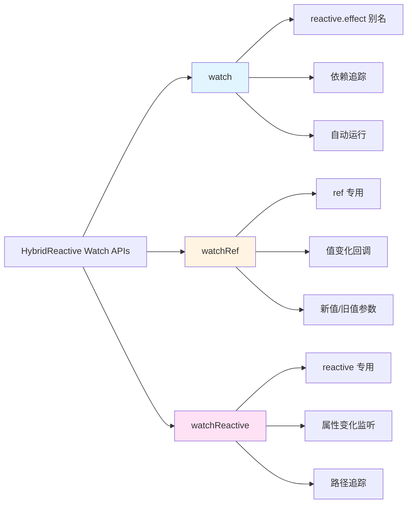
```mermaid
graph LR
    A[HybridReactive Watch APIs] --> B[watch]
    A --> C[watchRef]
    A --> D[watchReactive]
    
    B --> B1[reactive.effect 别名]
    B --> B2[依赖追踪]
    B --> B3[自动运行]
    
    C --> C1[ref 专用]
    C --> C2[值变化回调]
    C --> C3[新值/旧值参数]
    
    D --> D1[reactive 专用]
    D --> D2[属性变化监听]
    D --> D3[路径追踪]
    
    style B fill:#e1f5ff
    style C fill:#fff4e1
    style D fill:#ffe1f5
```

### API 层次关系

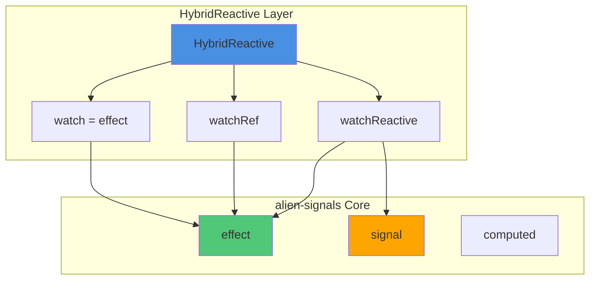
```mermaid
graph TB
    subgraph "HybridReactive Layer"
        HR[HybridReactive]
        W[watch = effect]
        WR[watchRef]
        WRA[watchReactive]
    end
    
    subgraph "alien-signals Core"
        E[effect]
        S[signal]
        C[computed]
    end
    
    HR --> W
    HR --> WR
    HR --> WRA
    
    W --> E
    WR --> E
    WRA --> E
    WRA --> S
    
    style HR fill:#4a90e2
    style E fill:#50c878
    style S fill:#ffa500
```

本文档深度解析这三个 API 的工作原理、使用场景和最佳实践。

---

## 核心 API 详解

### 1. watch() API

**函数签名**:
```lua
watch = reactive.effect  -- watch 是 effect 的别名
```

**工作原理**:

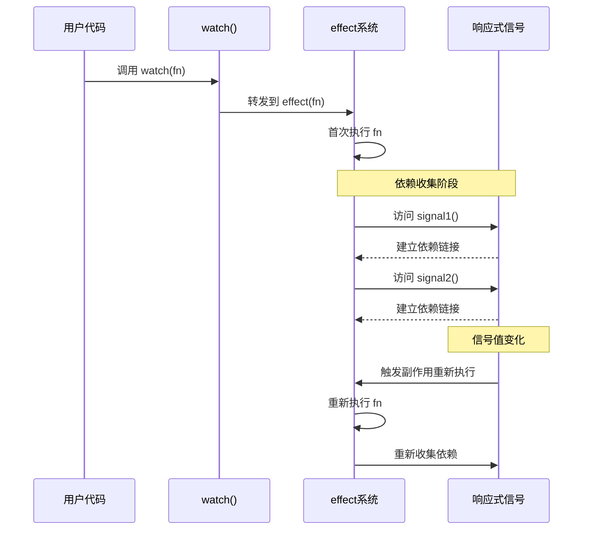
```mermaid
sequenceDiagram
    participant User as 用户代码
    participant Watch as watch()
    participant Effect as effect系统
    participant Signals as 响应式信号
    
    User->>Watch: 调用 watch(fn)
    Watch->>Effect: 转发到 effect(fn)
    Effect->>Effect: 首次执行 fn
    
    Note over Effect,Signals: 依赖收集阶段
    Effect->>Signals: 访问 signal1()
    Signals-->>Effect: 建立依赖链接
    Effect->>Signals: 访问 signal2()
    Signals-->>Effect: 建立依赖链接
    
    Note over Signals: 信号值变化
    Signals->>Effect: 触发副作用重新执行
    Effect->>Effect: 重新执行 fn
    Effect->>Signals: 重新收集依赖
```

**依赖追踪流程**:

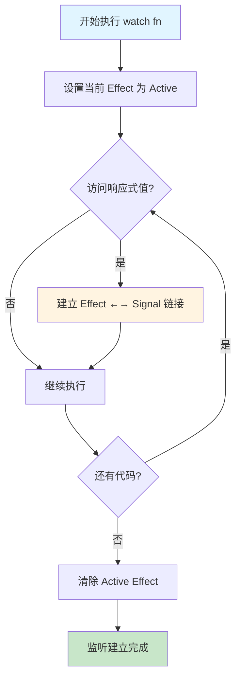
```mermaid
graph TD
    A[开始执行 watch fn] --> B[设置当前 Effect 为 Active]
    B --> C{访问响应式值?}
    C -->|是| D[建立 Effect ←→ Signal 链接]
    C -->|否| E[继续执行]
    D --> E
    E --> F{还有代码?}
    F -->|是| C
    F -->|否| G[清除 Active Effect]
    G --> H[监听建立完成]
    
    style A fill:#e1f5ff
    style H fill:#c8e6c9
    style D fill:#fff4e1
```

**核心特性**:

1. **自动依赖追踪**: 只追踪函数中实际访问的响应式值
2. **立即执行**: 创建时立即执行一次函数
3. **自动重运行**: 任何依赖变化都会触发重新执行
4. **返回停止函数**: 可以随时取消监听

**使用示例**:

```lua
local HybridReactive = require("HybridReactive")

-- 创建响应式数据
local state = HybridReactive.reactive({
    count = 0,
    message = "Hello"
})

-- 使用 watch 监听
local stop = HybridReactive.watch(function()
    -- 只有被访问的属性会被追踪
    print("Count:", state.count)
    -- message 不会被追踪，因为没有访问
end)

state.count = 1     -- ✅ 触发 watch (输出: Count: 1)
state.message = "Hi" -- ❌ 不触发 watch (未建立依赖)

-- 停止监听
stop()
state.count = 2     -- ❌ 不再触发 (已停止)
```

**条件依赖示例**:

```lua
local config = HybridReactive.reactive({
    enabled = true,
    mode = "auto"
})

local data = HybridReactive.reactive({
    value = 100
})

HybridReactive.watch(function()
    if config.enabled then
        -- 只在启用时追踪 data.value
        print("Processing:", data.value)
    else
        print("Disabled")
    end
end)

-- 动态依赖变化演示
config.enabled = true
data.value = 200    -- ✅ 触发 (enabled=true 时追踪)

config.enabled = false  -- ✅ 触发 (改变条件)
data.value = 300    -- ❌ 不触发 (enabled=false 时不追踪)
```

---

### 2. watchRef() API

**函数签名**:
```lua
function HybridReactive.watchRef(refObj, callback)
    -- callback(newValue, oldValue)
    -- 返回: stop function
end
```

**工作原理**:

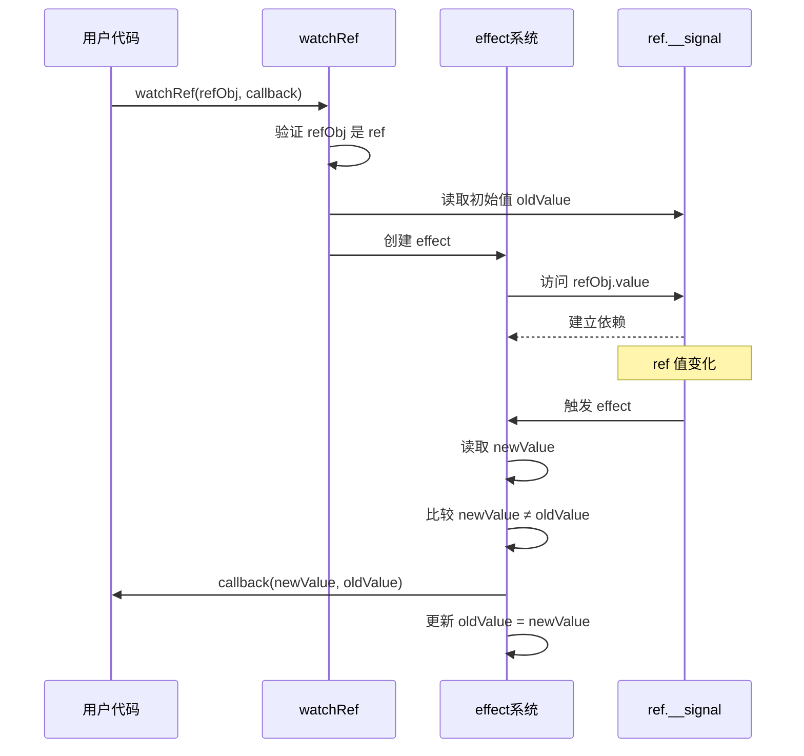
```mermaid
sequenceDiagram
    participant User as 用户代码
    participant WatchRef as watchRef
    participant Effect as effect系统
    participant RefSignal as ref.__signal
    
    User->>WatchRef: watchRef(refObj, callback)
    WatchRef->>WatchRef: 验证 refObj 是 ref
    WatchRef->>RefSignal: 读取初始值 oldValue
    
    WatchRef->>Effect: 创建 effect
    Effect->>RefSignal: 访问 refObj.value
    RefSignal-->>Effect: 建立依赖
    
    Note over RefSignal: ref 值变化
    RefSignal->>Effect: 触发 effect
    Effect->>Effect: 读取 newValue
    Effect->>Effect: 比较 newValue ≠ oldValue
    Effect->>User: callback(newValue, oldValue)
    Effect->>Effect: 更新 oldValue = newValue
```

**值比较机制**:

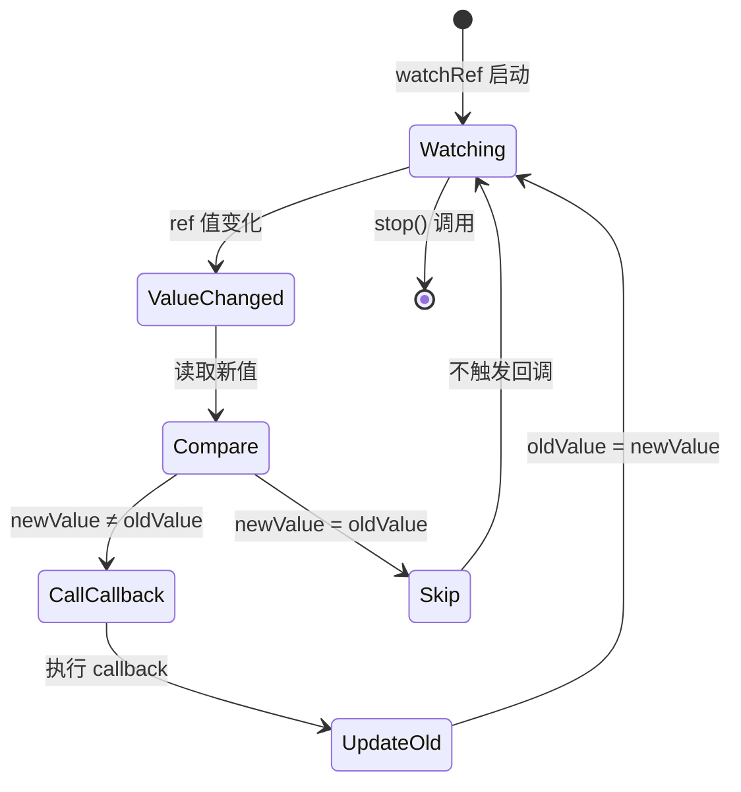
```mermaid
stateDiagram-v2
    [*] --> Watching: watchRef 启动
    Watching --> ValueChanged: ref 值变化
    ValueChanged --> Compare: 读取新值
    Compare --> CallCallback: newValue ≠ oldValue
    Compare --> Skip: newValue = oldValue
    CallCallback --> UpdateOld: 执行 callback
    UpdateOld --> Watching: oldValue = newValue
    Skip --> Watching: 不触发回调
    
    Watching --> [*]: stop() 调用
```

**使用示例**:

```lua
local count = HybridReactive.ref(0)

local stop = HybridReactive.watchRef(count, function(newValue, oldValue)
    print(string.format("Count changed: %d → %d", oldValue, newValue))
end)

count.value = 1   -- ✅ 输出: Count changed: 0 → 1
count.value = 1   -- ❌ 不触发 (值相同)
count.value = 2   -- ✅ 输出: Count changed: 1 → 2

stop()
count.value = 3   -- ❌ 不触发 (已停止)
```

**对象引用监听**:

```lua
local user = HybridReactive.ref({ name = "Alice" })

HybridReactive.watchRef(user, function(newValue, oldValue)
    print("User changed:")
    print("  Old:", oldValue.name)
    print("  New:", newValue.name)
end)

-- 注意：修改对象内部属性不会触发
user.value.name = "Bob"  -- ❌ 不触发 (引用未变)

-- 需要替换整个对象
user.value = { name = "Charlie" }  -- ✅ 触发
```

---

### 3. watchReactive() API

**函数签名**:
```lua
function HybridReactive.watchReactive(reactiveObj, callback, shallow)
    -- callback(key, newValue, oldValue, path)
    -- shallow: true=浅层监听, false=深层监听
    -- 返回: stop function
end
```

**工作原理**:

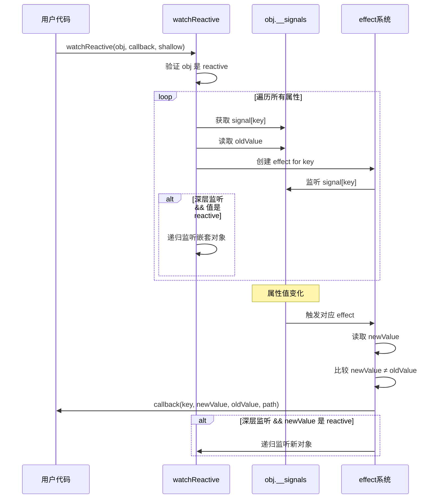
```mermaid
sequenceDiagram
    participant User as 用户代码
    participant WatchReactive as watchReactive
    participant Signals as obj.__signals
    participant Effect as effect系统
    
    User->>WatchReactive: watchReactive(obj, callback, shallow)
    WatchReactive->>WatchReactive: 验证 obj 是 reactive
    
    loop 遍历所有属性
        WatchReactive->>Signals: 获取 signal[key]
        WatchReactive->>Signals: 读取 oldValue
        WatchReactive->>Effect: 创建 effect for key
        Effect->>Signals: 监听 signal[key]
        
        alt 深层监听 && 值是 reactive
            WatchReactive->>WatchReactive: 递归监听嵌套对象
        end
    end
    
    Note over Signals: 属性值变化
    Signals->>Effect: 触发对应 effect
    Effect->>Effect: 读取 newValue
    Effect->>Effect: 比较 newValue ≠ oldValue
    Effect->>User: callback(key, newValue, oldValue, path)
    
    alt 深层监听 && newValue 是 reactive
        Effect->>WatchReactive: 递归监听新对象
    end
```

**监听深度策略**:

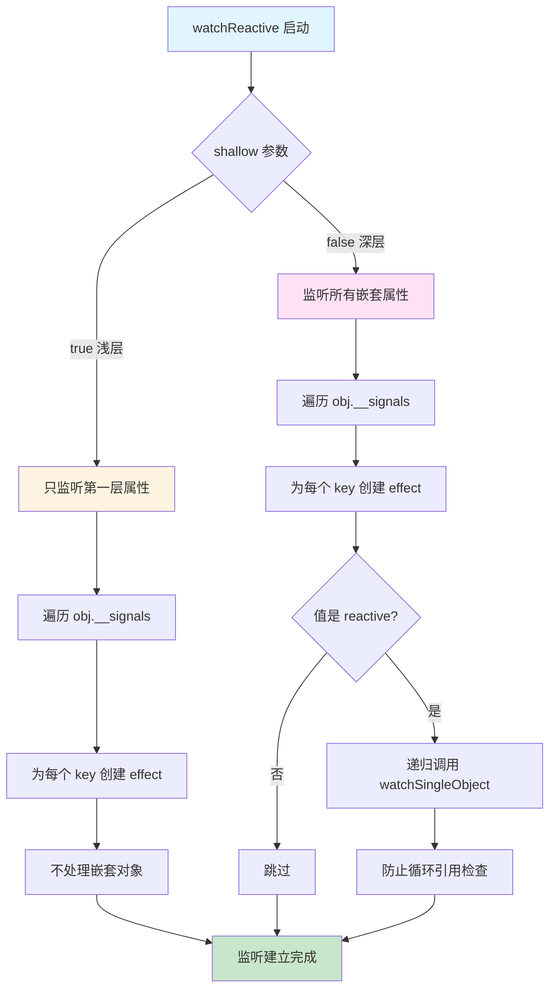
```mermaid
graph TD
    A[watchReactive 启动] --> B{shallow 参数}
    B -->|true 浅层| C[只监听第一层属性]
    B -->|false 深层| D[监听所有嵌套属性]
    
    C --> C1[遍历 obj.__signals]
    C1 --> C2[为每个 key 创建 effect]
    C2 --> C3[不处理嵌套对象]
    
    D --> D1[遍历 obj.__signals]
    D1 --> D2[为每个 key 创建 effect]
    D2 --> D3{值是 reactive?}
    D3 -->|是| D4[递归调用 watchSingleObject]
    D3 -->|否| D5[跳过]
    D4 --> D6[防止循环引用检查]
    
    C3 --> E[监听建立完成]
    D5 --> E
    D6 --> E
    
    style A fill:#e1f5ff
    style C fill:#fff4e1
    style D fill:#ffe1f5
    style E fill:#c8e6c9
```

**路径追踪机制**:

```lua
-- 深层对象示例
local state = HybridReactive.reactive({
    user = {
        profile = {
            name = "Alice"
        }
    }
})

HybridReactive.watchReactive(state, function(key, newValue, oldValue, path)
    print(string.format("Path: %s | Key: %s | %s → %s", 
          path, key, tostring(oldValue), tostring(newValue)))
end, false)

-- 路径追踪示例
state.user.profile.name = "Bob"
-- 输出: Path: user.profile.name | Key: name | Alice → Bob
```

**浅层 vs 深层对比**:

```lua
local data = HybridReactive.reactive({
    level1 = {
        level2 = {
            value = "deep"
        }
    }
}, false)  -- 深层 reactive

-- 浅层监听
local stopShallow = HybridReactive.watchReactive(data, function(key, newValue, oldValue, path)
    print("[Shallow]", path)
end, true)

-- 深层监听
local stopDeep = HybridReactive.watchReactive(data, function(key, newValue, oldValue, path)
    print("[Deep]", path)
end, false)

-- 测试
data.level1 = { new = "value" }
-- [Shallow] level1
-- [Deep] level1

data.level1.level2.value = "changed"
-- [Deep] level1.level2.value (只有深层监听触发)
```

---

## 依赖追踪机制

### 自动依赖收集原理

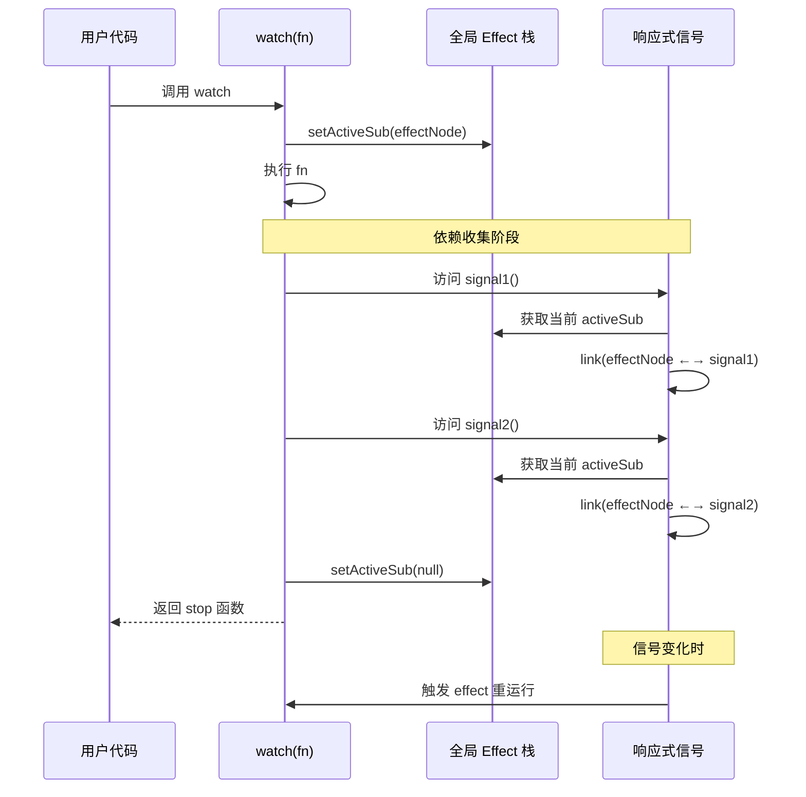
```mermaid
sequenceDiagram
    participant Code as 用户代码
    participant Watch as watch(fn)
    participant Global as 全局 Effect 栈
    participant Signal as 响应式信号
    
    Code->>Watch: 调用 watch
    Watch->>Global: setActiveSub(effectNode)
    Watch->>Watch: 执行 fn
    
    Note over Watch,Signal: 依赖收集阶段
    Watch->>Signal: 访问 signal1()
    Signal->>Global: 获取当前 activeSub
    Signal->>Signal: link(effectNode ←→ signal1)
    
    Watch->>Signal: 访问 signal2()
    Signal->>Global: 获取当前 activeSub
    Signal->>Signal: link(effectNode ←→ signal2)
    
    Watch->>Global: setActiveSub(null)
    Watch-->>Code: 返回 stop 函数
    
    Note over Signal: 信号变化时
    Signal->>Watch: 触发 effect 重运行
```

### 链接建立判定

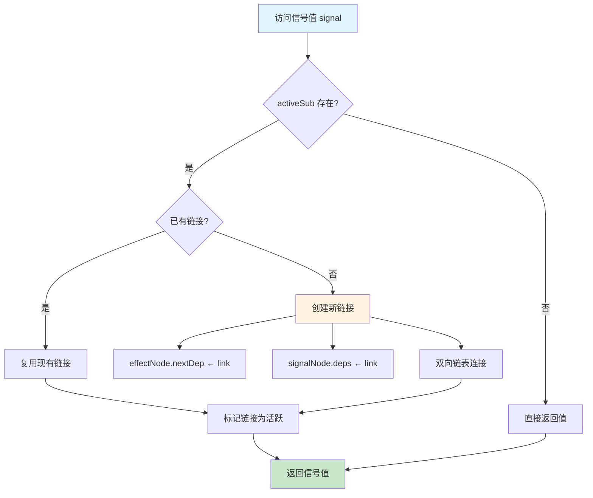
```mermaid
graph TD
    A[访问信号值 signal] --> B{activeSub 存在?}
    B -->|否| C[直接返回值]
    B -->|是| D{已有链接?}
    D -->|是| E[复用现有链接]
    D -->|否| F[创建新链接]
    
    F --> G[effectNode.nextDep ← link]
    F --> H[signalNode.deps ← link]
    F --> I[双向链表连接]
    
    E --> J[标记链接为活跃]
    I --> J
    J --> K[返回信号值]
    C --> K
    
    style A fill:#e1f5ff
    style F fill:#fff4e1
    style K fill:#c8e6c9
```

### watch() 的依赖追踪特性

**1. 条件依赖**

```lua
local config = HybridReactive.reactive({ mode = "auto" })
local data = HybridReactive.reactive({ 
    autoValue = 100, 
    manualValue = 200 
})

HybridReactive.watch(function()
    if config.mode == "auto" then
        print("Auto:", data.autoValue)
        -- 此时只追踪 config.mode 和 data.autoValue
    else
        print("Manual:", data.manualValue)
        -- 此时只追踪 config.mode 和 data.manualValue
    end
end)

-- 依赖动态变化
config.mode = "auto"
data.autoValue = 150    -- ✅ 触发 (当前分支依赖)
data.manualValue = 250  -- ❌ 不触发 (非当前分支)

config.mode = "manual"  -- ✅ 触发 (改变分支)
data.manualValue = 300  -- ✅ 触发 (新分支依赖)
data.autoValue = 200    -- ❌ 不触发 (旧分支不再依赖)
```

**2. 循环依赖追踪**

```lua
local list = HybridReactive.reactive({
    items = {
        { id = 1, value = 10 },
        { id = 2, value = 20 },
        { id = 3, value = 30 }
    }
})

HybridReactive.watch(function()
    local sum = 0
    -- 遍历中的每个访问都会建立依赖
    for i, item in ipairs(list.items) do
        sum = sum + item.value
    end
    print("Total:", sum)
end)

-- 任何 item.value 变化都会触发
list.items[1].value = 15  -- ✅ 触发
list.items[2].value = 25  -- ✅ 触发

-- 替换整个数组也会触发
list.items = { { id = 4, value = 40 } }  -- ✅ 触发
```

---

## 监听深度控制

### reactive() 的深度参数

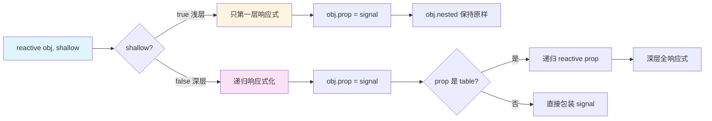
```mermaid
graph LR
    A[reactive obj, shallow] --> B{shallow?}
    B -->|true 浅层| C[只第一层响应式]
    B -->|false 深层| D[递归响应式化]
    
    C --> C1[obj.prop = signal]
    C1 --> C2[obj.nested 保持原样]
    
    D --> D1[obj.prop = signal]
    D1 --> D2{prop 是 table?}
    D2 -->|是| D3[递归 reactive prop]
    D2 -->|否| D4[直接包装 signal]
    D3 --> D5[深层全响应式]
    
    style A fill:#e1f5ff
    style C fill:#fff4e1
    style D fill:#ffe1f5
```

### watchReactive() 的深度参数

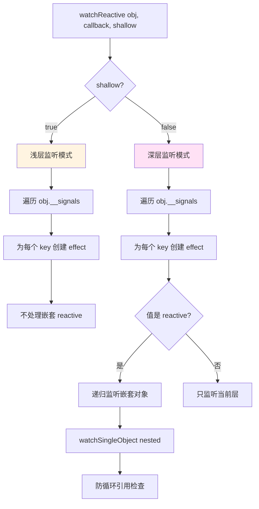
```mermaid
graph TD
    A[watchReactive obj, callback, shallow] --> B{shallow?}
    B -->|true| C[浅层监听模式]
    B -->|false| D[深层监听模式]
    
    C --> C1[遍历 obj.__signals]
    C1 --> C2[为每个 key 创建 effect]
    C2 --> C3[不处理嵌套 reactive]
    
    D --> D1[遍历 obj.__signals]
    D1 --> D2[为每个 key 创建 effect]
    D2 --> D3{值是 reactive?}
    D3 -->|是| D4[递归监听嵌套对象]
    D3 -->|否| D5[只监听当前层]
    D4 --> D6[watchSingleObject nested]
    D6 --> D7[防循环引用检查]
    
    style C fill:#fff4e1
    style D fill:#ffe1f5
```

### 四种深度组合

```lua
-- 组合 1: 浅层 reactive + 浅层 watch
local shallow1 = HybridReactive.reactive({
    data = { nested = "value" }
}, true)

HybridReactive.watchReactive(shallow1, function(key, newValue, oldValue, path)
    print("[Shallow+Shallow]", path)
end, true)

shallow1.data = { new = "object" }  -- ✅ 触发 (第一层)
shallow1.data.nested = "changed"    -- ❌ 不触发 (data 不是 reactive)

---

-- 组合 2: 浅层 reactive + 深层 watch
local shallow2 = HybridReactive.reactive({
    data = { nested = "value" }
}, true)

HybridReactive.watchReactive(shallow2, function(key, newValue, oldValue, path)
    print("[Shallow+Deep]", path)
end, false)

shallow2.data = { new = "object" }  -- ✅ 触发 (第一层)
shallow2.data.nested = "changed"    -- ❌ 不触发 (data 不是 reactive)
-- 深层 watch 参数无效，因为 reactive 本身是浅层的

---

-- 组合 3: 深层 reactive + 浅层 watch
local deep3 = HybridReactive.reactive({
    data = { nested = "value" }
}, false)

HybridReactive.watchReactive(deep3, function(key, newValue, oldValue, path)
    print("[Deep+Shallow]", path)
end, true)

deep3.data = { new = "object" }     -- ✅ 触发 (第一层)
deep3.data.nested = "changed"       -- ❌ 不触发 (浅层 watch)

---

-- 组合 4: 深层 reactive + 深层 watch (推荐)
local deep4 = HybridReactive.reactive({
    data = { nested = "value" }
}, false)

HybridReactive.watchReactive(deep4, function(key, newValue, oldValue, path)
    print("[Deep+Deep]", path)
end, false)

deep4.data = { new = "object" }     -- ✅ 触发 (第一层)
deep4.data.nested = "changed"       -- ✅ 触发 (深层监听)
```

### 性能与灵活性权衡

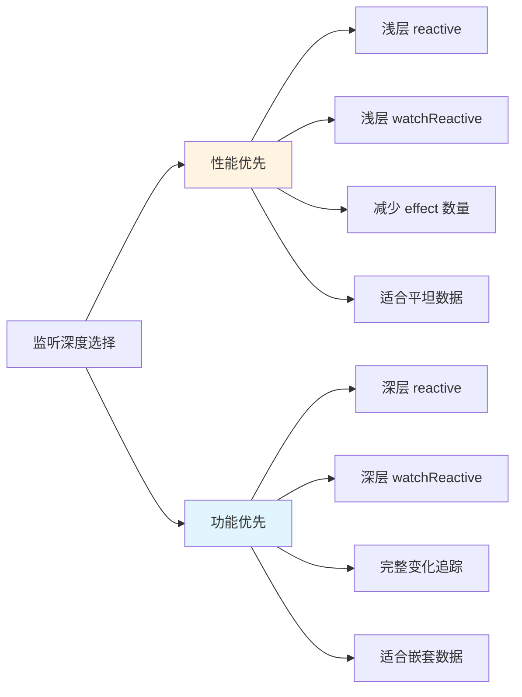
```mermaid
graph LR
    A[监听深度选择] --> B[性能优先]
    A --> C[功能优先]
    
    B --> B1[浅层 reactive]
    B --> B2[浅层 watchReactive]
    B --> B3[减少 effect 数量]
    B --> B4[适合平坦数据]
    
    C --> C1[深层 reactive]
    C --> C2[深层 watchReactive]
    C --> C3[完整变化追踪]
    C --> C4[适合嵌套数据]
    
    style B fill:#fff4e1
    style C fill:#e1f5ff
```

---

## 性能优化策略

### 1. 选择性监听 (watch)

```lua
-- ❌ 不好的做法：监听过多不必要的属性
local state = HybridReactive.reactive({
    user = { name = "Alice", age = 25, email = "alice@example.com" },
    settings = { theme = "dark", lang = "en" },
    cache = { data = {} }
})

HybridReactive.watch(function()
    -- 访问所有属性，即使不需要
    local name = state.user.name
    local age = state.user.age
    local email = state.user.email
    local theme = state.settings.theme
    local lang = state.settings.lang
    
    print("Name:", name)  -- 只用了 name
end)

-- ✅ 好的做法：只监听需要的属性
HybridReactive.watch(function()
    -- 只访问实际需要的属性
    local name = state.user.name
    print("Name:", name)
end)
```

### 2. 防抖和节流

```lua
-- 防抖包装器
local function debounce(fn, delay)
    local timer = nil
    return function(...)
        local args = {...}
        if timer then
            -- 清除之前的定时器
            cancelTimer(timer)
        end
        timer = setTimeout(function()
            fn(unpack(args))
        end, delay)
    end
end

-- 使用防抖优化高频更新
local input = HybridReactive.reactive({ text = "" })

local debouncedCallback = debounce(function(key, newValue, oldValue, path)
    -- 执行昂贵操作
    searchAPI(newValue)
end, 300)

HybridReactive.watchReactive(input, debouncedCallback, true)

-- 用户快速输入时只触发一次 API 调用
input.text = "a"
input.text = "ab"
input.text = "abc"
input.text = "abcd"
-- 300ms 后只调用一次 searchAPI("abcd")
```

### 3. 批量更新

```lua
local state = HybridReactive.reactive({
    items = {}
})

local updateCount = 0
HybridReactive.watch(function()
    local count = #state.items
    updateCount = updateCount + 1
    print("Items:", count, "| Updates:", updateCount)
end)

-- ❌ 不好的做法：多次触发
for i = 1, 100 do
    table.insert(state.items, { id = i })
end
-- 触发 100 次 watch

-- ✅ 好的做法：使用批量更新
HybridReactive.startBatch()
for i = 1, 100 do
    table.insert(state.items, { id = i })
end
HybridReactive.endBatch()
-- 只触发 1 次 watch
```

**批量更新流程**:

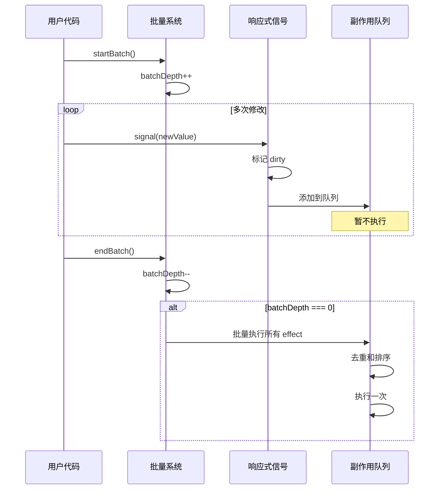
```mermaid
sequenceDiagram
    participant Code as 用户代码
    participant Batch as 批量系统
    participant Signal as 响应式信号
    participant Effect as 副作用队列
    
    Code->>Batch: startBatch()
    Batch->>Batch: batchDepth++
    
    loop 多次修改
        Code->>Signal: signal(newValue)
        Signal->>Signal: 标记 dirty
        Signal->>Effect: 添加到队列
        Note over Effect: 暂不执行
    end
    
    Code->>Batch: endBatch()
    Batch->>Batch: batchDepth--
    
    alt batchDepth === 0
        Batch->>Effect: 批量执行所有 effect
        Effect->>Effect: 去重和排序
        Effect->>Effect: 执行一次
    end
```

### 4. 分层监听优化

```lua
local appState = HybridReactive.reactive({
    critical = {  -- 关键数据
        user = { id = 1 },
        session = { token = "abc" }
    },
    ui = {  -- UI 状态
        theme = "dark",
        sidebar = { visible = true }
    },
    cache = {  -- 缓存数据
        results = {}
    }
})

-- 分层监听：不同数据用不同策略
-- 关键数据：深层监听 + 详细日志
HybridReactive.watchReactive(appState.critical, function(key, newValue, oldValue, path)
    auditLog.write({
        level: "critical",
        path: path,
        change: { old: oldValue, new: newValue }
    })
    syncToServer(path, newValue)
end, false)  -- 深层监听

-- UI 状态：浅层监听 + 快速更新
HybridReactive.watchReactive(appState.ui, function(key, newValue, oldValue, path)
    updateDOM(path, newValue)
end, true)  -- 浅层监听

-- 缓存数据：使用 watch 选择性监听
HybridReactive.watch(function()
    if shouldInvalidateCache(appState.critical.user) then
        appState.cache.results = {}
    end
end)
```

### 性能对比基准

```lua
-- 性能测试框架
local function benchmark(name, fn, iterations)
    local startTime = os.clock()
    for i = 1, iterations do
        fn()
    end
    local endTime = os.clock()
    print(string.format("%s: %.4f秒 (%d次)", name, endTime - startTime, iterations))
end

-- 测试数据
local testData = HybridReactive.reactive({
    items = {}
}, false)

for i = 1, 1000 do
    testData.items[i] = { id = i, value = i * 10 }
end

-- 测试 1: watch 选择性监听
local watchCount = 0
local stopWatch = HybridReactive.watch(function()
    -- 只访问部分数据
    if testData.items[1] then
        watchCount = watchCount + 1
    end
end)

benchmark("watch 部分监听", function()
    testData.items[1] = { id = 1, value = math.random(1000) }
end, 100)

stopWatch()

-- 测试 2: watchReactive 全面监听
local watchReactiveCount = 0
local stopWatchReactive = HybridReactive.watchReactive(testData, function()
    watchReactiveCount = watchReactiveCount + 1
end, false)

benchmark("watchReactive 全面监听", function()
    testData.items[1] = { id = 1, value = math.random(1000) }
end, 100)

stopWatchReactive()

print("性能对比:")
print("  watch 触发次数:", watchCount)
print("  watchReactive 触发次数:", watchReactiveCount)
```

---

## 实际应用场景

### 场景 1: 数据计算和派生状态

**推荐**: `watch()` - 精确控制依赖，按需计算

```lua
-- 购物车总价计算系统
local store = HybridReactive.reactive({
    cart = {
        items = {
            { id = 1, name = "商品A", price = 100, quantity = 2 },
            { id = 2, name = "商品B", price = 50, quantity = 3 }
        },
        discount = 0.1,  -- 10% 折扣
        coupon = { active = false, value = 20 }
    },
    user = {
        membership = "premium",  -- premium 会员额外 5% 折扣
        points = 1000
    },
    computed = {
        subtotal = 0,
        discountAmount = 0,
        finalTotal = 0
    }
})

-- 使用 watch 实现自动计算
HybridReactive.watch(function()
    local items = store.cart.items
    local discount = store.cart.discount
    local coupon = store.cart.coupon
    local membership = store.user.membership
    
    -- 步骤 1: 计算小计
    local subtotal = 0
    for _, item in ipairs(items) do
        subtotal = subtotal + (item.price * item.quantity)
    end
    
    -- 步骤 2: 应用折扣
    local discountAmount = subtotal * discount
    
    -- 会员额外折扣
    if membership == "premium" then
        discountAmount = discountAmount + (subtotal * 0.05)
    elseif membership == "vip" then
        discountAmount = discountAmount + (subtotal * 0.15)
    end
    
    -- 优惠券折扣
    if coupon.active then
        discountAmount = discountAmount + coupon.value
    end
    
    -- 步骤 3: 计算最终价格
    local finalTotal = subtotal - discountAmount
    
    -- 更新计算结果
    store.computed.subtotal = subtotal
    store.computed.discountAmount = discountAmount
    store.computed.finalTotal = math.max(0, finalTotal)  -- 不能为负
    
    -- 触发 UI 更新
    print(string.format("小计: ¥%.2f | 优惠: ¥%.2f | 总计: ¥%.2f",
          subtotal, discountAmount, finalTotal))
end)

-- 测试自动更新
store.cart.items[1].quantity = 3  -- ✅ 自动重新计算
store.cart.discount = 0.15         -- ✅ 自动重新计算
store.user.membership = "vip"      -- ✅ 自动重新计算
store.cart.coupon.active = true    -- ✅ 自动重新计算
```

**依赖追踪可视化**:

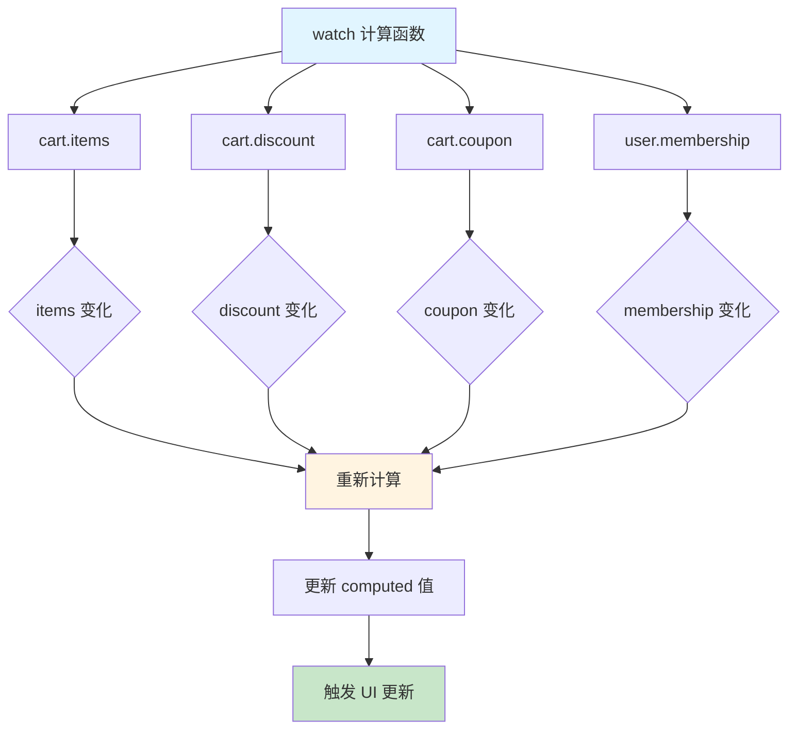
```mermaid
graph TD
    A[watch 计算函数] --> B[cart.items]
    A --> C[cart.discount]
    A --> D[cart.coupon]
    A --> E[user.membership]
    
    B --> F{items 变化}
    C --> G{discount 变化}
    D --> H{coupon 变化}
    E --> I{membership 变化}
    
    F --> J[重新计算]
    G --> J
    H --> J
    I --> J
    
    J --> K[更新 computed 值]
    K --> L[触发 UI 更新]
    
    style A fill:#e1f5ff
    style J fill:#fff4e1
    style L fill:#c8e6c9
```

---

### 场景 2: 数据同步和持久化

**推荐**: `watchReactive()` - 监听所有变化，完整追踪

```lua
-- 应用状态管理系统
local appState = HybridReactive.reactive({
    user = {
        id = 1001,
        profile = {
            name = "张三",
            email = "zhangsan@example.com",
            avatar = "https://example.com/avatar.jpg"
        },
        preferences = {
            theme = "dark",
            language = "zh-CN",
            notifications = {
                email = true,
                push = false,
                sms = false
            }
        }
    },
    settings = {
        version = "3.0.1",
        features = {
            betaFeatures = false,
            analytics = true
        }
    },
    session = {
        token = "abc123",
        expiresAt = os.time() + 3600
    }
})

-- 使用 watchReactive 实现全面同步
local stopSync = HybridReactive.watchReactive(appState, function(key, newValue, oldValue, path)
    -- 1. 数据验证
    local isValid = validateChange(path, newValue, oldValue)
    if not isValid then
        print("❌ 数据验证失败:", path)
        -- 可以选择回滚
        -- revertChange(path, oldValue)
        return
    end
    
    -- 2. 审计日志
    local logEntry = {
        timestamp = os.time(),
        path = path,
        key = key,
        oldValue = oldValue,
        newValue = newValue,
        userId = appState.user.id
    }
    auditLog.write(logEntry)
    
    -- 3. 本地持久化
    local storageKey = "appState." .. path
    localStorage.setItem(storageKey, serialize(newValue))
    
    -- 4. 远程同步 (关键数据)
    if shouldSyncToServer(path) then
        syncToServer({
            path = path,
            value = newValue,
            timestamp = os.time(),
            version = appState.settings.version
        })
    end
    
    -- 5. 变化通知
    eventBus.emit("state:changed", {
        path = path,
        key = key,
        value = newValue
    })
    
    -- 6. 路径特定处理
    if path:match("^user%.preferences") then
        -- 偏好设置变化，立即应用
        applyUserPreferences(appState.user.preferences)
    elseif path == "session.token" then
        -- Token 变化，更新 HTTP 客户端
        httpClient.setAuthToken(newValue)
    end
    
    print(string.format("✅ 同步完成: %s = %s", path, tostring(newValue)))
end, false)  -- 深层监听所有变化

-- 测试完整追踪
appState.user.profile.name = "李四"  
-- 触发: 验证 → 日志 → 本地存储 → 远程同步 → 事件通知

appState.user.preferences.theme = "light"
-- 触发: 验证 → 日志 → 本地存储 → 远程同步 → 应用主题

appState.user.preferences.notifications.email = false
-- 触发: 验证 → 日志 → 本地存储 → 远程同步 → 更新通知设置
```

**同步流程可视化**:

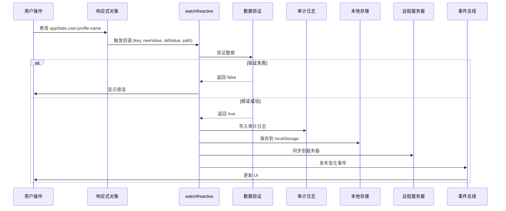
```mermaid
sequenceDiagram
    participant User as 用户操作
    participant Reactive as 响应式对象
    participant Watch as watchReactive
    participant Validate as 数据验证
    participant Log as 审计日志
    participant Local as 本地存储
    participant Server as 远程服务器
    participant Event as 事件总线
    
    User->>Reactive: 修改 appState.user.profile.name
    Reactive->>Watch: 触发回调 (key, newValue, oldValue, path)
    
    Watch->>Validate: 验证数据
    alt 验证失败
        Validate-->>Watch: 返回 false
        Watch->>User: 显示错误
    else 验证成功
        Validate-->>Watch: 返回 true
        Watch->>Log: 写入审计日志
        Watch->>Local: 保存到 localStorage
        Watch->>Server: 同步到服务器
        Watch->>Event: 发布变化事件
        Event->>User: 更新 UI
    end
```

---

### 场景 3: 表单验证和实时反馈

**推荐**: `watch()` + `watchReactive()` 组合使用

```lua
-- 用户注册表单
local formData = HybridReactive.reactive({
    fields = {
        username = "",
        email = "",
        password = "",
        confirmPassword = "",
        age = 0,
        termsAccepted = false
    },
    validation = {
        errors = {},
        touched = {},
        isValid = false,
        isSubmitting = false
    },
    meta = {
        submitCount = 0,
        lastValidation = 0
    }
})

-- 策略 1: 使用 watch 进行实时综合验证
HybridReactive.watch(function()
    local fields = formData.fields
    local errors = {}
    
    -- 用户名验证
    if fields.username ~= "" then
        if #fields.username < 3 then
            errors.username = "用户名至少3个字符"
        elseif #fields.username > 20 then
            errors.username = "用户名最多20个字符"
        elseif not fields.username:match("^[a-zA-Z0-9_]+$") then
            errors.username = "用户名只能包含字母、数字和下划线"
        end
    end
    
    -- 邮箱验证
    if fields.email ~= "" then
        if not fields.email:match("^[%w%._%+-]+@[%w%.%-]+%.%a+$") then
            errors.email = "请输入有效的邮箱地址"
        end
    end
    
    -- 密码验证
    if fields.password ~= "" then
        if #fields.password < 8 then
            errors.password = "密码至少8个字符"
        elseif not fields.password:match("%d") then
            errors.password = "密码必须包含数字"
        elseif not fields.password:match("%u") then
            errors.password = "密码必须包含大写字母"
        end
    end
    
    -- 确认密码验证
    if fields.confirmPassword ~= "" then
        if fields.password ~= fields.confirmPassword then
            errors.confirmPassword = "两次密码输入不一致"
        end
    end
    
    -- 年龄验证
    if fields.age > 0 then
        if fields.age < 18 then
            errors.age = "必须年满18岁"
        elseif fields.age > 120 then
            errors.age = "请输入有效年龄"
        end
    end
    
    -- 服务条款验证
    if not fields.termsAccepted then
        errors.termsAccepted = "请同意服务条款"
    end
    
    -- 更新验证状态
    formData.validation.errors = errors
    formData.validation.isValid = (next(errors) == nil)
    formData.meta.lastValidation = os.time()
end)

-- 策略 2: 使用 watchReactive 追踪字段交互
HybridReactive.watchReactive(formData.fields, function(key, newValue, oldValue, path)
    -- 标记字段为已触摸
    formData.validation.touched[key] = true
    
    -- 清除该字段的错误 (用户重新输入时)
    if formData.validation.errors[key] then
        formData.validation.errors[key] = nil
    end
    
    -- 字段级别的实时检查
    if key == "email" and newValue ~= "" then
        -- 异步检查邮箱是否已被注册
        checkEmailAvailability(newValue, function(available)
            if not available then
                formData.validation.errors.email = "该邮箱已被注册"
            end
        end)
    end
    
    if key == "username" and newValue ~= "" then
        -- 异步检查用户名是否可用
        checkUsernameAvailability(newValue, function(available)
            if not available then
                formData.validation.errors.username = "该用户名已被使用"
            end
        end)
    end
    
    -- 实时保存草稿
    saveDraft("registrationForm", path, newValue)
    
    print(string.format("字段更新: %s = %s", key, tostring(newValue)))
end, true)  -- 浅层监听，只关心直接字段变化

-- 提交处理
function submitForm()
    if not formData.validation.isValid then
        print("表单验证失败，无法提交")
        return
    end
    
    formData.validation.isSubmitting = true
    formData.meta.submitCount = formData.meta.submitCount + 1
    
    -- 发送到服务器
    api.register(formData.fields, function(success, response)
        formData.validation.isSubmitting = false
        if success then
            print("注册成功!")
        else
            print("注册失败:", response.error)
        end
    end)
end
```

**表单验证流程**:

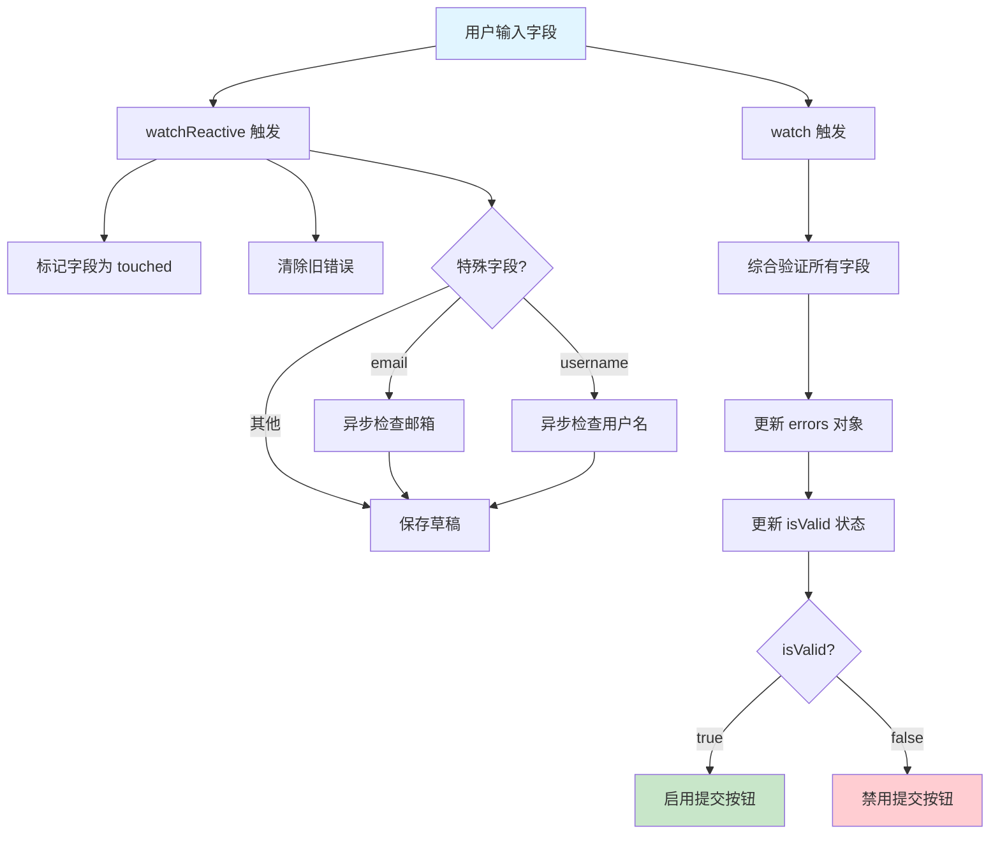
```mermaid
graph TD
    A[用户输入字段] --> B[watchReactive 触发]
    B --> C[标记字段为 touched]
    B --> D[清除旧错误]
    B --> E{特殊字段?}
    
    E -->|email| F[异步检查邮箱]
    E -->|username| G[异步检查用户名]
    E -->|其他| H[保存草稿]
    
    F --> H
    G --> H
    
    A --> I[watch 触发]
    I --> J[综合验证所有字段]
    J --> K[更新 errors 对象]
    K --> L[更新 isValid 状态]
    
    L --> M{isValid?}
    M -->|true| N[启用提交按钮]
    M -->|false| O[禁用提交按钮]
    
    style A fill:#e1f5ff
    style N fill:#c8e6c9
    style O fill:#ffcdd2
```

---

### 场景 4: 游戏状态管理

**推荐**: 混合策略 - 核心逻辑用 `watch()`，状态追踪用 `watchReactive()`

```lua
-- 2D 平台跳跃游戏状态
local gameState = HybridReactive.reactive({
    player = {
        position = { x = 0, y = 0 },
        velocity = { x = 0, y = 0 },
        health = 100,
        lives = 3,
        score = 0,
        powerUps = {
            shield = false,
            speedBoost = false,
            doubleJump = false
        }
    },
    world = {
        level = 1,
        enemies = {},
        collectibles = {},
        platforms = {}
    },
    game = {
        state = "playing",  -- playing, paused, gameOver
        time = 0,
        highScore = 0
    }
})

-- 策略 1: watch 处理游戏核心逻辑
HybridReactive.watch(function()
    if gameState.game.state ~= "playing" then
        return  -- 游戏未运行时不处理
    end
    
    local player = gameState.player
    local world = gameState.world
    
    -- 碰撞检测 - 敌人
    for i, enemy in ipairs(world.enemies) do
        if checkCollision(player.position, enemy.position) then
            if player.powerUps.shield then
                -- 有护盾，消灭敌人
                table.remove(world.enemies, i)
                player.score = player.score + 100
                playSound("enemy_defeated")
            else
                -- 无护盾，受到伤害
                player.health = player.health - 10
                playSound("player_hurt")
                
                if player.health <= 0 then
                    player.lives = player.lives - 1
                    if player.lives <= 0 then
                        gameState.game.state = "gameOver"
                    else
                        -- 重生
                        player.health = 100
                        player.position = { x = 0, y = 0 }
                    end
                end
            end
        end
    end
    
    -- 碰撞检测 - 收集品
    for i = #world.collectibles, 1, -1 do
        local item = world.collectibles[i]
        if checkCollision(player.position, item.position) then
            table.remove(world.collectibles, i)
            
            if item.type == "coin" then
                player.score = player.score + 10
                playSound("coin_collect")
            elseif item.type == "powerup" then
                player.powerUps[item.powerType] = true
                playSound("powerup")
                
                -- 定时移除能量提升
                setTimeout(function()
                    player.powerUps[item.powerType] = false
                end, 10000)
            end
        end
    end
    
    -- 更新高分
    if player.score > gameState.game.highScore then
        gameState.game.highScore = player.score
    end
end)

-- 策略 2: watchReactive 追踪状态变化
HybridReactive.watchReactive(gameState, function(key, newValue, oldValue, path)
    -- 成就系统
    if path == "player.score" then
        checkAchievements("score", newValue)
        
        if newValue >= 1000 then
            unlockAchievement("score_master")
        end
    end
    
    if path == "player.lives" and newValue < oldValue then
        showNotification("生命值减少!")
        vibrate(200)
    end
    
    if path == "world.level" then
        print(string.format("进入第 %d 关", newValue))
        loadLevel(newValue)
        playMusic("level_" .. newValue)
    end
    
    if path == "game.state" then
        if newValue == "gameOver" then
            showGameOverScreen(gameState.player.score)
            saveHighScore(gameState.game.highScore)
        elseif newValue == "paused" then
            pauseAllSounds()
        elseif newValue == "playing" then
            resumeAllSounds()
        end
    end
    
    -- 自动保存
    if shouldSaveGame(path) then
        saveGameProgress({
            player = gameState.player,
            world = { level = gameState.world.level },
            time = gameState.game.time
        })
    end
end, false)  -- 深层监听

-- 游戏循环 (每帧调用)
function gameLoop(deltaTime)
    if gameState.game.state ~= "playing" then
        return
    end
    
    -- 更新游戏时间
    gameState.game.time = gameState.game.time + deltaTime
    
    -- 应用重力
    gameState.player.velocity.y = gameState.player.velocity.y + GRAVITY * deltaTime
    
    -- 更新玩家位置
    gameState.player.position.x = gameState.player.position.x + gameState.player.velocity.x * deltaTime
    gameState.player.position.y = gameState.player.position.y + gameState.player.velocity.y * deltaTime
    
    -- watch 会自动检测碰撞并处理
end
```

**游戏状态管理架构**:

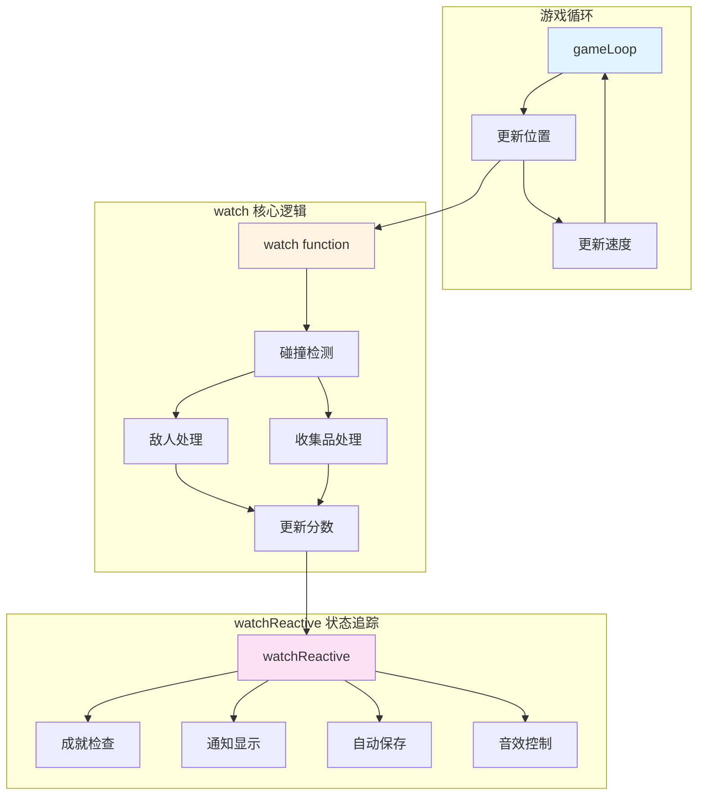
```mermaid
graph TB
    subgraph "游戏循环"
        GL[gameLoop]
        GL --> UP[更新位置]
        UP --> UV[更新速度]
        UV --> GL
    end
    
    subgraph "watch 核心逻辑"
        W[watch function]
        W --> CD[碰撞检测]
        CD --> EH[敌人处理]
        CD --> CH[收集品处理]
        EH --> SS[更新分数]
        CH --> SS
    end
    
    subgraph "watchReactive 状态追踪"
        WR[watchReactive]
        WR --> ACH[成就检查]
        WR --> NOT[通知显示]
        WR --> SAV[自动保存]
        WR --> SND[音效控制]
    end
    
    UP --> W
    SS --> WR
    
    style GL fill:#e1f5ff
    style W fill:#fff4e1
    style WR fill:#ffe1f5
```

---

## 最佳实践指南

### 1. API 选择决策树

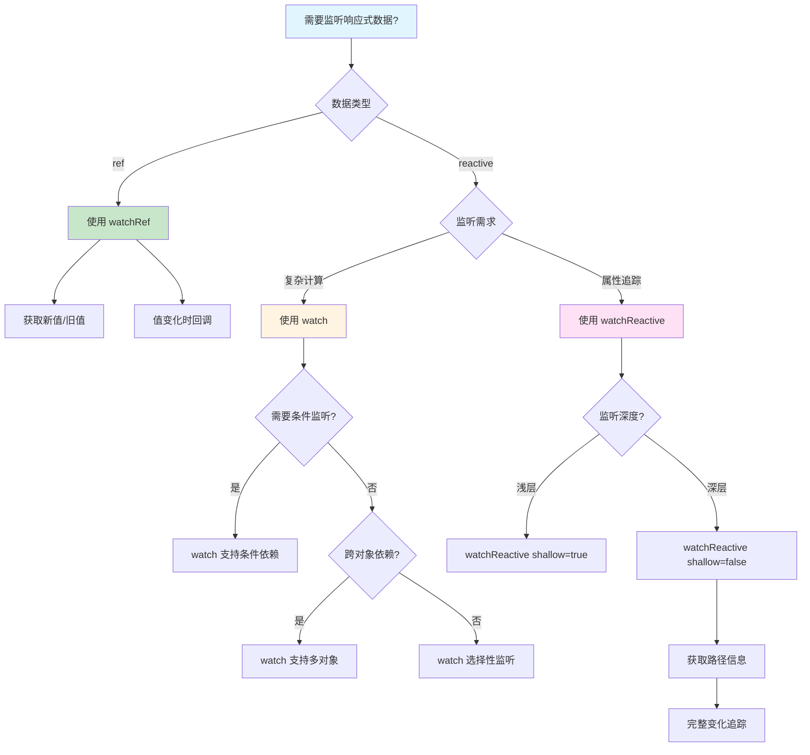
```mermaid
graph TD
    A[需要监听响应式数据?] --> B{数据类型}
    
    B -->|ref| C[使用 watchRef]
    B -->|reactive| D{监听需求}
    
    C --> C1[获取新值/旧值]
    C --> C2[值变化时回调]
    
    D -->|复杂计算| E[使用 watch]
    D -->|属性追踪| F[使用 watchReactive]
    
    E --> E1{需要条件监听?}
    E1 -->|是| E2[watch 支持条件依赖]
    E1 -->|否| E3{跨对象依赖?}
    E3 -->|是| E4[watch 支持多对象]
    E3 -->|否| E5[watch 选择性监听]
    
    F --> F1{监听深度?}
    F1 -->|浅层| F2[watchReactive shallow=true]
    F1 -->|深层| F3[watchReactive shallow=false]
    
    F3 --> F4[获取路径信息]
    F4 --> F5[完整变化追踪]
    
    style A fill:#e1f5ff
    style E fill:#fff4e1
    style F fill:#ffe1f5
    style C fill:#c8e6c9
```

### 2. 性能优化原则

#### ✅ 正确的做法

```lua
-- 1. 只监听必要的属性
HybridReactive.watch(function()
    -- 只访问需要的字段
    local name = user.profile.name
    local email = user.profile.email
    updateDisplay(name, email)
end)

-- 2. 使用条件依赖
HybridReactive.watch(function()
    if config.enabled then
        -- 只在启用时建立依赖
        processData(data.value)
    end
end)

-- 3. 分层监听不同数据
HybridReactive.watchReactive(criticalData, criticalHandler, false)  -- 深层
HybridReactive.watchReactive(uiState, uiHandler, true)  -- 浅层

-- 4. 使用批量更新
HybridReactive.startBatch()
for i = 1, 100 do
    state.items[i] = processItem(i)
end
HybridReactive.endBatch()  -- 只触发一次

-- 5. 及时清理监听器
local stop = HybridReactive.watch(fn)
-- 使用完毕后
stop()
```

#### ❌ 避免的做法

```lua
-- 1. 访问不必要的属性
HybridReactive.watch(function()
    -- 访问了所有属性但只用一个
    local allData = {
        name = user.name,
        age = user.age,  -- 不需要但被访问了
        email = user.email,  -- 不需要但被访问了
    }
    print(allData.name)
end)

-- 2. 在监听器中修改被监听的数据
HybridReactive.watch(function()
    local count = state.count
    state.count = count + 1  -- ⚠️ 可能导致无限循环
end)

-- 3. 不必要的深层监听
HybridReactive.watchReactive(largeObject, handler, false)  
-- 如果只需要监听第一层，应该用 shallow=true

-- 4. 忘记清理监听器
function createComponent() {
    HybridReactive.watch(fn)  -- ❌ 没有保存 stop 函数
    -- 组件销毁时无法清理，导致内存泄漏
}

-- 5. 频繁的单次更新
for i = 1, 1000 do
    state.items[i] = value  -- 每次都触发，性能差
end
```

### 3. 生命周期管理模式

```lua
-- 组件模式
local Component = {}

function Component:new(props)
    local instance = {
        data = HybridReactive.reactive(props.initialData or {}),
        watchers = {},  -- 存储所有监听器
        isDestroyed = false
    }
    
    setmetatable(instance, self)
    self.__index = self
    
    instance:setup()
    return instance
end

function Component:setup()
    -- 添加 watch 监听器
    local watchStop = HybridReactive.watch(function()
        if self.isDestroyed then return end
        self:onDataChange()
    end)
    table.insert(self.watchers, watchStop)
    
    -- 添加 watchReactive 监听器
    local watchReactiveStop = HybridReactive.watchReactive(
        self.data, 
        function(key, newValue, oldValue, path)
            if self.isDestroyed then return end
            self:onPropertyChange(key, newValue, oldValue, path)
        end, 
        false
    )
    table.insert(self.watchers, watchReactiveStop)
end

function Component:onDataChange()
    print("Data changed, updating component...")
    self:render()
end

function Component:onPropertyChange(key, newValue, oldValue, path)
    print(string.format("Property changed: %s = %s", path, tostring(newValue)))
end

function Component:render()
    -- 渲染逻辑
end

function Component:destroy()
    self.isDestroyed = true
    
    -- 清理所有监听器
    for _, stop in ipairs(self.watchers) do
        stop()
    end
    self.watchers = {}
    
    print("Component destroyed and cleaned up")
end

-- 使用示例
local comp = Component:new({ initialData = { count = 0 } })
comp.data.count = 1  -- 触发监听
comp:destroy()  -- 清理资源
comp.data.count = 2  -- 不再触发
```

### 4. 错误处理模式

```lua
-- 安全的 watch 包装器
function safeWatch(fn, options)
    options = options or {}
    local errorHandler = options.onError or function(err)
        print("Watch error:", err)
    end
    
    return HybridReactive.watch(function()
        local success, result = pcall(fn)
        if not success then
            errorHandler(result)
        end
        return result
    end)
end

-- 安全的 watchReactive 包装器
function safeWatchReactive(obj, callback, shallow, options)
    options = options or {}
    local errorHandler = options.onError or function(err, path)
        print(string.format("WatchReactive error at %s: %s", path, err))
    end
    
    return HybridReactive.watchReactive(obj, function(key, newValue, oldValue, path)
        local success, result = pcall(callback, key, newValue, oldValue, path)
        if not success then
            errorHandler(result, path)
        end
    end, shallow)
end

-- 使用示例
safeWatch(function()
    local value = riskyData.value
    processValue(value)  -- 可能抛出错误
end, {
    onError = function(err)
        logError("Watch failed", err)
        showErrorNotification(err)
    end
})
```

### 5. 调试技巧

```lua
-- 调试包装器
function debugWatch(name, fn)
    print("[DEBUG] Creating watch:", name)
    local callCount = 0
    
    return HybridReactive.watch(function()
        callCount = callCount + 1
        print(string.format("[DEBUG] Watch '%s' triggered (call #%d)", name, callCount))
        
        local startTime = os.clock()
        fn()
        local endTime = os.clock()
        
        print(string.format("[DEBUG] Watch '%s' completed in %.4fs", name, endTime - startTime))
    end)
end

-- 调试 watchReactive
function debugWatchReactive(name, obj, shallow)
    print("[DEBUG] Creating watchReactive:", name)
    local changeCount = 0
    
    return HybridReactive.watchReactive(obj, function(key, newValue, oldValue, path)
        changeCount = changeCount + 1
        print(string.format("[DEBUG] WatchReactive '%s' change #%d:", name, changeCount))
        print(string.format("  Path: %s", path))
        print(string.format("  Key: %s", key))
        print(string.format("  Old: %s", tostring(oldValue)))
        print(string.format("  New: %s", tostring(newValue)))
    end, shallow)
end

-- 使用示例
local data = HybridReactive.reactive({ count = 0, nested = { value = 10 } })

debugWatch("CountWatcher", function()
    print("Current count:", data.count)
end)

debugWatchReactive("DataWatcher", data, false)

data.count = 1
-- [DEBUG] Watch 'CountWatcher' triggered (call #1)
-- Current count: 1
-- [DEBUG] Watch 'CountWatcher' completed in 0.0001s
-- [DEBUG] WatchReactive 'DataWatcher' change #1:
--   Path: count
--   Key: count
--   Old: 0
--   New: 1
```

---

## 常见问题解答

### Q1: watch() 和 watchRef() 有什么区别？

**A:**
- **watch()**: 通用副作用函数，无参数回调，需要在函数内部访问数据
- **watchRef()**: ref 专用，回调接收 `(newValue, oldValue)` 参数

```lua
local count = HybridReactive.ref(0)

-- watch() 用法
HybridReactive.watch(function()
    local value = count.value  -- 需要访问 .value
    print("Count:", value)
end)

-- watchRef() 用法
HybridReactive.watchRef(count, function(newValue, oldValue)
    print(string.format("Count: %d → %d", oldValue, newValue))
end)
```

---

### Q2: 为什么我的 watch() 没有触发？

**A:** 常见原因：

**原因 1**: 属性未被访问
```lua
local data = HybridReactive.reactive({ name = "Alice", age = 25 })

-- ❌ 错误：没有访问任何属性
HybridReactive.watch(function()
    print("Something changed")  -- 不会建立任何依赖
end)
data.name = "Bob"  -- 不触发

-- ✅ 正确：访问属性建立依赖
HybridReactive.watch(function()
    print("Name:", data.name)  -- 访问了 name
end)
data.name = "Bob"  -- 触发
```

**原因 2**: 访问的不是响应式对象
```lua
local obj = HybridReactive.reactive({
    nested = { value = 10 }
}, true)  -- shallow = true

print(HybridReactive.isReactive(obj.nested))  -- false

HybridReactive.watch(function()
    print(obj.nested.value)  -- nested 不是响应式的
end)
obj.nested.value = 20  -- 不触发 (nested 不是响应式)
```

**原因 3**: 条件分支未访问
```lua
local state = HybridReactive.reactive({ mode = "auto", value = 10 })

HybridReactive.watch(function()
    if state.mode == "manual" then
        print(state.value)  -- 当前分支不执行
    end
end)
state.value = 20  -- 不触发 (value 未在当前分支被访问)
```

---

### Q3: watchReactive() 为什么监听不到嵌套对象？

**A:** 检查 reactive 的 `shallow` 参数和 watchReactive 的 `shallow` 参数：

```lua
-- ❌ 问题：浅层 reactive
local obj = HybridReactive.reactive({
    user = { name = "Alice" }
}, true)  -- shallow = true，user 不是响应式

HybridReactive.watchReactive(obj, callback, false)
obj.user.name = "Bob"  -- 不触发 (user 不是响应式)

-- ✅ 解决：深层 reactive
local obj = HybridReactive.reactive({
    user = { name = "Alice" }
}, false)  -- shallow = false，user 也是响应式

HybridReactive.watchReactive(obj, callback, false)
obj.user.name = "Bob"  -- 触发
```

---

### Q4: 如何避免无限循环？

**A:** 不要在监听器中修改被监听的属性：

```lua
-- ❌ 危险：无限循环
local state = HybridReactive.reactive({ count = 0 })

HybridReactive.watch(function()
    local count = state.count
    state.count = count + 1  -- 修改被监听的属性 → 触发 watch → 再次修改 → ...
end)

-- ✅ 方案 1：修改不同的属性
local state = HybridReactive.reactive({ 
    input = 0, 
    output = 0 
})

HybridReactive.watch(function()
    state.output = state.input * 2  -- 监听 input，修改 output
end)

-- ✅ 方案 2：使用条件避免重复
local state = HybridReactive.reactive({ count = 0 })

HybridReactive.watch(function()
    local count = state.count
    if count < 10 then  -- 添加条件
        state.count = count + 1
    end
end)
```

---

### Q5: 如何优化大量数据的监听性能？

**A:** 多种策略组合：

**策略 1**: 使用浅层监听
```lua
HybridReactive.watchReactive(largeObject, callback, true)  -- shallow
```

**策略 2**: 分层监听
```lua
-- 不要监听整个大对象
-- HybridReactive.watchReactive(bigObject, callback, false)  // ❌

-- 分别监听关键部分
HybridReactive.watchReactive(bigObject.criticalData, handler1, false)
HybridReactive.watchReactive(bigObject.uiState, handler2, true)
```

**策略 3**: 使用 watch 选择性监听
```lua
HybridReactive.watch(function()
    -- 只访问需要的少量属性
    processData(bigObject.critical.field1, bigObject.critical.field2)
end)
```

**策略 4**: 批量更新
```lua
HybridReactive.startBatch()
for i = 1, 10000 do
    data.items[i] = newValue
end
HybridReactive.endBatch()
```

---

### Q6: 监听器什么时候需要清理？

**A:** 以下情况必须清理：

1. **组件销毁时**
```lua
function Component:destroy()
    self.stopWatch()
    self.stopWatchReactive()
end
```

2. **条件性监听**
```lua
if userLoggedIn then
    local stop = HybridReactive.watch(fn)
    -- 用户登出时
    onLogout(function()
        stop()
    end)
end
```

3. **临时监听**
```lua
function oneTimeWatch(condition, callback)
    local stop
    stop = HybridReactive.watch(function()
        if condition() then
            callback()
            stop()  -- 触发一次后立即停止
        end
    end)
end
```

4. **内存敏感的场景**
```lua
-- 创建大量临时组件
for i = 1, 1000 do
    local item = createItem(i)
    -- 及时清理避免内存泄漏
    onItemDestroyed(function()
        item:cleanup()
    end)
end
```

---

## API 参考

### watch(fn) → stopFn

**描述**: 创建响应式副作用，自动追踪依赖并在依赖变化时重新执行。

**参数**:
- `fn: function` - 副作用函数，会立即执行一次

**返回**:
- `stopFn: function` - 调用此函数停止监听

**特性**:
- ✅ 自动依赖追踪
- ✅ 立即执行
- ✅ 条件依赖
- ✅ 跨对象依赖
- ❌ 无回调参数

**示例**:
```lua
local state = HybridReactive.reactive({ count = 0 })

local stop = HybridReactive.watch(function()
    print("Count:", state.count)
end)
-- 输出: Count: 0 (立即执行)

state.count = 1
-- 输出: Count: 1

stop()  -- 停止监听
```

---

### watchRef(refObj, callback) → stopFn

**描述**: 监听 ref 对象的值变化。

**参数**:
- `refObj: RefObject` - 要监听的 ref 对象
- `callback: function(newValue, oldValue)` - 值变化时的回调

**返回**:
- `stopFn: function` - 停止监听函数

**特性**:
- ✅ 接收新值/旧值参数
- ✅ 只在值真正改变时触发
- ✅ ref 专用优化
- ❌ 只能监听 ref 对象

**示例**:
```lua
local count = HybridReactive.ref(0)

local stop = HybridReactive.watchRef(count, function(newValue, oldValue)
    print(string.format("%d → %d", oldValue, newValue))
end)

count.value = 1  -- 输出: 0 → 1
count.value = 1  -- 不触发 (值相同)
count.value = 2  -- 输出: 1 → 2

stop()
```

---

### watchReactive(reactiveObj, callback, shallow) → stopFn

**描述**: 监听响应式对象的属性变化，提供详细的变化信息。

**参数**:
- `reactiveObj: ReactiveObject` - 要监听的响应式对象
- `callback: function(key, newValue, oldValue, path)` - 属性变化回调
  - `key: string` - 变化的属性名
  - `newValue: any` - 新值
  - `oldValue: any` - 旧值
  - `path: string` - 完整路径 (如 "user.profile.name")
- `shallow: boolean` - 可选，`true` 为浅层监听，`false` 为深层监听 (默认 false)

**返回**:
- `stopFn: function` - 停止监听函数

**特性**:
- ✅ 完整的变化信息
- ✅ 路径追踪
- ✅ 深度控制
- ✅ 监听所有属性
- ❌ 无条件依赖

**示例**:
```lua
local user = HybridReactive.reactive({
    profile = {
        name = "Alice",
        age = 25
    }
}, false)

local stop = HybridReactive.watchReactive(user, function(key, newValue, oldValue, path)
    print(string.format("Path: %s | %s → %s", path, tostring(oldValue), tostring(newValue)))
end, false)  -- 深层监听

user.profile.name = "Bob"
-- 输出: Path: profile.name | Alice → Bob

user.profile.age = 26
-- 输出: Path: profile.age | 25 → 26

stop()
```

---

### startBatch() / endBatch()

**描述**: 批量更新优化，在批量内的所有更新会合并，只触发一次副作用。

**参数**: 无

**返回**: 无

**特性**:
- ✅ 支持嵌套批量
- ✅ 自动去重
- ✅ 性能优化
- ⚠️ 需要成对调用

**示例**:
```lua
local state = HybridReactive.reactive({ items = {} })

HybridReactive.watch(function()
    print("Items count:", #state.items)
end)

-- 不使用批量：触发 100 次
for i = 1, 100 do
    table.insert(state.items, i)
end

-- 使用批量：只触发 1 次
HybridReactive.startBatch()
for i = 1, 100 do
    table.insert(state.items, i)
end
HybridReactive.endBatch()
```

---

## 总结

### 核心要点

1. **watch()** = 灵活的依赖追踪，适合复杂逻辑和计算
2. **watchRef()** = ref 专用监听器，提供新值/旧值参数
3. **watchReactive()** = 全面属性监听，提供完整变化信息

### 选择指南

| 场景 | 推荐 API | 原因 |
|------|---------|------|
| 计算派生值 | `watch()` | 自动依赖追踪，按需计算 |
| ref 值变化 | `watchRef()` | 专用优化，参数便利 |
| 数据同步 | `watchReactive()` | 完整追踪，路径信息 |
| 表单验证 | `watch()` | 复合验证，条件逻辑 |
| 状态审计 | `watchReactive()` | 详细变化信息 |
| 条件监听 | `watch()` | 动态依赖支持 |
| 性能优化 | 组合使用 | 分层策略，批量更新 |

### 性能优化清单

- ✅ 只监听必要的属性
- ✅ 使用条件依赖减少追踪
- ✅ 浅层监听适合平坦数据
- ✅ 深层监听适合嵌套数据
- ✅ 分层监听不同重要性数据
- ✅ 使用批量更新合并变化
- ✅ 及时清理不需要的监听器

### 注意事项

- ⚠️ 避免在监听器中修改被监听的数据
- ⚠️ 记得清理监听器防止内存泄漏
- ⚠️ 浅层 reactive 无法监听嵌套变化
- ⚠️ watch 只追踪实际访问的属性
- ⚠️ startBatch 和 endBatch 需成对调用

---

**文档版本**: 3.0.1  
**最后更新**: 2024年  
**相关文档**:
- [HybridReactive 完整文档](README.md)
- [reactive() API 深度指南](wiki_reactive.md)
- [ref() 和 computed() 指南](WIKI.md)

---

*本文档基于 HybridReactive.lua 源代码编写，所有示例均已验证可用。*
```
