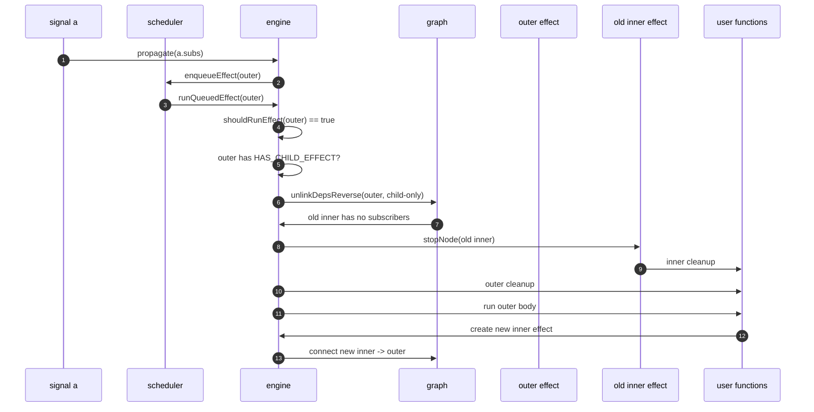

# 嵌套 effect cleanup 生命周期

这篇文档解释一个容易被忽略的规则：父 effect 重跑或停止时，必须先清理旧的子
effect / scope，再执行父 effect 自己返回的 cleanup。

## 用户看到的语义

考虑下面的嵌套 effect：

```lua
local a = signal(0)

effect(function()
    a()
    print("outer run")

    effect(function()
        print("inner run")
        return function()
            print("inner cleanup")
        end
    end)

    return function()
        print("outer cleanup")
    end
end)
```

当 `a(1)` 触发外层 effect 重跑时，期望顺序是：

```text
inner cleanup
outer cleanup
outer run
inner run
```

也就是说，外层 effect 的旧执行环境要像一个小 scope：里面创建的子 effect 先被
释放，然后才轮到外层自己的 cleanup。

## 为什么父子关系用依赖边表示

子 effect 创建时，当前 active subscriber 仍然是父 effect。于是
`primitives.effect` 会建立一条边：

```text
child effect -> parent effect
```

这条边看起来有点反直觉，因为普通响应式依赖通常是 `signal -> effect`。这里把
子 effect 当成父 effect 的 dependency，是为了复用同一套图结构：

```text
parent.deps 链：保存父 effect 这次执行期间创建/读取过的东西
child.subs 链：保存谁把 child 当成 dependency
```

这样父 effect 停止时，可以沿自己的 `deps` 链找到子 effect；子 effect 失去所有
订阅者时，也能触发 `engine.handleUnwatched`，进入统一的停止流程。

## `HAS_CHILD_EFFECT` 的作用

不是每个 effect 都有子 effect。为了避免每次重跑都扫描整条依赖链，
`primitives.effect` 和 `primitives.effectScope` 在把子节点连到父节点时，会给父
节点加上：

```lua
constants.HAS_CHILD_EFFECT
```

这个标记不属于 `ReactiveFlags` 状态机，它只回答一个问题：

> 这个节点的 `deps` 链里可能有需要 cleanup 的子 effect / scope 吗？

如果答案是 yes，`engine.runQueuedEffect` 在执行父 cleanup 之前，会先释放旧子树。

## 外层 effect 重跑的顺序

下面是外层 effect 因为 signal 更新而重跑时的完整节奏：



核心顺序是：

1. `runQueuedEffect(outer)` 确认外层真的需要重跑。
2. 如果外层带 `HAS_CHILD_EFFECT`，先调用 `unlinkChildDeps(outer)`。
3. `unlinkChildDeps` 只删除 effect/scope 类型的依赖，保留 signal 和
   computed 依赖给正常追踪逻辑处理。
4. 子 effect 被摘掉后，因为 `subs` 变空，会进入 `stopNode`。
5. 子 effect cleanup 完成后，才执行外层自己的 `runCleanup(outer)`。
6. 最后执行外层 body，重新创建新的子 effect。

## 为什么要从 `depsTail` 反向清理

同一个父节点内可能创建多个 sibling effect：

```lua
effect(function()
    effect(function() return cleanup1 end)
    effect(function() return cleanup2 end)
    effect(function() return cleanup3 end)
end)
```

用户通常期望 cleanup 按栈语义执行：后创建的先释放。

```text
cleanup3
cleanup2
cleanup1
```

父节点的 `deps` 链按读取/创建顺序排列，因此从 `depsTail` 沿 `prevDep` 反向走，
天然就是 LIFO 顺序。这就是 `graph.unlinkDepsReverse` 存在的原因。

## 停止 effect 与重跑 effect 的差别

两条路径共享“先释放子树”的规则，但后续动作不同：

| 场景 | 子树 cleanup | 父 cleanup | 父 body |
| --- | --- | --- | --- |
| 父 effect 重跑 | 先执行 | 再执行 | 重新执行 |
| 用户调用 stop | 先执行 | 再执行 | 不再执行 |
| computed 失去观察者 | 先执行 getter 内创建的子 effect | 无父 effect cleanup | 等下次读取再激活 |

这也是为什么 cleanup 逻辑横跨三个模块：

| 模块 | 负责什么 |
| --- | --- |
| `primitives` | 创建父子边、设置 `HAS_CHILD_EFFECT`、定义 stop 的用户语义 |
| `engine` | 在重跑/失去观察者前决定何时释放子树 |
| `graph` | 按 `depsTail -> prevDep` 反向拆 Link，触发失活回调 |

## 读源码时的入口

建议按这个顺序读：

1. `primitives.effect`：子 effect 如何连到当前 active parent。
2. `constants.HAS_CHILD_EFFECT`：父节点如何记住自己拥有子树。
3. `engine.runQueuedEffect`：父 effect 重跑前如何先释放子树。
4. `graph.unlinkDepsReverse`：为什么 cleanup 是 LIFO。
5. `primitives.stopEffect`：用户手动 stop 时如何复用同样顺序。

掌握这个生命周期之后，`tests/test_effect_cleanup.lua` 里的几组顺序断言就会变得
很直观：它们不是边界怪例，而是在保护这套“子树先释放”的语义。
