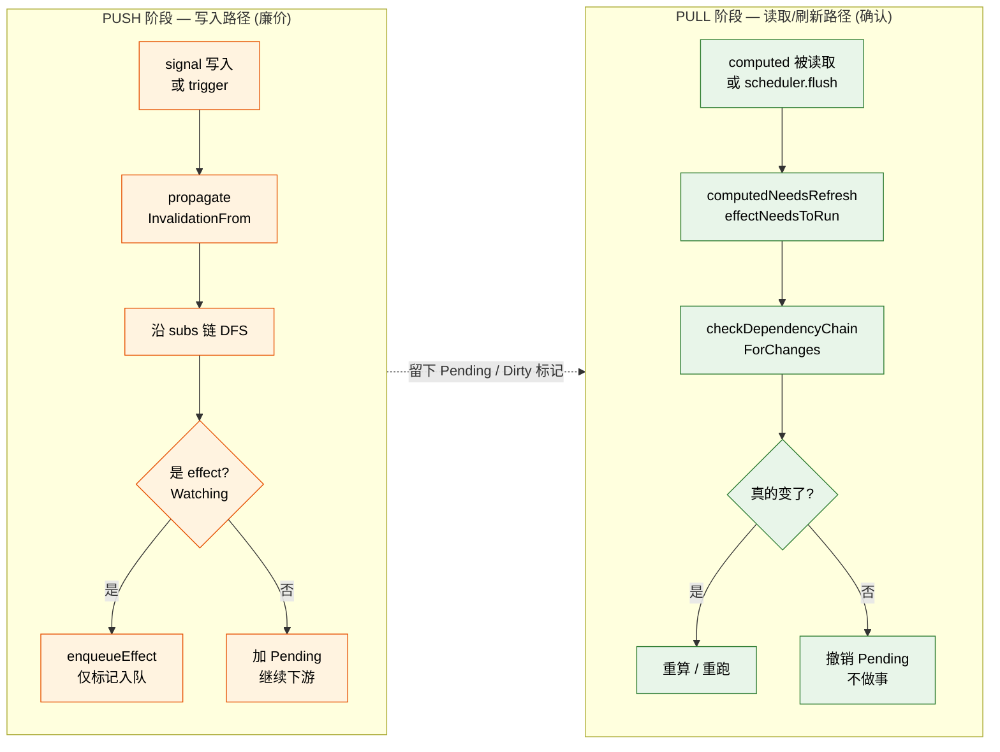
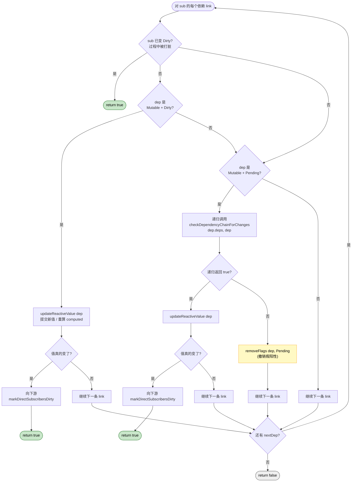

# `engine.lua` — 响应式核心算法

## 设计动机

`engine` 是整套系统的算法层。它要回答三个核心问题：

1. **谁在读？** —— 当前的 active subscriber 是谁，读到的依赖该连给谁。
2. **谁会脏？** —— signal 写入后，沿下游图传播哪些 "可能脏" 标记。
3. **真的脏了吗？** —— 在 computed 被读取 / effect 被刷新时，逐链确认
   "可能脏" 是否变成 "确实脏"。

把这三件事独立成一个模块，意味着 `primitives.lua` 创建节点时不需要重复
写传播/检查逻辑；而 `graph.lua` 与 `scheduler.lua` 也无需理解业务语义。

## 内部状态

```lua
local activeSubscriber = nil      -- 当前正在追踪依赖的订阅者
local runDepth         = 0        -- 嵌套 effect/computed 的层数
local trackingVersion  = 0        -- 单调递增的追踪世代号
local stopInactiveNode = no-op    -- primitives 注入的"停止 effect/scope"回调
```

## 公共算法概览

### 1. activeSub 追踪 — "读到的依赖该连给谁"

- `setActiveSub(sub)` / `getActiveSub()`：核心可重入开关，进入一个 effect/
  computed/trigger 前替换 active 订阅者，返回旧值供恢复。
- `callWithSubscriber(sub, fn)`：在 `pcall` 里推/弹 active subscriber，
  同时增减 `runDepth`。返回 `(ok, result)`，错误传给调用方决定如何处理。
- `trackDependencyRead(dep)`：当 `activeSubscriber` 存在时，把
  `dep → activeSubscriber` 这条边交给 `graph.connectDependencyToSubscriber`，
  并带上当前的 `trackingVersion`。
- `beginFreshTracking(sub, baseFlags, advanceVersion)` /
  `finishFreshTracking(sub)`：effect/computed 重跑的标准包裹流程——
  推进 version、置空 `depsTail`、加 `RecursedCheck`；跑完后摘掉
  `RecursedCheck`，并调用 `graph.removeStaleDependencyLinks` 清旧依赖。

### 2. 失效传播 — `propagateInvalidationFrom`（PUSH 阶段）

写入一个 signal 之后，要把 "可能脏" 沿下游图扩散到所有可达节点。这里**不做
重算**，只做"标记 + 入队"，留待之后真正读取时再决定要不要重算。

#### PUSH vs PULL 全景对比

整个响应式系统的运行节奏可以拆成两个阶段，分别由不同入口触发：



PUSH 阶段只做最便宜的"打标"和"入队"，**不调用任何 getter**；PULL 阶段在真正
需要值的时候才沿 `deps` 链回溯确认。这种分离让 "先写新值再写回旧值"
之类的瞬时波动不会触发任何下游重算。

#### 单步决策：`decidePropagationForSubscriber(sub, link, isWriteInsideRun)`

按以下顺序判断，命中即返回：

1. 该 subscriber **不可追踪**（既不 Mutable、也不 Watching、也未入队）：
   返回 `None`，不传播。
2. 该 subscriber **完全干净** (`PROPAGATION_GUARD_FLAGS` 全 0)：加上
   `Pending`，如果是"在 effect 重跑过程中触发的写入"，再加 `Recursed`。
   返回原 flags，调用方据此决定是否继续向下游扩散。
3. 该 subscriber 已被传播过且没有任何递归相关标记：返回 `None`，跳过。
4. 该 subscriber 不在 `RecursedCheck` 中：撤掉 `Recursed`、加上 `Pending`，
   继续传播。
5. 该 subscriber 在 `RecursedCheck` 中、还不脏，且本次 link 落在
   `linkIsInsideCurrentDependencyPrefix` 范围内：补上 `Recursed | Pending`，
   仅当它是 Mutable 时才向下游继续传播。
6. 否则不传播。

#### 单步动作：`processOneInvalidatedSubscriber`

- 若决策结果含 `Watching` —— 把 effect 入队 (`scheduler.enqueueEffect`)。
- 若决策结果含 `Mutable` —— 返回 `subscriber.subs` 作为"下一层 link"，让
  外层循环继续向下扩散。

#### 外层遍历：手写显式栈代替递归

`propagateInvalidationFrom` 用 `currentLink` / `nextLink` / `stack` 三个变量
实现深度优先遍历。深入到下游时，把当前层级的 `nextLink` 推入栈，回溯时再
弹回。这避免了真递归带来的 Lua 栈深限制，也方便在错误情况下断点调试。

### 3. 脏值检查 — `checkDependencyChainForChanges`（PULL 阶段）

`Pending` 是写入路径上留下的低成本标记，不代表 "值真的变了"。脏值检查就是
**把 `Pending` 落实为 `Dirty` 或者撤回**。沿 `subscriber.deps` 顺链行走，
对每个依赖按下图分支：



关键观察：

- **首次发现"真的变了"就立即返回 true**，不需要再看后面的 link——调用方
  （`computedNeedsRefresh` / `effectNeedsToRun`）会据此决定重算。
- **递归路径上 Pending 可能被撤销**：上游 computed 标了 Pending 不代表它真的
  会输出新值；如果递归发现它的所有上游都没变，就直接 `removeFlags(Pending)`，
  让自己的下游也无需再被惊动。这就是"先写新值再写回旧值"零成本的原因。
- **重算后还要 `markDirectSubscribersDirty`**：把"可能脏 (Pending)"升级为
  "确认脏 (Dirty)"，避免下游的下一次 pull 再走一遍递归。

### 4. 节点重算

- `commitSignalValue` —— 把 `pendingValue` 落到 `currentValue`，返回是否
  变化。值相等时不触发下游。
- `updateComputedValue` —— 用 `beginFreshTracking` 包裹 getter 调用，
  失败时给节点打上 `Dirty` 以便下次仍尝试重跑，再 `error` 上抛。
- `runComputedForTheFirstTime` —— 首次激活 lazy computed；和 update 的差别在
  不推进 `trackingVersion`（首次还没有"上一轮"可比较）。
- `runEffectBody` / `runCleanup` / `runScheduledEffect` —— effect 的完整
  重跑流程；`runScheduledEffect` 是注入给 `scheduler` 的入口函数。

### 5. 资源回收 — `handleNodeWithoutSubscribers`

由 `graph` 在依赖源 `subs` 变为空时回调：

- 非 Mutable 节点（effect / scope）：调用 `stopInactiveNode(node)` 真正停掉。
- Mutable 节点（computed）：保留对象但清掉自己的 `depsTail` 与上游依赖，
  转回 "lazy + dirty" 状态，等待下次被读取时再激活。

## 模块协作 (注入点)

启动末尾两行：

```lua
scheduler.setRunEffectHandler(engine.runScheduledEffect)
graph.setUnwatchedHandler(engine.handleNodeWithoutSubscribers)
```

把 `engine` 的回调函数注入到 `scheduler` 与 `graph`。`primitives` 启动末尾
再把 `stopEffectScopeNode` 注入到 `engine.setStopInactiveNodeHandler`，
形成完整的协作环。这种"模块自带默认 no-op + 由更高层注入真实实现"
的模式让每个模块都可以被单独 require、单独测试。

## 模块间依赖关系

- **依赖**：`bit`、`constants`、`graph`、`scheduler`。
- **被依赖**：`primitives`、`init`。
- **反向注入**：`engine.runScheduledEffect → scheduler`、
  `engine.handleNodeWithoutSubscribers → graph`、
  `primitives.stopEffectScopeNode → engine`。

## 关键细节回顾

- **`runDepth` 的用途**：`primitives.signal` 写入时调用
  `engine.isInsideReactiveRun()` 来判定 "本次写入是否发生在 effect 重跑过程
  中"，并把结果传给 `propagateInvalidationFrom`，决定是否在传播路径上
  补 `Recursed` 标志。
- **`trackingVersion` 为什么是全局递增？** 它必须跨节点共享，才能让
  `graph.connectDependencyToSubscriber` 在"同一次重跑内同一依赖被读两次"
  时去重。
- **错误恢复**：每个外部调用 (`updateComputedValue` / `runEffectBody` /
  `runCleanup`) 都把 `activeSubscriber` 与 `runDepth` 在 `callWithSubscriber`
  内恢复，确保即使 user code 抛错，全局追踪上下文也不会泄漏。
