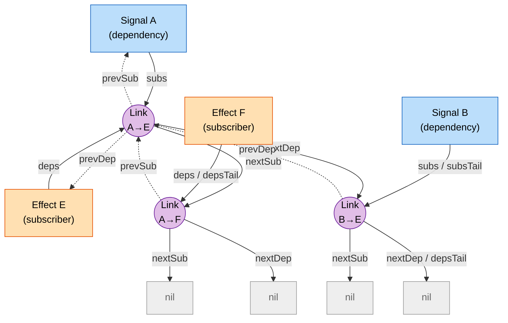
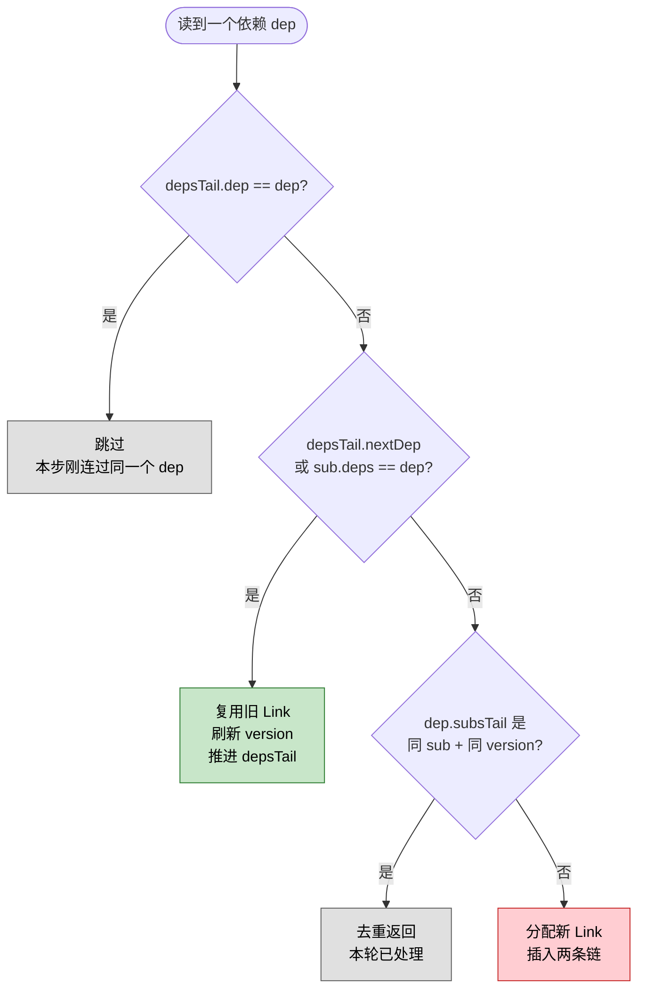

# `graph.lua` — 双向链表依赖图

## 设计动机

响应式系统的"图"在概念上是 *依赖源 → 订阅者* 的多对多关系。要既能"从依赖源
找到所有订阅者"（写入时传播失效）、又能"从订阅者找到所有依赖源"（重跑时
清理旧依赖），自然就需要双向索引。

`alien-signals` 选择的实现方式是：**每条边由一个 `Link` 节点表示，且这个
`Link` 同时挂在两条双向链表上**。这样：

- 增加/删除一条边都是 O(1)；
- 不需要 hashmap 这种动态分配的容器，极大降低 GC 压力；
- 在 effect 重跑时可以按"读取顺序"原地复用上一轮的 Link，做"零分配增量更新"。

`graph.lua` 只关心"如何连接节点"，对节点本身是 signal、computed、effect、scope
还是临时 subscriber 完全无感知。

## 关键数据结构：Link 节点

```lua
{
    version = <integer>,      -- 用于增量追踪去重
    dep     = <dependency>,   -- 这条边指向的依赖源节点
    sub     = <subscriber>,   -- 这条边指向的订阅者节点
    prevSub, nextSub,         -- 在 dep.subs 链上的前/后指针
    prevDep, nextDep,         -- 在 sub.deps 链上的前/后指针
}
```

### Link 作为"桥梁"：同时存在于两条链上

每一个 `Link` 同时属于两条互相正交的双向链表。下面的图展示了 2 个依赖源
(`Signal A` / `Signal B`) 被同一个 `Effect E` 订阅，同时 `Signal A` 还被
`Effect F` 订阅的场景，一共生成 3 个 Link：



实线箭头是 `next*` 方向，虚线箭头是 `prev*` 方向。可以看到：

- **横向（subs 链）**：每个 `Signal` 通过 `subs / subsTail` 串起所有订阅自己
  的 Link，遍历方向用 `prevSub` / `nextSub`。写入信号时沿这条链向下游传播。
- **纵向（deps 链）**：每个 `Effect` 通过 `deps / depsTail` 串起自己读到过的
  所有 Link，遍历方向用 `prevDep` / `nextDep`。重跑 effect 时沿这条链识别
  并清理"上一轮读过、本轮没再读"的旧依赖。
- **Link 本身就是两条链的交点**：摘除一个 Link 必须同时切断 4 条指针，
  否则任一侧都会留下悬挂引用。

对应的"矩阵视图"也能直观看出 Link 的桥梁作用：

```
                    Effect E (subs)         Effect F (subs)
                    deps 链 ↓               deps 链 ↓
                  ┌─────────────────┐     ┌─────────────────┐
Signal A  subs ──►│   Link(A→E)     │────►│   Link(A→F)     │──► nil
(横向 subs 链)    └────────┬────────┘     └────────┬────────┘
                            │ nextDep              │ nextDep
                            ▼                      ▼
                  ┌─────────────────┐
Signal B  subs ──►│   Link(B→E)     │──► nil    (Effect F 没订阅 B)
                  └────────┬────────┘
                            │ nextDep
                            ▼
                           nil
```

- `dependency.subs` / `subsTail` —— 一个依赖源的所有订阅者，按订阅时间排列。
- `subscriber.deps` / `depsTail` —— 一个订阅者的所有依赖源，按**读取顺序**排列。

`depsTail` 是订阅者侧链的"游标"。effect/computed 重跑前会被置 nil，重跑过程中
每读到一个依赖，`depsTail` 都会前进一步。读取结束后，`depsTail.nextDep` 之后
残留的所有 Link 就是"本轮没再被读到的旧依赖"，可被清理。

## 内部逻辑

### `createLink(dep, sub, prevSub, nextSub, prevDep, nextDep)`

朴素的构造函数。`version = 0` 是初始值，调用方随后会写入当前 `trackingVersion`。

### `connectDependencyToSubscriber(dep, sub, version)` — 增量复用算法

这是 graph 模块里最微妙的函数。核心思想：**effect 重跑时，依赖的读取顺序
往往与上一轮一致；如果一致，就原地复用上一轮的 Link，不分配新对象**。

执行路径（自上而下命中即返回）：

1. `depsTail` 已经指向 `dep`：当前读到的依赖就是上一步刚连过的，跳过。
2. `depsTail.nextDep`（或 `sub.deps`，当 `depsTail` 为 nil 时）刚好指向 `dep`：
   说明读取顺序与上一轮一致，**直接把游标推进到旧 Link，并刷新它的 `version`**。
   这是"零分配"的快路径。
3. `dep.subsTail` 是同一 subscriber + 同一 version：本轮已经处理过，去重返回。
4. 以上都不命中：分配新 Link，分别插入到两条链上。



绿色分支是高频热路径（effect 重跑时依赖顺序不变），红色分支才会真正分配
新 Link。

### `removeDependencyLink(link, explicitSubscriber?)`

双向链表方案最需要谨慎的地方：**只拆一边会留下悬挂引用**，下一轮传播或清理
就会跑到一个已经无效的订阅者上。函数严格执行四步：

1. 在 `subscriber.deps` 链上接通 `link.prevDep ↔ link.nextDep`。
2. 在 `dependency.subs` 链上接通 `link.prevSub ↔ link.nextSub`。
3. 清空 `link` 自身的四个指针，方便 GC。
4. 如果 `dependency.subs == nil`，回调 `onDependencyBecameUnwatched(dep)`，
   通知上层算法（`engine.handleNodeWithoutSubscribers`）该依赖源已无观察者，
   可以停掉它自己的依赖。

返回 `nextDependencyLink`，方便 `removeStaleDependencyLinks` 顺链清理。

### `removeStaleDependencyLinks(sub)`

按规则起点：

- 如果本轮读到过依赖，则从 `depsTail.nextDep` 开始；
- 如果本轮一个依赖都没读，则从 `sub.deps` 开始（整条链都过时了）。

然后调用 `removeDependencyLink` 顺序拆除。

### `linkIsInsideCurrentDependencyPrefix(link, sub)`

从 `sub.depsTail` 沿 `prevDep` 向前找，看 `link` 是不是落在"已经被本轮重新
追踪过的前缀"里。`engine` 在判断"是否要把一个正在追踪中的 subscriber 标记
为 Recursed+Pending"时用到——只有当传入的 link 已经被本轮覆盖时，才会
继续向下传播失效，否则只会留待之后的脏值检查。

### `setUnwatchedHandler(handler)`

允许 `engine` 注入"依赖源失去全部订阅者时该做什么"的钩子。这是 `engine` →
`graph` 反向依赖的唯一通道，保证 `graph` 本身不需要 `require("engine")`。
默认值是 no-op，方便单测 `graph` 时无副作用。

## 模块间依赖关系

- **依赖**：无（甚至不依赖 `constants`，因为 graph 只摆指针、不读 flags）。
- **被依赖**：`engine`、`primitives`。`scheduler` 不直接使用 graph。
- **反向回调**：`engine.handleNodeWithoutSubscribers` 通过
  `graph.setUnwatchedHandler` 注入。

## 关键细节回顾

- **`version` 字段的作用**：它和 `trackingVersion` 共同实现"同一次重跑里
  同一依赖只追踪一次"。任意一次写入或追踪都会推进版本号，避免误判。
- **`subsTail` 与 `depsTail` 不对称**：`subsTail` 始终指向最后一个订阅者
  （仅追加场景），`depsTail` 在 effect 重跑时被当作游标使用，含义不同。
- **不抛错原则**：graph 的所有函数都不抛错，所有失败情形都通过返回 nil
  或保留旧状态表达，便于在 `engine.callWithSubscriber` 的 pcall 里安全调用。
