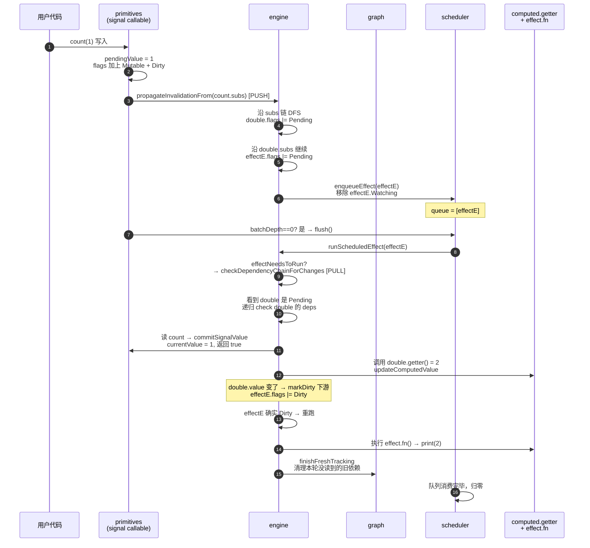

# `primitives.lua` — 用户侧响应式 API

## 设计动机

`primitives` 是面向用户的"成品层"。它的目标是：

- 提供与原版 `alien-signals` 完全一致的 API；
- 不在用户代码里暴露 Link、ReactiveFlags、trackingVersion 之类的实现概念；
- 让每个原语的实现都尽量薄，把脏值检查、传播、调度交给 `engine` 与
  `scheduler`，避免业务行为漂移。

模块本身只做两件事：

1. 创建对应节点（按 `constants.*_MARKER` 区分身份）。
2. 用 `constants.bind(operation, node)` 把闭包返回给用户，并把闭包反向登记
   到 `functionToNode` 表里，使 `isSignal` 等判断成为常数时间查表。

## 用户原语

### `signal(initialValue)` → callable

返回的 callable 同时承担 getter 与 setter：

- **读 (`s()`)**：若节点处于 `Dirty`，先 `commitSignalValue` 把 `pendingValue`
  落到 `currentValue`，并对直接下游 `markDirectSubscribersDirty`；
  再调用 `engine.trackDependencyRead(signalNode)` 把自己挂到当前
  activeSubscriber 的依赖链上；最后返回 `currentValue`。
- **写 (`s(v)`)**：值相同直接 no-op；值不同时把 `pendingValue` 改为新值，
  加 `Mutable | Dirty` 标志，若 `subs` 非空就触发
  `propagateInvalidationFrom` + 视 `batchDepth` 决定是否 `flush`。

注意 setter 并不立即写 `currentValue`——这让 effect 在 batch 内观察到的值
始终是 "本次读取时的最新值"，而不是中间某个临时状态。

### `computed(getter)` → callable

节点初始 `flags = None`，处于"懒态"。读取时分两条路径：

- `computedNeedsRefresh` 返回 true：调用 `updateComputedValue(node, true)`，
  把旧值作为参数传给 getter；若新值变了，对下游 `markDirectSubscribersDirty`。
- 节点 `isInactive`（首次被读）：调用 `runComputedForTheFirstTime`，
  不带旧值地执行 getter，并把结果存进 `value`。

之后必然调用 `trackDependencyRead(node)`，让 computed 自己成为
activeSubscriber 的依赖。

### `effect(fn)` → stop callable

- 创建节点时直接设上 `Watching | RecursedCheck`，使首次执行就走"重跑"路径。
- 如果当前 active subscriber 存在（嵌套场景），调用
  `graph.connectDependencyToSubscriber(effectNode, parent, 0)` 把当前 effect
  作为 dependency 挂到父 subscriber 上——这条边是父子关系的物理体现，
  也是 `scheduler.enqueueEffect` 沿 `subs` 链上收集嵌套 effect 的依据。
  同时给父节点加上 `HAS_CHILD_EFFECT`，让父节点重跑或停止时先释放旧子树。
- 用 `callWithSubscriber` 在 `pcall` 里执行 `fn`：返回值若是函数，作为下次
  重跑前/停止时的 cleanup 保存到 `effectNode.cleanup`。
- 失败时调用 `stopEffectScopeNode` 把节点彻底拆除并上抛错误。
- 返回 `bind(stopEffectNode, effectNode)`：用户调用即停止 effect、运行 cleanup。

### `effectScope(fn)` → stop callable

scope 是"批量管理子 effect 的容器"，自己不重跑：

- 节点 `flags = Mutable`，使其可作为子 effect 的 dependency 而被收集。
- `setActiveSub(scopeNode)` 让 `fn` 内部创建的所有 effect 都把 scope 作为
  parent；执行完毕后无论成败都恢复旧 activeSubscriber。
- 返回的 stop callable 会清空 scope 自己的依赖与所有子订阅者
  （子 effect 在被 `graph.removeDependencyLink` 摘除后，因 subs 变空触发
  `engine.handleNodeWithoutSubscribers` → `stopInactiveNode` →
  `stopEffectNode` 链式停止并运行 cleanup）。

### `trigger(fn)` — 手动失效

用于"setter 看不到的变化"（例如就地修改 signal 内部的 table）：

1. 构造一个临时 subscriber，flags 设为 `Watching`，使读取路径正常追踪依赖。
2. 在它的上下文里执行 `fn`，收集 `fn` 中读到的所有依赖源到 `deps` 链上。
3. 退出后逐条摘除这些 Link，并对每个 dependency 主动调用
   `propagateInvalidationFrom + markDirectSubscribersDirty`，
   等价于"假装这些 signal 都被写入过一次"。
4. 若不在 batch 中，立即 `flush` 让 effect 跑起来。

### `isSignal / isComputed / isEffect / isEffectScope`

`constants.nodeForCallable(value)` 通过 `functionToNode` 反查节点，再比对
`node.__type` 是哪一个 marker。错误类型或非闭包都安全地返回 `false`。

## 内部辅助：`stopEffectScopeNode`

承担"安全停掉一个 effect 或 scope"时的共同部分：

```lua
scopeNode.isQueued = false
setFlags(scopeNode, ReactiveFlags.None)   -- 标记为 inactive
removeDependencyLinksInReverse(scopeNode) -- 逆序摘掉上游；子 effect 会先 cleanup
while scopeNode.subs do                   -- 摘掉自己的所有下游
    removeDependencyLink(scopeNode.subs)
end
```

注意第二个循环依赖 `removeDependencyLink` 摘掉 `link` 后会让
`scopeNode.subs` 自动指向 `nextSub`，所以无需手动推进。

`stopEffectNode` 在此基础上多跑一次 cleanup。注意顺序是先停子树，再跑父 effect
自己的 cleanup：

```lua
stopEffectScopeNode(effectNode)
if effectNode.cleanup then runCleanup(effectNode) end
```

`stopInactiveNode` 是注入给 engine 的分发入口：effect 走 `stopEffectNode`，
scope 走 `stopEffectScopeNode`。

## 端到端链路：从 `signal(v)` 写入到 `effect` 重跑

以一个最常见的链路为例：用户有 `count = signal(0)`、`double = computed(() => count() * 2)`、
`effect(() => print(double()))`。当用户执行 `count(1)` 时：



整个流程的节奏一目了然：

| 阶段 | 入口 | 做的事 | 不做的事 |
| --- | --- | --- | --- |
| ① 写入 | `signal(v)` | 改 `pendingValue`、打 `Dirty` | 不重算下游 |
| ② PUSH | `propagateInvalidationFrom` | 沿 `subs` 打 `Pending`、收集 effect 入队 | 不调用任何 getter |
| ③ 调度 | `flush()`（或 `endBatch`） | 出队、调用 `runScheduledEffect` | — |
| ④ PULL | `checkDependencyChainForChanges` | 沿 `deps` 递归确认、必要时重算 computed | 不传播"未变"的标记 |
| ⑤ 重跑 | `runEffectBody` | 执行用户 `fn`、重建依赖、保存 cleanup | — |

注意：如果第 ④ 步发现"`double` 计算后值居然没变"（例如 `count(1) → count(0)`
被并到同一 batch 里），递归会把 `Pending` 撤掉，第 ⑤ 步根本不会执行。

## 模块间依赖关系

- **依赖**：`bit`、`constants`、`graph`、`scheduler`、`engine`。
- **被依赖**：`init`。
- **反向注入**：`stopInactiveNode → engine.setStopInactiveNodeHandler`。

## 关键细节回顾

- **为什么 callable 用 `constants.bind`，而不是直接闭包 + 加字段？**
  Lua 函数不支持挂属性。把"闭包 → node"的映射放在弱键表里，既能让
  `isSignal` 之类查询走查表（O(1)），又能在用户丢弃 callable 后让 node
  随之被 GC。
- **为什么 `signal` 读路径要先检查 `Dirty`？** 因为写入路径只更新了
  `pendingValue`，并把节点标记为 `Dirty`。第一次"读取"时再统一落盘，
  保证在 batch/嵌套写入场景里 "读到的永远是最近一次写入的值"。
- **`effect` 的初始 `RecursedCheck` 哪里去掉？** 在原语函数体内执行完
  `fn` 后，立即 `removeFlags(effectNode, ReactiveFlags.RecursedCheck)` 并
  调用 `graph.removeStaleDependencyLinks(effectNode)`——这等价于
  `engine.finishFreshTracking`，但因为构造期不走 `engine.beginFreshTracking`，
  所以在这里手动收尾。
- **`trigger` 为什么要先做一个 fake subscriber？** 这样能复用现有的依赖
  收集机制（`trackDependencyRead → graph.connectDependencyToSubscriber`），
  无需在 `primitives` 里再写一份"如何识别 signal/computed 读取"的逻辑。
