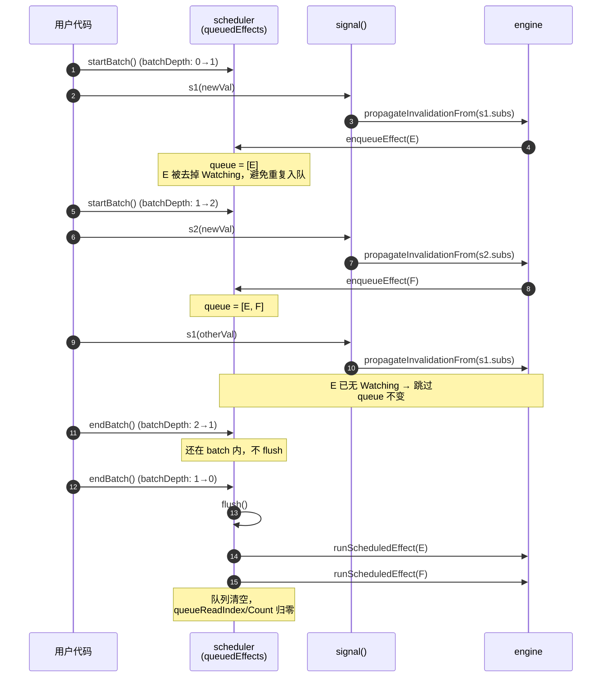

# `scheduler.lua` — 批量更新与 effect 调度

## 设计动机

响应式系统必须回答一个非常细的问题："多个 signal 在同一段代码里相继被写入，
所有受影响的 effect 应该跑几次？"

答案显然是"一次"。要做到这一点，写入只能负责**标记**，effect 重跑必须被**延迟**
到一个安全的合并点。这就是 `scheduler` 的存在意义：

- 用一个 **batch 深度计数器** 决定"现在能不能 flush"；
- 用一个 **顺序队列** 收集"等会儿要跑的 effect"；
- 用一个 **flush 函数** 顺序消费队列，并在 effect 抛错时安全恢复队列状态。

它特意**不**关心"具体如何重跑一个 effect"——实际重跑逻辑由 `engine` 通过
`setRunEffectHandler` 注入。这种"控制反转"让 scheduler 本身完全可以脱离
响应式语义独立测试。

## 内部状态

```lua
local queuedEffects     = {}    -- 顺序队列（1-based table）
local queuedEffectCount = 0     -- 队列写指针
local queueReadIndex    = 0     -- 队列读指针
local batchDepth        = 0     -- 当前嵌套 batch 深度
local runEffectHandler  = ...   -- 由 engine 注入的"如何跑一个 effect"
```

队列采用"读写双指针 + 一维数组"实现，没有用 `table.remove`（O(n)），
而是把已读位置置 nil，待整个 flush 结束后再统一重置 `queueReadIndex` 与
`queuedEffectCount`。

## 关键算法

### `enqueueEffect(effectNode)` — 嵌套父 effect 的反向收集

普通做法是 "把 effect 直接 push 到队尾"，但本实现里 effect 之间存在父子关系：
当 effect A 内部用 `effect(B)` 创建子 effect 时，A 会被作为 B 的 dependency
（通过 `connectDependencyToSubscriber(effectNode, parentSubscriber, 0)`）。
意味着 A 自己作为 dependency 时，它的 `subs` 链上挂着内层 effect。

为了让"内层 effect 与平铺写法的同级 effect 拥有一致的执行顺序"，入队时必须：

1. 沿 `effectNode → subs.sub → subs.sub → ...` 一路向内收集；
2. 每收集一个，立即**移除 `Watching` 标志**（避免被重复入队）；
3. 最后**反向**写入主队列。

```lua
while effectNode and isWatchingEffect(effectNode) do
    collected[#collected + 1] = effectNode
    effectNode.isQueued = true
    removeFlags(effectNode, ReactiveFlags.Watching)
    effectNode = innerLink and innerLink.sub or nil
end
for i = #collected, 1, -1 do
    queuedEffects[...] = collected[i]
end
```

这样"最外层的父 effect 先跑、最内层后跑"的语义就被保留下来了。

### `flush()` — 抛错安全的队列消费

flush 的标准消费在 `pcall` 里完成，每个 effect 都通过注入的
`runEffectHandler(effectNode)` 重跑。

危险点在于"如果某个 effect 抛错，队列里还没轮到的 effect 怎么办"：

- 它们在 `enqueueEffect` 阶段已经被去掉了 `Watching` 标志；
- 如果直接丢弃，下次写入也不会再入队它们；
- 用户视角下，它们会变成"沉默无效的 effect"。

`flush` 的恢复逻辑在 `pcall` 之后扫描剩余条目，**重新加上
`Watching | Recursed`**，让它们回到"可监听 + 待处理"的状态，从而下次写入
能够再次入队并重跑。

最后再把读/写指针归零；如果之前 pcall 捕到错误，则在彻底恢复完毕后再 `error`
原始错误，避免错误吞没。

### `startBatch` / `endBatch`

```lua
function startBatch()  batchDepth = batchDepth + 1 end
function endBatch()
    batchDepth = batchDepth - 1
    if batchDepth == 0 then flush() end
end
```

`primitives.signal` 在 `subs` 不为空时检查 `getBatchDepth() == 0`，
为 0 才立即 `flush`；否则 effect 一直被攒在队列里，直到最外层 `endBatch`
触发统一刷新。

#### 嵌套 batch 下 effect 的生命周期

下图展示两层嵌套 `startBatch`：写入三次 signal（其中第一次和第三次都会影响
同一个 Effect E），最终只 flush 一次、Effect E 也只跑一次：



要点：

- **batchDepth 只有归零时 `endBatch` 才触发 `flush`**，嵌套层数完全不影响最终
  flush 的次数。
- **`Watching` 标志的临时移除**让同一 Effect 在同一批中被多个 signal 击中
  也只会入队一次，是天然的去重机制。
- **flush 之外，写入路径也能直接 flush**：当外部根本没调用 `startBatch` 时，
  `signal` 写完会立刻 `flush`；上图中的 `endBatch → flush` 与单次写入路径
  共用同一个 `flush` 实现。

### `setRunEffectHandler(handler)`

允许 `engine` 把 `runScheduledEffect` 注入进来。默认的 handler 会主动报错，
保证忘记接线时能快速失败而不是静默吞掉所有 effect。

## 模块间依赖关系

- **依赖**：`bit`、`constants`。
- **被依赖**：`engine`（注入回调 + 入队）、`primitives`（写入/trigger 后
  视情况触发 `flush`、暴露 `startBatch`/`endBatch`）。
- **不依赖** `graph`：scheduler 只通过 `effectNode.subs / sub.sub` 这种
  小范围链表行走，已经具备所需信息。

## 关键细节回顾

- **为什么把 `Watching` 移除？** 这是入队的去重机制。已入队的 effect 不再被
  `engine.decidePropagationForSubscriber` 视作"可入队的 watching effect"，
  避免在同一次传播中被反复 push。effect 真正跑完后会重新加回 `Watching`。
- **为什么队列恢复时加 `Recursed`？** 让重新入队的 effect 在下一次传播判定
  里走"曾经触达过"的分支，行为与正常重新入队一致，避免被误标为脏。
- **batchDepth 为什么不在 `flush` 内部检查？** 因为 `flush` 也可能被
  signal 写入路径直接调用（深度本就为 0）。检查放在 `endBatch` 与
  `primitives` 的写入路径里，让 `flush` 自身保持"无条件消费"的简单语义。
